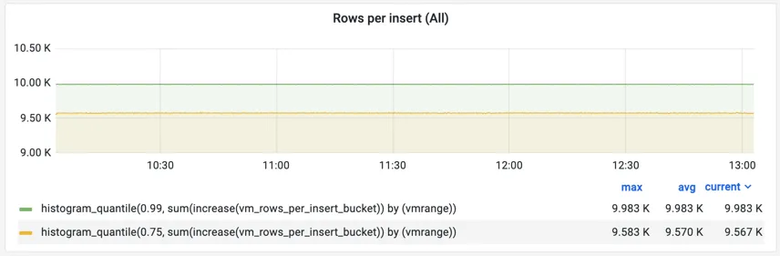
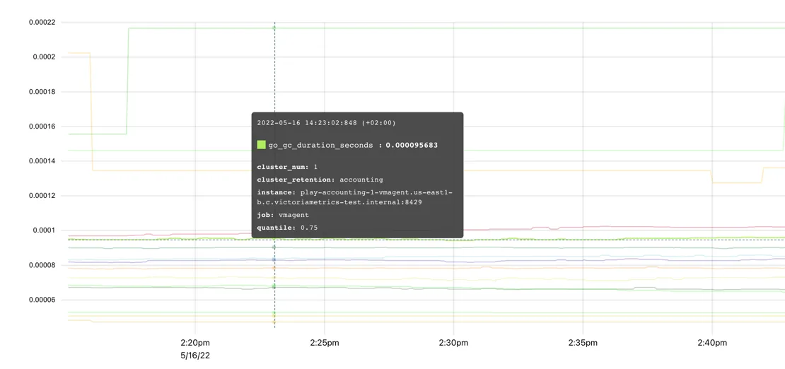

本文主要阐述一些词汇概念的基本定义，如果你对这些基本概念或词汇没有基本的了解，对本书中的大部分内容的理解上都会有一些困难。

## 什么是 Metric（度量指标）

简单来说，`metric`是对事物的数值测量或观察。

Metric 最常见的用途包括：  

+ 检查系统在特定时间段内的行为；
+ 将行为变化与其他测量结果相关联；
+ 观察或预测趋势；
+ 如果度量标准超过阈值，则触发事件（告警）。

在其他的 tsdb 中，也有使用 **measurement** 这个单词的，其表达的核心内容是一样的。

## Metric 结构

### `__name__` (指标名)

让我们从一个例子开始。为了追踪我们的应用程序处理了多少请求，我们将定义一个名为`requests_total`的指标。

在这里你可以更具体一些，比如说`requests_success_total`（仅针对成功的请求）或者`request_errors_total`（针对失败的请求）。

选择一个指标名称非常重要，它应该能够清楚地向每个看到它的人传达正确信息：实际测量到了什么内容；就像编程中的变量名一样。
我们建议遵循[Prometheus的指标命名规范](https://prometheus.io/docs/practices/naming/)。对于 VictoriaMetrics 来说，没有严格的限制，所以任何指标名称和 Label 名称都是可以接受的。但是遵循这个约定有助于保持名称有意义、描述性强，并且清晰易懂给其他人。遵循这个约定是一个好习惯。

### Labels（标签）

每个指标都可以包含额外的元信息，以 Label 对的形式呈现：

```scheme
requests_total{path="/", code="200"} 
requests_total{path="/", code="403"}
```

指标元信息，即一组用花括号括起来的键值对，为我们提供了`request`被处理的`path`和`status code`的上下文。Label 的值始终是`string`类型。VictoriaMetrics数据模型是无模式的（No Scheme），即没有预先定义的表结构，用户不需要预先定义指标名称或其标签，而是可以随时添加或更改已采用的指标。

实际上，指标名称也是一个具有特殊名称`__name__`的 Label。因此，以下两个系列是相同的：

```scheme
requests_total{path="/", code="200"} 
{__name__="requests_total", path="/", code="200"}
```

Labels可以自动附加到通过vmagent或Prometheus采集的 [timeseries](#timeseries) 上，即 vmagent 和 Prometheus 都具备向采集的指标中注入特定 Label 的能力。

#### 最佳实践

每个 Metric 都可以包含任意数量的`key="value"`标签。良好的实践是保持这个数量可控。否则，处理包含大量Label的数据将会很困难。默认情况下，VictoriaMetrics将每个Metric的Label数限制为`30`，并丢弃其他标签。如果需要，可以通过`-maxLabelsPerTimeseries`启动参数来更改此限制（但不建议这样做）。

每个Label的值都可以包含任意字符串值。良好的实践是使用简短而有意义的标签值来描述指标属性，而不是讲述它们的故事。例如，`environment="prod"`是可以接受的正常Label，但`log_message="long log message with a lot of details..."`就不是可接受的。默认情况下，VictoriaMetrics将标签值大小限制为`16kB`。可以通过`-maxLabelValueLen`启动参数来更改此限制（同样强烈不建议这样做）。

控制唯一标签值的数量非常重要，因为每个唯一标签值都会导致一个新 [timeseries](#timeseries) 产生。尽量避免使用易变性较高的标签值（如会话ID或查询ID），以避免过多资源使用和数据库减速问题发生。


### Timeseries（时间序列） {#timeseries}

一个指标名称和其 Label 的组合定义了一个 timeseries。例如，`requests_total{path="/", code="200"}` 和` requests_total{path="/", code="403"}` 是两个不同的 timeseries，因为它们在`code`标签上有不同的值。

唯一时间序列的数量对数据库资源用量产生影响。详细信息请参阅[什么是活跃时间序列]()以及[什么是高流失率]()。

### Cardinality（基数） {#cardinality}
唯一时间序列的数量被称为基数。过多的唯一时间序列被称为[高基数]()。高基数可能导致在VictoriaMetrics中增加资源使用量。请参阅[这篇文档]()以获取更多详细信息。

### Raw samples（原始样本） {#samples}

每个唯一的时间序列可以由任意数量的`(value，timestamp)`数据点（也称为`原始样本`）组成，它们按照`timestamp`排序。`value`是[双精度浮点数](https://en.wikipedia.org/wiki/Double-precision_floating-point_format)。`timestamp`是具有毫秒精度的 [Unix 时间戳](https://en.wikipedia.org/wiki/Unix_time)。

以下是一个[Prometheus文本格式](https://github.com/prometheus/docs/blob/main/content/docs/instrumenting/exposition_formats.md#text-based-format)的单个原始样本的示例：

```scheme
requests_total{path="/", code="200"} 123 4567890
```

+ `requests_total{path="/", code="200"}` 用于标识给定样本的相关 timeseries。 
+ `123` 是一个样本值。 
+ `4567890` 是可选的样本时间戳。如果缺失，则数据被存储到VictoriaMetrics中时使用数据库的当前时间戳。

### Timeseries resolution（时间序列粒度） {#resolution}
分辨率是 [timeseries](#timeseries) 的 [samples](#samples) 之间的最小间隔。考虑以下示例：

```scheme
----------------------------------------------------------------------
|              <time series>                 | <value> | <timestamp> |
| requests_total{path="/health", code="200"} |    1    |  1676297640 |
| requests_total{path="/health", code="200"} |    2    |  1676297670 |
| requests_total{path="/health", code="200"} |    3    |  1676297700 |
| requests_total{path="/health", code="200"} |    4    |  1676297730 |
....
```

这里有一个代表请求总数的 timeseries`{path="/health", code="200"}`，每30秒更新一次值。这意味着它的分辨率也是30秒。

在 [Pull 模式]()中，分辨率等于抓取间隔，并由监控系统（服务器）控制。对于 [Push 模式]()，分辨率是样本时间戳之间的间隔，并由客户端（指标收集器）控制。

尽量保持时间序列的分辨率一致，因为某些 [MetricsQL]() 函数可能期望如此，以免计算出『奇怪』的结果。

## Metric 类型 {#metrics}
在 VictoriaMetrics 内部，并 metric type 的概念。此概念存在是为了帮助用户理解度量是如何测量的。有四种常见的度量类型。

### Counter（计数器）
`Counter` 是一种用于统计某些事件的发生次数的 Metric。它的值是累加的，随着时间增加或保持不变，在一般情况下不会减少。唯一的例外是当计数器重置为零时，例如`计数器重置`。当暴露 Counter 指标的服务重新启动时，可能会发生`计数器重置`。因此，`Counter`指标显示了自服务启动以来观察到的事件数量。

在编程中，Counter 是一个变量，在每次发生某个事件时递增其值。


`vm_http_requests_total` 是一个典型的 Counter 示例。上面图表的解释是，时间序列 `vm_http_requests_total{instance="localhost:8428", job="victoriametrics", path="api/v1/query_range"}` 在下午1点38分到1点39分之间迅速变化，然后在1点41分之前没有任何变化。

`Counter`用于测量事件数量，例如请求、错误、日志、消息等。与计数器一起使用最常见的 [MetricsQL]() 函数有：

+ `rate` - 计算指标每秒平均变化速度。例如，`rate(requests_total)` 显示平均每秒服务多少个请求；
+ `increase` - 计算给定时间段内指标的增长情况，时间段由方括号中指定。例如，`increase(requests_total[1h])` 显示过去一小时内服务的请求数量。

Counter 可以具有小数值。例如，`request_duration_seconds_sum` 计数器可能会对所有请求的持续时间进行求和。每个持续时间可能以秒为单位具有小数值，如`0.5` 秒。因此所有请求持续时间的累积总和也可能是小数。

建议在 `Counter` 指标名称中添加 `_total`、`_sum` 或 `_count` 后缀，这样人们就可以轻松区分这些指标与其他类型的指标。

### Gauge（仪表）
Gauge 用于测量可以上下变化的值：


图表上的度量指标 `process_resident_memory_anon_bytes` 显示了应用程序在每个给定时间点的内存使用情况。它经常变化，上下波动，显示进程如何分配和释放内存。在编程中，`gauge` 是一个变量，你可以将其设置为随着变化而改变的特定值。

以下是 `gauge` 的使用场景：

+ 测量温度、内存使用情况、磁盘使用情况等；
+ 存储某个过程的状态。例如，如果配置重新加载成功，则可以将 gauge `config_reloaded_successful` 设置为 `1`；如果配置重新加载失败，则设置为 `0`；
+ 存储事件发生时的时间戳。例如，`config_last_reload_success_timestamp_seconds` 可以存储最后一次成功配置重新加载的时间戳。

与 gauges 最常用的 [MetricsQL]() 函数是聚合函数和滚动函数。

### Histogram（直方图）
Histogram是一组具有不同`vmrange`或`le`标签的 Counter 指标。 `vmrange`或`le`标签定义了特定`bucket`（桶）的测量边界。当观察到的测量值命中特定的`bucket`时，相应的`Counter`会递增。

直方图桶通常在其名称中带有`_bucket`后缀。例如，VictoriaMetrics使用`vm_rows_read_per_query`直方图跟踪每个查询处理的行分布情况。该 Histogram 的暴露格式如下：


```scheme
vm_rows_read_per_query_bucket{vmrange="4.084e+02...4.642e+02"} 2
vm_rows_read_per_query_bucket{vmrange="5.275e+02...5.995e+02"} 1
vm_rows_read_per_query_bucket{vmrange="8.799e+02...1.000e+03"} 1
vm_rows_read_per_query_bucket{vmrange="1.468e+03...1.668e+03"} 3
vm_rows_read_per_query_bucket{vmrange="1.896e+03...2.154e+03"} 4
vm_rows_read_per_query_sum 15582
vm_rows_read_per_query_count 11
```

其中 `vm_rows_read_per_query_bucket{vmrange="4.084e+02...4.642e+02"} 2` 这一行表示自上次VictoriaMetrics启动以来，vmrange的值在`(408.4 - 464.2]`区间的查询有2个。

以 `_bucket` 后缀结尾的计数器可以使用 `histogram_quantile` 函数估算观测测量值的任意百分位数。例如，以下查询返回在过去一小时内每个查询读取的行数的估算第99百分位数（见方括号中的 1h）：

```sql
histogram_quantile(0.99, sum(increase(vm_rows_read_per_query_bucket[1h])) by (vmrange))
```

这个查询的执行逻辑如下：

+ 增加`(vm_rows_read_per_query_bucket[1h])` 计算每个桶每个实例在过去一小时内的事件数量。
+ `sum(...)` 按 `(vmrange)` 计算相同 `vmrange` 值的每个实例桶的事件总数。
+ `histogram_quantile(0.99, ...)` 在步骤 2 返回的 `vmrange` 桶上计算第 99 百分位数。

histogram 类型还暴露了额外两个附加计数器，以 `_sum` 和 `_count` 后缀结尾。

`vm_rows_read_per_query_sum`是所有观测到的测量值的总和，例如自上次VictoriaMetrics启动以来由所有查询服务的行数之和。

`vm_rows_read_per_query_count`是观测到的事件总数，例如自上次VictoriaMetrics启动以来观测到的查询总数。

这些计数器允许在特定回溯窗口内计算平均测量值。例如，以下查询计算最近5分钟（方括号中为5m）每个查询读取行数的平均值：

```sql
increase(vm_rows_read_per_query_sum[5m]) / increase(vm_rows_read_per_query_count[5m])
```

使用 [github.com/VictoriaMetrics/metrics](https://github.com/VictoriaMetrics/metrics) 包，可以通过以下方式在Go应用程序中使用`vm_rows_read_per_query`直方图：

```go
// define the histogram
rowsReadPerQuery := metrics.NewHistogram(`vm_rows_read_per_query`)

// use the histogram during processing
for _, query := range queries {
    rowsReadPerQuery.Update(float64(len(query.Rows)))
}
```

我们来看看每次调用`rowsReadPerQuery.Update`时，会发生什么：

+ 计数器`vm_rows_read_per_query_sum`的值将增加`query.Rows`表达式的长度；
+ 计数器`vm_rows_read_per_query_count`增加`1`；
+ 只有在观察到的值在`vmrange`定义的范围（桶）内时，计数器`vm_rows_read_per_query_bucket`才会递增。

这样一组计数器指标可以在[Grafana中绘制热力图](https://grafana.com/docs/grafana/latest/visualizations/heatmap/)并计算[分位数](https://prometheus.io/docs/practices/histograms/#quantiles)：



Grafana对带有vmrange标签的桶不理解，因此在构建Grafana中的热力图之前，必须使用[prometheus_buckets](https://www.victoriametrics.com.cn/victoriametrics/shu-ju-cha-xun/metricql)函数将带有`vmrange`标签的桶转换为带有`le`标签的桶。

histogram 通常用于测量延迟分布、元素大小（例如批处理大小）等。VictoriaMetrics支持两种直方图实现：

+ Prometheus Histogram。[大多数客户端库](https://prometheus.io/docs/instrumenting/clientlibs/)都支持这种经典的 Histogram 实现方式。Prometheus Histogram 要求用户静态定义范围（bucket）。
+ VictoriaMetrics Histogram 由 [VictoriaMetrics/metrics](https://github.com/VictoriaMetrics/metrics) 工具库支持。Victoriametrics Histogram 会自动处理桶边界，因此用户无需考虑它们。

我们建议您在开始使用直方图之前阅读以下文章：

1. [Prometheus histogram](https://prometheus.io/docs/concepts/metric_types/#histogram)
2. [Histograms and summaries](https://prometheus.io/docs/practices/histograms/)
3. [How does a Prometheus Histogram work?](https://www.robustperception.io/how-does-a-prometheus-histogram-work)
4. [Improving histogram usability for Prometheus and Grafana](https://valyala.medium.com/improving-histogram-usability-for-prometheus-and-grafana-bc7e5df0e350)

### Summary（摘要）
Summary 与 Histogram 非常相似，用于计算[分位数](https://prometheus.io/docs/practices/histograms/#quantiles)。主要区别在于 Summary 是在客户端进行计算的，因此指标公开格式已经包含了预定义的分位数：


```scheme
go_gc_duration_seconds{quantile="0"} 0
go_gc_duration_seconds{quantile="0.25"} 0
go_gc_duration_seconds{quantile="0.5"} 0
go_gc_duration_seconds{quantile="0.75"} 8.0696e-05
go_gc_duration_seconds{quantile="1"} 0.001222168
go_gc_duration_seconds_sum 0.015077078
go_gc_duration_seconds_count 83
```

Summary 的可视化非常直观：



这种方法使得 Summary 更易于使用，但与 Histogram 相比也存在显著的限制：

+ 无法计算多个 Summary 指标的分位数，例如 `sum(go_gc_duration_seconds{quantile="0.75"})`、`avg(go_gc_duration_seconds{quantile="0.75"})` 或 `max(go_gc_duration_seconds{quantile="0.75"})` 不会返回从应用程序的多个实例收集到的 `go_gc_duration_seconds` 指标的预期第75百分位数。有关详细信息，请[参阅本文](https://latencytipoftheday.blogspot.de/2014/06/latencytipoftheday-you-cant-average.html)。
+ 无法计算除已经预先计算过的分位数之外的其他分位数。
+ 无法针对在任意时间范围内收集到的测量值计算分位数。通常，Summary 分位数是在固定时间范围内（如最近5分钟）计算出来的。

Summary 通常用于跟踪延迟、元素大小（例如批处理大小）等预定义百分比。
