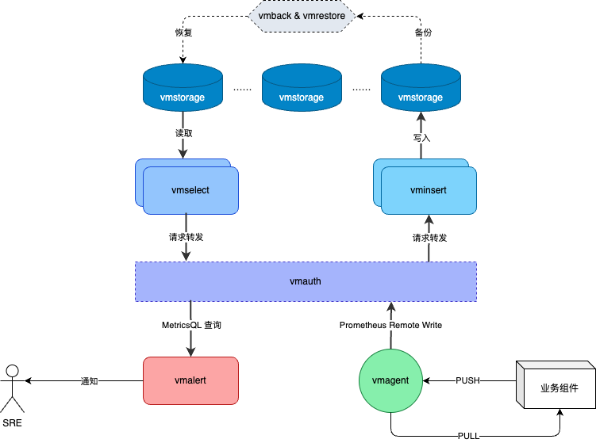

## 集群规划

### 架构概览 {#arch}
VictoriaMetrics 集群版本由以下几个服务组成：

+ `vmstorage`- 存储指标数据，并返回在给定时间范围内针对 Label Filter 查询的数据。
+ `vminsert`- 接收写入的数据，并根据对 Metric 名称及其所有 Label 的一致散列，将数据分散到`vmstorage`实例中
+ `vmselect`- 通过从所有已配置的`vmstorage`实例获取所需数据，然后用数据来执行接收到的查询请求。

每项服务都可独立扩展，并可以在最合适的硬件上运行。`vmstorage`实例之间互不相识，互不通信，也不共享任何数据。 这是一种 [SN 架构](https://en.wikipedia.org/wiki/Shared-nothing_architecture)。这提高了集群的可用性，简化了集群维护和扩展成本。

在`vminsert`和`vmselect`前面，我建议是加一层代理，用于用户认证，管控等。  
`vmagent`用于数据采集，可以主动以 PULL 的模式采集业务组件指标，也可以让业务指标自己 [PUSH]() 进来；当业务组件采用 PUSH 时，也可以绕过`vmagent`直接 [PUSH]() 到`vmauth`。



### 安全 {#security}
一般的安全建议：

+ 所有 VictoriaMetrics 集群组件都必须在受保护的私有网络中运行，并且不能被互联网等不受信任的网络直接访问。
+ 外部客户端必须通过身份验证代理（例如 [vmauth](https://docs.victoriametrics.com/vmauth.html) 或 [vmgateway](https://docs.victoriametrics.com/vmgateway.html)）访问 vminsert 和 vmselect。
+ 为了保护身份验证令牌不被窃听，身份验证代理必须仅通过 https 接受来自不受信任网络的身份验证令牌。
+ 建议对不同的[租户](#tenant)使用不同的身份验证令牌，以减少某些租户的身份验证令牌被泄露时造成的潜在损害。
+ 在`vminsert`和`vmselect`之前配置身份验证代理时，最好使用允许的 API 接口白名单，同时禁止访问其他接口。这可以最大限度地减少攻击面。

参见 [集群版安全建议]() 以及 [网站的常规安全策略](https://victoriametrics.com/security/).


### 基数限制
`vmstorage`实例同[单机版]()一样支持使用`-storage.maxHourlySeries`和`-storage.maxDailySeries`两个参数做基数限制。

因为 VictoriaMetrics 集群采用的是 SN 架构，所以`vmstorage`是针对自身实例的全局限制，不分租户。  
如果集群设置了副本数为`N`，即`-replicationFactor=N`，则整个集群的独立 timeseries 总量会是真实数据的`N`倍。

关于更多的基数限制可以看[这些文档]()。 


### 集群可用性 {#cluster-available}
**VictoriaMetrics 集群架构优先考虑可用性而不是数据一致性**。这意味着，如果集群的某些组件暂时不可用，集群仍可用于数据提取和数据查询。

如果满足以下条件，VictoriaMetrics 集群将保持可用：

+ HTTP 负载均衡（比如[vmauth]()）必须停止将请求路由到不可用的 vminsert 和 vmselect 实例上。
+ 集群中至少有一个 vminsert 实例是可用的，并且它们能够支撑数据写入压力。如果剩余 vminsert 实例没有足够的资源来支撑数据写入压力，则数据写入的延迟会变高且出现抖动。有关更多详细信息，请参阅[容量规划](#capacity)和[集群扩缩容](#resize)部分。 
+ 集群中至少有一个 vmselect 实例是可用的，并且他们能够支撑所有查询请求。如果剩余 vmselect 实例没有足够的资源来处理查询请求，则查询请求可能会发生偶发的故障和高延迟。有关更多详细信息，请参阅[容量规划](#capacity)和[集群扩缩容](#resize)文档。 
+ 集群中至少有一个 vmstorage 实例是可用的，并且足以支撑数据读写请求。如果剩余 vmstorage 实例没有足够的资源来处理读写请求，则在数据读写可能会发生偶发故障和高延迟。有关更多详细信息，请参阅[容量规划](#capacity)和[集群扩缩容](#resize)文档。 

当某些 vmstorage 实例不可用时，集群的内部容错机制如下： 

+ vminsert 将新写入的数据从不可用的 vmstorage 实例重新路由到剩余的健康 vmstorage 实例。如果健康的 vmstorage 实例具有足够的 CPU、RAM、磁盘 IO 和网络带宽来处理这些新增的数据，则数据就可以正常写入。
vminsert 会在健康的 vmstorage 实例之间均匀分布新增的数据，将这部分新增出来的数据压力让所有 vmstorage 实例均摊掉。
+ 只要有一个 vmstorage 实例可用，vmselect 就会继续工作。它会将其余健康 vmstorage 实例提供的数据的响应标记为`partial`，因为这种情况下可能会丢失故障 vmstorage 实例上的历史数据。每个 JSON 响应都包含`“isPartial”：true`选项。如果您期望一致性而不是可用性，
请使用`-search.denyPartialResponse`启动参数运行 vmselect 实例。在这种情况下，只要有一个 vmstorage 实例不可用，vmselect 就报错。另一个方法是在 vmselect 的查询请求中加上`deny_partial_response=1`参数。

vmselect 还接受`-replicationFactor=N`启动参数。此参数表示 vmselect 在查询期间如果少于`-replicationFactor`个 vmstorage 实例不可用则返回完整响应，因为它假定剩余的 vmstorage 实例包含完整数据。有关详细信息，请参阅[这些文档](#replication)。 

vmselect 不会为返回原始数据点的 API 处理程序提供`partion response`，比如[`/api/v1/export*`接口]()；因为用户通常希望这些数据始终是完整的。 

数据副本可用于提高数据可用性。有关详细信息，请参阅[这些文档](#replication)。

### 容量规划 {#capacity}
根据我们的[案例研究](https://docs.victoriametrics.com/CaseStudies.html)，与其他解决方案（Prometheus、Thanos、Cortex、TimescaleDB、InfluxDB、QuestDB、M3DB）相比，VictoriaMetrics 在生产环境中上消耗的 CPU、RAM 和存储空间更少。 

每种组件（`vminsert`、`vmselect`和`vmstorage`）都可以在最合适的硬件上运行。集群容量随可用资源水平扩展。
每种组件所需的 CPU 和 RAM 数量高度依赖于数据量 - [活动时间序列]()的数量、[序列替换率]()、查询类型、查询 qps 等。
建议为生产环境搭建一个测试 VictoriaMetrics 集群，并反复调整每个组件的资源和实例数量，直到集群平稳。建议为集群[设置监控](#monitoring)。有助于发现集群的瓶颈。同时也建议遵循[故障排除]()文档。 

数据保存时间所需的存储空间（保留期通过 vmstorage 的`-retentionPeriod`启动参数设置）可以根据测试运行中的磁盘空间使用情况推断出来。例如，如果在生产环境运行了一天的测试集群，存储空间使用量为`10GB`，那么在`-retentionPeriod=100d`（100 天）的情况下，至少需要`10GB*100=1TB`的磁盘空间。可以使用 VictoriaMetrics 集群的[官方 Grafana 大盘](#monitoring)监控存储空间使用情况。

建议按照以下的原则为组件预留资源：

+ 所有实例类型预留 50% 的可用内存，避免压力临时激增时出现 OOM（内存不足）崩溃和性能下降。
+ 所有实例类型预留 50% 的空闲 CPU，避免压力临时激增时出现 OOM（内存不足）崩溃和性能下降。
+ vmstorage `-storageDataPath`参数指向的目录中至少预留`20%`的空闲空间。另请参阅 vmstorage 的`-storage.minFreeDiskSpaceBytes`[参数描述](#flags)。

VictoriaMetrics 集群的一些容量规划建议：

+ [多副本](#replication)会将集群所需的资源量扩大`N`倍，其中`N`是副本数。这是因为`vminsert`将每条写入数据复制 N 份并存储在不同的`vmstorage`实例上。
查询时，`vmselect`会对这些副本进行去重。解决数据高可用的最具性价比的方案是使用云存储（例如 [Google Compute 持久磁盘](https://cloud.google.com/compute/docs/disks#pdspecs)），而不是使用 [VictoriaMetrics 级别的复制机制](#replication)。
+ 建议集群中 vmstorage 实例的个数尽量多而轻量，而非弄少量的重实例。这样，在进行维护操作（如升级、配置更改或迁移）时，如果部分 vmstorage 实例临时不可用，集群更有可能保持高可用性和稳定性。
举例来说，若一个集群拥有`10`个vmstorage实例，其中一个实例不可用时，其余`9`个实例的负载将增加约`11%`（即1/9）。而如果集群仅由`3`个vmstorage实例构成，其中一个实例不可用时，其余两个实例的负载将激增`50%`（即1/2）。在这种情况下，剩余实例可能无法承受新增的数据压力，导致集群过载，进而影响可用性和稳定性。
+ 增加每个 vmstorage 实例的内存和 CPU 资源，或者添加新的 vmstorage 实例，可以提高集群对[活跃时间序列]()的处理能力。
+ 提高每个 vmselect 实例的CPU资源可以降低查询延迟，因为每个查询请求都由单个 vmselect 实例处理。vmselect 实例的可用 CPU 核数越多，其处理时间序列的性能就越好。
+ 如果集群需要提高查询并发能力，可以通过添加更多 vmselect 实例来提高其处理能力，这样查询请求就可以分散到更多的 vmselect 实例上。
+ 默认情况下，vminsert 会压缩发送给 vmstorage 的数据，减少网络带宽消耗。压缩过程会消耗 vminsert 实例 CPU。如果 vminsert 实例的 CPU 不多，可以通过 vminsert 的`-rpc.disableCompression`启动参数来禁用压缩。
+ 默认情况下，vmstorage 处理数据查询时会把数据压缩后发送给 vmselect，以减少网络带宽消耗。压缩过程会消耗 vmstorage 实例的 CPU 资源。如果 vmstorage 实例的 CPU 不多，可以通过 vmstorage 的`-rpc.disableCompression`启动参数来禁用压缩。

也可以参阅[资源使用限制文档](#limitation)。

### 资源使用限制 {#limitation}
默认情况下，VictoriaMetrics 的集群组件已经针对典型的数据写入场景进行了资源优化。如果存在某些情况需要对资源使用限制进行更细粒度调整。调整以下启动参数可能会有用：

+ `-memory.allowedPercent`和`-memory.allowedBytes`限制所有的 VictoriaMetrics 集群组件里的各种内部 cache 会使用的内存用量，包括`vminsert`,`vmselect`和`vmstorage`。注意，VictoriaMetrics 组件实际会消耗更多内存，因为这些参数并不会限制其他地方消耗的内存，比如处理查询请求需要消耗的内存。
+ `-search.maxMemoryPerQuery`限制 vmselect 实例执行一次查询请求所使用的内存总量。申请超限的内存会被拒绝。查询大量时间序列的重查询，可能会略微超出该限制。并发查询的内存总限制差不多等于`-search.maxMemoryPerQuery`和`-search.maxConcurrentRequests`的乘积。
+ `vmselect`组件的`-search.maxUniqueTimeseries`参数限制了单次查询允许检索多少个独立时间序列。`vmselect`会将该限制参数传递给`vmstorage`组件，`vmstorage`在内存中记录每个查询请求检索到的时间序列的元信息，并消耗一定的 CPU 来处理检索到的时间序列。这意味着在`vmstorage`中，单次查询消耗的最大内存和 CPU 与`-search.maxUniqueTimeseries`成正比。
+ `vmselect`的`-search.maxQueryDuration`参数限制单次查询的最大执行时间。如果查询超过给定的时间，就会取消执行。这可以使`vmselect`和`vmstorage`遇到非预期的重查询时，避免 CPU 和 内存的过度消耗。
+ `vmselect`和`vmstorage`的`-search.maxConcurrentRequests`参数限制单个`vmselect`和`vmstorage`实例可以并行处理多少个查询。更大的并发数通常意味着需要消耗更多的内存。比如，如果一个查询在执行期间需要消耗`100MiB`的内存，那么`100`个并行的查询就需要`100 * 100 MiB = 10 GiB`的内存。所以最好限制一下请求并发数，这样会把超出并发限制的请求挂起排队。`vmselect`和`vmstorage`同时提供了`-search.maxQueueDuration`参数来限制请求排队的最长时间。同时也看下`vmselect`的`-search.maxMemoryPerQuery`参数。
+ `vmselect`和`vmstorage`的`-search.maxQueueDuration`限制查询因超出并发数限制而挂起排队的最长等待时间。上面提到了`-search.maxConcurrentRequests`参数指定了最大查询并发数。
+ `vmselect`的`-search.maxSamplesPerSeries`限制了对于一个时间序列允许处理的最大原始样本的数量。在处理查询时，`vmselect`会顺序地处理每个检索到的时间序列中的原始样本。它将每个时间序列的指定时间范围内的原始样本解压到内存，然后执行[rollup函数]()。
+ `vmselect`的`-search.maxSamplesPerQuery`限制一次查询允许处理的最大原始样本数。可以限制`vmselect`遇到重查询时的 CPU 用量。
+ `-search.maxPointsPerTimeseries`限制了[范围查询(query range)]()中每个时间序列最终返回的最多数据点数。
+ `-search.maxPointsSubqueryPerTimeseries`限制了每个[子查询]()执行时所产生的最大数据点数。
+ `-search.maxSeriesPerAggrFunc`限制一次查询由 [MetricsQL 聚合函数]()所产生的最大时间序列数量。
+ `vmselect`的`-search.maxSeries`参数限制`/api/v1/series`接口最多返回的 series 数量。这个接口主要用于 Grafana 自动补全 Metric 名称，Label Name 和 Label Value。
如果数据库中因为[高基数]()存储了大量的时间序列，那么这个接口会消耗`vmstorage`和`vmselect`的大量 CPU。
所以在这种情况下需要使用`-search.maxSeries`来限制下CPU和内存的过度消耗。
+ `vmstorage`的`-search.maxTagKeys`限制 [/api/v1/labels](https://prometheus.io/docs/prometheus/latest/querying/api/#getting-label-names) 接口返回的 label 总数量。
这个接口主要用于 Grafana 自动补全 Label Name。如果数据库中因为存储了大量的时间序列而存在[高基数]()现象，那么这个接口会消耗`vmstorage`和`vmselect`的大量 CPU。
所以在这种情况下需要使用`-search.maxTagKeys`来限制下 CPU 和内存的过度消耗。
+ `vmstorage`的`-search.maxTagKeys`限制 [/api/v1/label/…/values](https://prometheus.io/docs/prometheus/latest/querying/api/#querying-label-values) 接口返回的 label 值总数量。
这个接口主要用于 Grafana 自动补全 Label Value。如果数据库中因为存储了大量的时间序列而存在[高基数]()现象，那么这个接口会消耗`vmstorage`和`vmselect`的大量 CPU。
所以在这种情况下需要使用`-search.maxTagValues`来限制下 CPU 和内存的过度消耗。
+ `vmstorage`的`-storage.maxDailySeries`可以用于限制每天最多创建多少个新时间序列。见[限制文档](#limitation)。
+ vmstorage的`-storage.maxHourlySeries`可以用于限制活跃时间序列的数量。见[限制文档](#limitation)。

也可以参考[容量规划文档](#capacity)和[vmagent的基数显示器]()。

### 高可用 {#high-available}
如果数据库在部分组件暂时不可用时仍能接收新数据并处理查询请求，则被认为是高可用的。VictoriaMetrics 集群符合这一定义，请参阅[集群可用性文档](#cluster-available)。

建议在同一个具有高带宽、低延迟和低错误率的网络内部署集群组件，可以提高集群的性能和可用性。不建议将集群的组件分布在多个可用区（AZ）中，因为跨 AZ 网络通常带宽较低、延迟较高、错误率也较高。

如果你需要跨多个 AZ 的设置，建议在每个 AZ 中运行独立的集群，并使用[vmagent]()将数据多发到所有集群中，详情请参阅[相关文档]()。此外，可以配置额外的 vmselect 实例，从多个集群中读取数据，具体细节参见[这些文档](#multi-level)。

### 多层联邦部署 {#multi-level}
当 vmselect 实例运行时带有`-clusternativeListenAddr`启动参数，它们可以被其他 vmselect 实例查询。
例如，如果 vmselect 以`-clusternativeListenAddr=:8401`启动，那么它会在 TCP 端口`8401`上处理来自其他 vmselect 实例的查询，接口行为跟 vmstorage 实例一样。
这就允许 vmselect 可以进行链式部署，构建出多层集群拓扑。例如，顶层 vmselect 实例可以查询不同可用区（AZ）中的第二层 vmselect 实例，而第二层 vmselect 实例可以查询同 AZ 中的 vmstorage 实例。

当 vminsert 实例运行时带有`-clusternativeListenAddr`启动参数，它们可以接收来自其他 vminsert 实例的写入数据。
例如，如果 vminsert 以`-clusternativeListenAddr=:8400`启动，那么它可以在 TCP 端口`8400`上处理来自其他 vminsert 实例的数据，接口行为跟 vmstorage 实例一样。
这就允许 vminsert 可以进行链式部署，构建多层集群拓扑。例如，顶层 vminsert 实例可以将数据复制到位于不同可用区（AZ）的第二层 vminsert 实例中，而第二层 vminsert 实例可以将数据分散到同 AZ 中的 vmstorage 实例。

由于同步复制和数据分片机制，vminsert 实例的多层联邦集群设置存在以下缺点：

+ 数据写入速度受限于连接到 AZ 的最慢链路。
+ 当某些可用区（AZ）暂时不可用时，顶层的`vminsert`实例会将传入数据重新路由到剩余的AZ中。这会导致在暂时不可用的 AZ 中出现数据丢点。

当[vmagent]()以[多租户模式]()部署时，就不存在这个问题了。当一个 AZ 暂时不可用时，vmagent 会缓冲必须发送到该 AZ 的数据。缓冲区存储在磁盘上。一旦 AZ 恢复，缓冲的数据就会被发送到 AZ。


### 副本和数据安全 {#replication}
默认情况下，VictoriaMetrics 将复制工作转架到由`-storageDataPath`指定的底层存储上，如[Google计算引擎的持久磁盘](https://cloud.google.com/compute/docs/disks#pdspecs)，这保证了数据的持久性。如果出于某种原因无法使用高可用存储，VictoriaMetrics 支持应用级复制。

通过向 vminsert 传递`-replicationFactor=N`参数可以打开复制机制，这让 vminsert 在`N`个不同的 vmstorage 实例上将每个写入样本存储`N`份。
这保证了即使有最多`N-1`个 vmstorage 实例不可用，剩余存储的数据仍然可用于查询。

向`vmselect`传递`-replicationFactor=N`启动参数，表示只有遇到大于`-replicationFactor`个 vmstorage 实例不可用时，才将响应标记为`partial`。详情请参阅[集群可用性文档](#high-available)。

为了在`N-1`个存储实例不可用时保证新写入的数据还能有`N`个副本，集群必须包含至少`2*N-1`个`vmstorage`实例，其中`N`是副本数。

VictoriaMetrics 以毫秒精度存储时间戳，因此在启用复制时必须向 vmselect 实例传递`-dedup.minScrapeInterval=1ms`启动参数，这样它们在处理查询可以对来自不同 vmstorage 实例的样本数据进行去重。如果从配置相同的[vmagent]()实例或 Prometheus 实例向 VictoriaMetrics 推送了重复数据，则根据[去重文档](#deduplicate)，`-dedup.minScrapeInterval`必须设置为采集配置中的`scrape_interval`。

[复制不能防止灾难]()，因此我们建议定期备份。详情请参阅[这些文档](#backup)。  
此外，复制会增加资源消耗（包括 CPU、RAM、磁盘空间、网络带宽，最多可多消耗`-replicationFactor=N`倍，因为 vminsert 将 N 份写入数据存储到不同的 vmstorage 实例上，并且 vmselect 在查询期间需要对 vmstorage 实例获得的重复数据去重。
因此，将复制工作卸载到由`-storageDataPath`指定的底层复制的持久存储上，如[Google计算引擎的持久磁盘](https://cloud.google.com/compute/docs/disks/#pdspecs)，可以防止数据丢失和数据损坏的同时，更加成本效益。
云存储还能提供高性能，并且在不停机的情况下[调整大小](https://cloud.google.com/compute/docs/disks/add-persistent-disk)。

### 多租户 {#tenant}

VictoriaMetrics 集群支持多个隔离的租户（即命名空间）。租户通过`accountID`或`accountID:projectID`进行标识，这些标识符提现在请求 URL 中。详情请参阅[这些文档]()。

关于VictoriaMetrics中租户的一些事实：
- 每个 accountID 和 projectID 均由一个任意的32位整数标识，范围为`[0..2^32)`。
如果 projectID 缺失，则默认为`0`。
建议将其他租户信息，如身份验证令牌、租户名称、限制、会计等，存储在一个独立的关系数据库中。该数据库由位于 VictoriaMetrics 集群前端的代理服务管理，例如[vmauth]()。
- 当有数据点被写入给定的租户时，租户会被自动创建。
- 所有租户的数据均匀分布在`vmstorage`实例上。这保证了当不同租户拥有不同数量的数据和不同的查询负载时，`vmstorage`实例之间的负载也是均匀的，集群不会因为个别租户的用量问题而出现偏压。
- 数据库的性能和资源使用情况和租户数量无关，主要取决于所有租户中[活跃时间序列]()的总数。如果一个时间序列在过去的一小时中有样本数据写入，或者在过去的一小时中被查询访问过，那么它就被认为是活跃的。
- VictoriaMetrics 不支持在一个请求里跨租户访问。
- 已注册租户的列表可以通过`http://<vmselect>:8481/admin/tenants`获取。请参阅[这些文档]()。

VictoriaMetrics 通过指标暴露了各租户的统计数据，请参阅[这些文档](https://docs.victoriametrics.com/PerTenantStatistic.html)。

也可以看下[通过 labels 实现多租户](#tenant-by-label)。

#### 通过 Labels 实现多租户 {#tenant-by-label}
`vminsert`支持一个特殊的[多租户](#tenant)写入接口`http://vminsert:8480/insert/multitenant/<suffix>`，其中`<suffix>`为[写入接口]()中支持的所有 Path。
在这种情况下，AccountID 和 ProjectID 是从指标中`vm_account_id`和`vm_project_id` Label 中获取的。如果`vm_account_id`或`vm_project_id`不存在或非法，则相应的 AccountID 或 ProjectID 将设置为`0`。
在将数据转发到`vmstorage`之前，会自动从指标中删除这些 Label。

例如，如果将以下样本写入`http://vminsert:8480/insert/multitenant/prometheus/api/v1/write`：

```plain
http_requests_total{path="/foo",vm_account_id="42"} 12
http_requests_total{path="/bar",vm_account_id="7",vm_project_id="9"} 34
```

那么`http_requests_total｛path=“/foo”｝12`将被存储在租户`accountID=42，projectID=0`中，而`http_requests_total{path=“/bar”｝34`将被存储到租户`accountID=7，projectID=9`中。

安全提示：为租户加上安全认证，避免各个租户之间互相交叉乱写，而导致指标数据出现冲突。


### 不要使用消息队列（非官方）

消息队列几乎是大数据领域的默认组件选项。因为它性能强劲，可用性高，可以应对大数据量冲击；而且将数据生产端和消费端服务解耦；受到了很多架构师的青睐。

但我强烈不建议在 VictoriaMetrics 前面再加一层 MQ 组件，此建议同样适用于大多数 TSDB。

因为 MQ 消费延时是常见可接受的一种现象，但这种现象的出现会对 VictoriaMetrics 带来灾难。比如：

1. 延时消费的数据对 VictoriaMetrics 来说是历史数据，属[补数据](#backfilling)场景，它会导致[Rollup Cache](#rollup)大量失效，进而导致整个 DB 的查询结果全部出错。
2. VictoriaMetrics 内部有[每日索引]()来加快数据的写入和查询，该索引在UTC时间每日0点（中国时区早8点）进行一次更替刷新。  
   如果延时恰好出现在这个时间点，可能导致很多索引在新一日的索引中是缺失的；当消费恢复后，大量历史数据涌入，诱发大批量索引创建，[写入速度会很慢]()，集群很可能会在高压中瘫痪。
3. 数据延时修复后，追数据通常是一个漫长的过程。如果 VictoriaMetrics 的数据用于实时告警，那么在最新数据追上前，整个告警系统都是瘫痪不可用的，因为最新的数据一直在 MQ 里排队。

总结上述现象的本质原因，是 **MQ 更多应用于离线数据分析场景，而 VictoriaMetrics 要解决的是实时在线场景，二者系统设计上的取舍不同，最好不要混在一个架构里**。


## 集群维护

### 监控 {#monitoring}
所有集群组件均在`-httpListenAddr`启动参数中设置的 TCP 端口上的`/metrics`页面上以 Prometheus 兼容格式暴露各种指标。默认情况下，使用以下 TCP 端口：

+ `vminsert`- 8480
+ `vmselect`- 8481
+ `vmstorage`- 8482

建议使用 [vmagent]() 或 Prometheus 从所有集群组件中采集`/metrics`页面，这样就可以使用 VictoriaMetrics 集群的[官方 Grafana 大盘](https://grafana.com/grafana/dashboards/11176-victoriametrics-cluster/)或 [VictoriaMetrics 集群大盘](https://grafana.com/grafana/dashboards/11831)进行监控和分析。这些仪表板上的图表包含有用的提示 - 将鼠标悬停在每个图表左上角的`i`图标上即可阅读。

建议通过[此配置](https://github.com/VictoriaMetrics/VictoriaMetrics/blob/cluster/deployment/docker/alerts.yml)在 [vmalert](https://docs.victoriametrics.com/vmalert.html) 或 Prometheus 中设置告警。更多详细信息请参阅文章 [VictoriaMetrics 监控](https://victoriametrics.com/blog/victoriametrics-monitoring/)。

### 备份 {#backup}

建议定期从[即时快照](https://medium.com/@valyala/how-victoriametrics-makes-instant-snapshots-for-multi-terabyte-time-series-data-e1f3fb0e0282)进行备份，以避免用户操作失误将数据删除。

创建备份时，必须对每个 vmstorage 实例执行以下步骤：

+ 通过发送请求到`/snapshot/create`创建即时快照。它将创建快照并返回其名称。
+ 使用[vmbackup]()从`<storageDataPath>/snapshots/<snapshot_name>`文件夹归档快照。归档过程不会干扰 vmstorage 的工作，因此可以在任何合适的时间进行。
+ 通过`/snapshot/delete?snapshot=<snapshot_name>`或`/snapshot/delete_all`删除未使用的快照，可以释放它占用的存储空间。

无需在所有vmstorage实例之间同步备份。

从备份中恢复数据：

1. `kill -INT`命令关停`vmstorage`。
2. 使用 [vmrestore]() 将备份数据恢复到`-storageDataPath`指定的目录。
3. 启动`vmstorage`实例.

### 升级集群实例

所有实例类型 - `vminsert`、`vmselect`和`vmstorage`- 都可以通过启停进行更新。向相应进程发送`SIGINT`信号，等待其退出，然后使用新配置启动新版本。 

建议按以下顺序，使用更新的配置/升级的二进制文件逐个重新启动集群中的每个实例。：

1. 重启`vmstorage`.
2. 重启`vminsert`.
3. 重启`vmselect`.

如果满足以下条件，该策略可以保证升级过程中不停机：
+ 集群里每个至少有两个及以上实例（每种类型都有`vminsert`、`vmselect`和`vmstorage`），因此当单个实例在重启期间暂时不可用时，其它实例可以继续处理请求。有关详细信息，请参阅[集群可用性](./#high-available)文档。
+ 当任何类型的实例（`vminsert`、`vmselect`或`vmstorage`）在重启期间暂时不可用时，集群剩余的实例有足够的计算资源（CPU、RAM、网络带宽、磁盘 IO）来处理当前请求。
+ 更新后的的二进制文件与集群中的其余组件兼容。请参阅 [CHANGELOG](https://docs.victoriametrics.com/CHANGELOG.html) 了解不同版本之间的兼容性说明。 

只要有一个条件不满足，则滚动重启时可能会导致集群不可用。在这种情况下，建议采用以下策略。


### 集群扩缩容 {#resize}
集群的性能和容量有两种提升方式：

+ 为先有的实例实例增加计算资源（CPU，内存，磁盘IO，磁盘空间，网络带宽），即垂直扩容。
+ 为集群增加更多的实例实例，即水平扩容。

一些扩容建议：

+ 增加`vmselect`的 CPU 和内存可提高重度查询的性能，这些查询会处理大量时间序列和大量原始样本。请[参阅本文](https://valyala.medium.com/how-to-optimize-promql-and-metricsql-queries-85a1b75bf986)，了解如何检测和优化重度查询。
+ 增加`vmstorage`实例个数，可以增加集群可以处理的[活动时间序列]()的数量。这还会提高[高替换率]()时间序列的查询性能。
集群稳定性也会随着`vmstorage`实例数量的增加而提高，因为当某些 vmstorage 实例不可用时，剩余`vmstorage`实例需要分担的额外请求较少。
+ 增加`vmstorage`的 CPU 和内存资源可以增加集群可以处理的[活动时间序列]()的数量。
与增加`vmstorage`实例 CPU 和内存资源相比，增加`vmstorage`实例个数是更好的选择，因为`vmstorage`实例数量越多，集群稳定性就越高，并且会提高[高替换率]()时间序列的查询性能。
+ 增加`vminsert`实例个数会增加数据写入速度，因为数据可能会在更多数量的`vminsert`实例之间分配。
+ 增加`vmselect`实例个数会增加查询并发，因为并发请求可能会在更多`vmselect`实例之间分配。

新增`vmstorage`实例会触发数据在`vmstorage`实例之间的重新分配，进而引起一定量的[慢写入]()，过程需要谨慎，详细步骤参见[这篇文档]()。


### 只读模式
当`-storageDataPath`指向的目录包含的可用空间少于`-storage.minFreeDiskSpaceBytes`时，vmstorage 实例会自动切换到只读模式。`vminsert`实例会停止向此类实例发送数据，并将数据重新路由到剩余的 vmstorage 实例。

当`vmstorage`进入只读模式时，它会将`http://vmstorage:8482/metrics`上的`vm_storage_is_read_only`指标设置为`1`，正常情况时为`0`。

## 其他

### 数据维护

集群的数据维护和单机版没有太多区别，只不过一些数据维护接口被放到了[vminsert]()和[vmselect]() 组件中，更多内容可参考[该文档]()

### vmstorage API接口

查询和写入接口详见[查询API]()和[写入API]()。

此外`vmstorage`组件在`8482`端口上提供了如下接口：
- `/internal/force_merge`- 强制启动 vmstorage 实例的[数据合并压缩](https://docs.victoriametrics.com/#forced-merge)。
- `/snapshot/create`- 创建[实例快照](https://medium.com/@valyala/how-victoriametrics-makes-instant-snapshots-for-multi-terabyte-time-series-data-e1f3fb0e0282)，可用于后台备份。
快照在`<storageDataPath>/snapshots`文件夹中创建，其中`<storageDataPath>`是通过相应的启动参数指定。
- `/snapshot/list`- 列出可用的快照。
- `/snapshot/delete?snapshot=<id>`- 删除给定的快照。
- `/snapshot/delete_all`- 删除所有快照。

快照可以在每个`vmstorage`实例上独立创建。无需在`vmstorage`实例之间同步快照的创建。

### 去重机制 {#deduplicate}

VictoriaMetrics 的集群版本支持数据去重，与单机版本的方式相同。唯一的区别是，由于以下几点原因，一个时间序列的样本在多个`vmstorage`实例上可能存在差异：

+ 当添加/移除`vmstorage`实例时。此时，部分时间序列的新样本将被路由到其他`vmstorage`实例；
+ 当`vmstorage`实例暂时不可用（例如，在它们重启期间）。此时，新样本将被重新路由到剩余的可用`vmstorage`实例；
+ 当`vmstorage`实例没有足够的能力处理传入的数据流时。此时，vminsert将新样本重新路由到其他`vmstorage`实例。

所以建议`vmselect`和`vmstorage`的`-dedup.minScrapeInterval`参数值相同来保证查询的一致性。

## 运行参数 {#flags}

### vmstorage {#flag-vmstorage}
 
```sh
  -cacheExpireDuration duration
    	内存中的缓存条目如果在参数设定的时间内没有被访问，则被清理。该参数值越小，内存消耗越小，但相应的 CPU 消耗会上升。另请参见 -prevCacheRemovalPercent 参数（默认为 30m）
  -dedup.minScrapeInterval duration
    	如果 -dedup.minScrapeInterval 大于 0，则如果该时间间隔内同一个 timeseries 包含多个样本数据，只保留最后一个。
  -denyQueriesOutsideRetention
      是否拒绝查询 -retentionPeriod（保存时间）范围外的查询请求。如果是，则如果 from 参数超出了数据保留期 /api/v1/query_range 接口就会返回 '503 Service Unavailable' 错误。
  -denyQueryTracing
    	是否禁用查询追踪机制
  -enableTCP6
    	是否启用 IPv6 支持，默认情况仅支持 IPv4。
  -envflag.enable
      是否从环境变量中解析启动参数。启动命令行中参数值优先级高于环境变量。
  -envflag.prefix string
    	环境变量名的前缀，只有在 -envflag.enable 启用后该参数才有意义
  -finalMergeDelay duration
      对于每个月的 partition，要隔多久没有数据写入，才开始执行终极合并。终极合并会消耗磁盘 IO 和磁盘空间。在一些场景中，终极合并会加速查询，也能减少磁盘空间。设置为 0 代表禁用终极合并。
  -flagsAuthKey string
    	/flags 接口的 Auth Key。在查询请求的 authKey 中指定。它会覆盖 httpAuth.* 参数配置。
  -forceFlushAuthKey string
    	authKey, 必须在 /internal/force_flush 接口的 url 参数里指定
  -forceMergeAuthKey string
    	authKey, 必须在 /internal/force_merge 接口的 url 参数里指定
  -fs.disableMmap
      是否使用 pread() 代替 mmap() 来读取数据文件。默认情况下，在 64位架构下使用 mmap()，在 32位架构下使用 pread()，因为他们不能在内存储读取超过 2^32 字节的数据。mmap() 在读取小数据块的场景下通常比 pread() 要快。
  -http.connTimeout duration
    	Incoming http connections are closed after the configured timeout. This may help to spread the incoming load among a cluster of services behind a load balancer. Please note that the real timeout may be bigger by up to 10% as a protection against the thundering herd problem (default 2m0s)
  -http.disableResponseCompression
    	Disable compression of HTTP responses to save CPU resources. By default compression is enabled to save network bandwidth
  -http.idleConnTimeout duration
    	Timeout for incoming idle http connections (default 1m0s)
  -http.maxGracefulShutdownDuration duration
    	The maximum duration for a graceful shutdown of the HTTP server. A highly loaded server may require increased value for a graceful shutdown (default 7s)
  -http.pathPrefix string
    	An optional prefix to add to all the paths handled by http server. For example, if '-http.pathPrefix=/foo/bar' is set, then all the http requests will be handled on '/foo/bar/*' paths. This may be useful for proxied requests. See https://www.robustperception.io/using-external-urls-and-proxies-with-prometheus
  -http.shutdownDelay duration
    	Optional delay before http server shutdown. During this delay, the server returns non-OK responses from /health page, so load balancers can route new requests to other servers
  -httpAuth.password string
    	Password for HTTP Basic Auth. The authentication is disabled if -httpAuth.username is empty
  -httpAuth.username string
    	Username for HTTP Basic Auth. The authentication is disabled if empty. See also -httpAuth.password
  -httpListenAddr string
    	Address to listen for http connections. See also -httpListenAddr.useProxyProtocol (default ":8482")
  -httpListenAddr.useProxyProtocol
    	Whether to use proxy protocol for connections accepted at -httpListenAddr . See https://www.haproxy.org/download/1.8/doc/proxy-protocol.txt . With enabled proxy protocol http server cannot serve regular /metrics endpoint. Use -pushmetrics.url for metrics pushing
  -insert.maxQueueDuration duration
    	The maximum duration to wait in the queue when -maxConcurrentInserts concurrent insert requests are executed (default 1m0s)
  -internStringMaxLen int
    	The maximum length for strings to intern. Lower limit may save memory at the cost of higher CPU usage. See https://en.wikipedia.org/wiki/String_interning (default 500)
  -logNewSeries
    	Whether to log new series. This option is for debug purposes only. It can lead to performance issues when big number of new series are ingested into VictoriaMetrics
  -loggerDisableTimestamps
    	Whether to disable writing timestamps in logs
  -loggerErrorsPerSecondLimit int
    	Per-second limit on the number of ERROR messages. If more than the given number of errors are emitted per second, the remaining errors are suppressed. Zero values disable the rate limit
  -loggerFormat string
    	Format for logs. Possible values: default, json (default "default")
  -loggerJSONFields string
    	Allows renaming fields in JSON formatted logs. Example: "ts:timestamp,msg:message" renames "ts" to "timestamp" and "msg" to "message". Supported fields: ts, level, caller, msg
  -loggerLevel string
    	Minimum level of errors to log. Possible values: INFO, WARN, ERROR, FATAL, PANIC (default "INFO")
  -loggerOutput string
    	Output for the logs. Supported values: stderr, stdout (default "stderr")
  -loggerTimezone string
    	Timezone to use for timestamps in logs. Timezone must be a valid IANA Time Zone. For example: America/New_York, Europe/Berlin, Etc/GMT+3 or Local (default "UTC")
  -loggerWarnsPerSecondLimit int
    	Per-second limit on the number of WARN messages. If more than the given number of warns are emitted per second, then the remaining warns are suppressed. Zero values disable the rate limit
  -maxConcurrentInserts int
    	The maximum number of concurrent insert requests. Default value should work for most cases, since it minimizes the memory usage. The default value can be increased when clients send data over slow networks. See also -insert.maxQueueDuration (default 192)
  -memory.allowedBytes size
    	Allowed size of system memory VictoriaMetrics caches may occupy. This option overrides -memory.allowedPercent if set to a non-zero value. Too low a value may increase the cache miss rate usually resulting in higher CPU and disk IO usage. Too high a value may evict too much data from OS page cache resulting in higher disk IO usage
    	Supports the following optional suffixes for size values: KB, MB, GB, TB, KiB, MiB, GiB, TiB (default 0)
  -memory.allowedPercent float
    	Allowed percent of system memory VictoriaMetrics caches may occupy. See also -memory.allowedBytes. Too low a value may increase cache miss rate usually resulting in higher CPU and disk IO usage. Too high a value may evict too much data from OS page cache which will result in higher disk IO usage (default 60)
  -metricsAuthKey string
    	Auth key for /metrics endpoint. It must be passed via authKey query arg. It overrides httpAuth.* settings
  -pprofAuthKey string
    	Auth key for /debug/pprof/* endpoints. It must be passed via authKey query arg. It overrides httpAuth.* settings
  -precisionBits int
    	The number of precision bits to store per each value. Lower precision bits improves data compression at the cost of precision loss (default 64)
  -prevCacheRemovalPercent float
    	Items in the previous caches are removed when the percent of requests it serves becomes lower than this value. Higher values reduce memory usage at the cost of higher CPU usage. See also -cacheExpireDuration (default 0.1)
  -pushmetrics.extraLabel array
    	Optional labels to add to metrics pushed to -pushmetrics.url . For example, -pushmetrics.extraLabel='instance="foo"' adds instance="foo" label to all the metrics pushed to -pushmetrics.url
    	Supports an array of values separated by comma or specified via multiple flags.
  -pushmetrics.interval duration
    	Interval for pushing metrics to -pushmetrics.url (default 10s)
  -pushmetrics.url array
    	Optional URL to push metrics exposed at /metrics page. See https://docs.victoriametrics.com/#push-metrics . By default metrics exposed at /metrics page aren't pushed to any remote storage
    	Supports an array of values separated by comma or specified via multiple flags.
  -retentionPeriod value
    	Data with timestamps outside the retentionPeriod is automatically deleted. See also -retentionFilter
    	The following optional suffixes are supported: h (hour), d (day), w (week), y (year). If suffix isn't set, then the duration is counted in months (default 1)
  -retentionTimezoneOffset duration
    	The offset for performing indexdb rotation. If set to 0, then the indexdb rotation is performed at 4am UTC time per each -retentionPeriod. If set to 2h, then the indexdb rotation is performed at 4am EET time (the timezone with +2h offset)
  -rpc.disableCompression
    	Whether to disable compression of the data sent from vmstorage to vmselect. This reduces CPU usage at the cost of higher network bandwidth usage
  -search.maxConcurrentRequests int
    	The maximum number of concurrent vmselect requests the vmstorage can process at -vmselectAddr. It shouldn't be high, since a single request usually saturates a CPU core, and many concurrently executed requests may require high amounts of memory. See also -search.maxQueueDuration (default 192)
  -search.maxQueueDuration duration
    	The maximum time the incoming vmselect request waits for execution when -search.maxConcurrentRequests limit is reached (default 10s)
  -search.maxTagKeys int
    	The maximum number of tag keys returned per search (default 100000)
  -search.maxTagValueSuffixesPerSearch int
    	The maximum number of tag value suffixes returned from /metrics/find (default 100000)
  -search.maxTagValues int
    	The maximum number of tag values returned per search (default 100000)
  -search.maxUniqueTimeseries int
    	The maximum number of unique time series, which can be scanned during every query. This allows protecting against heavy queries, which select unexpectedly high number of series. Zero means 'no limit'. See also -search.max* command-line flags at vmselect
  -smallMergeConcurrency int
    	The maximum number of CPU cores to use for small merges. Default value is used if set to 0
  -snapshotAuthKey string
    	authKey, which must be passed in query string to /snapshot* pages
  -snapshotsMaxAge value
    	Automatically delete snapshots older than -snapshotsMaxAge if it is set to non-zero duration. Make sure that backup process has enough time to finish the backup before the corresponding snapshot is automatically deleted
    	The following optional suffixes are supported: h (hour), d (day), w (week), y (year). If suffix isn't set, then the duration is counted in months (default 0)
  -storage.cacheSizeIndexDBDataBlocks size
    	Overrides max size for indexdb/dataBlocks cache. See https://docs.victoriametrics.com/Single-server-VictoriaMetrics.html#cache-tuning
    	Supports the following optional suffixes for size values: KB, MB, GB, TB, KiB, MiB, GiB, TiB (default 0)
  -storage.cacheSizeIndexDBIndexBlocks size
    	Overrides max size for indexdb/indexBlocks cache. See https://docs.victoriametrics.com/Single-server-VictoriaMetrics.html#cache-tuning
    	Supports the following optional suffixes for size values: KB, MB, GB, TB, KiB, MiB, GiB, TiB (default 0)
  -storage.cacheSizeIndexDBTagFilters size
    	Overrides max size for indexdb/tagFiltersToMetricIDs cache. See https://docs.victoriametrics.com/Single-server-VictoriaMetrics.html#cache-tuning
    	Supports the following optional suffixes for size values: KB, MB, GB, TB, KiB, MiB, GiB, TiB (default 0)
  -storage.cacheSizeStorageTSID size
    	Overrides max size for storage/tsid cache. See https://docs.victoriametrics.com/Single-server-VictoriaMetrics.html#cache-tuning
    	Supports the following optional suffixes for size values: KB, MB, GB, TB, KiB, MiB, GiB, TiB (default 0)
  -storage.maxDailySeries int
    	The maximum number of unique series can be added to the storage during the last 24 hours. Excess series are logged and dropped. This can be useful for limiting series churn rate. See https://docs.victoriametrics.com/#cardinality-limiter . See also -storage.maxHourlySeries
  -storage.maxHourlySeries int
    	The maximum number of unique series can be added to the storage during the last hour. Excess series are logged and dropped. This can be useful for limiting series cardinality. See https://docs.victoriametrics.com/#cardinality-limiter . See also -storage.maxDailySeries
  -storage.maxNewSeriesPerSecond int
    	The maximum number of unique new series can be created to the storage per second. Excess series are logged and dropped. This can be useful for limiting series cardinality.
  -storage.minFreeDiskSpaceBytes size
    	The minimum free disk space at -storageDataPath after which the storage stops accepting new data
    	Supports the following optional suffixes for size values: KB, MB, GB, TB, KiB, MiB, GiB, TiB (default 10000000)
  -storageDataPath string
    	Path to storage data (default "vmstorage-data")
  -tls
    	Whether to enable TLS for incoming HTTP requests at -httpListenAddr (aka https). -tlsCertFile and -tlsKeyFile must be set if -tls is set
  -tlsCertFile string
    	Path to file with TLS certificate if -tls is set. Prefer ECDSA certs instead of RSA certs as RSA certs are slower. The provided certificate file is automatically re-read every second, so it can be dynamically updated
  -tlsCipherSuites array
    	Optional list of TLS cipher suites for incoming requests over HTTPS if -tls is set. See the list of supported cipher suites at https://pkg.go.dev/crypto/tls#pkg-constants
    	Supports an array of values separated by comma or specified via multiple flags.
  -tlsKeyFile string
    	Path to file with TLS key if -tls is set. The provided key file is automatically re-read every second, so it can be dynamically updated
  -tlsMinVersion string
    	Optional minimum TLS version to use for incoming requests over HTTPS if -tls is set. Supported values: TLS10, TLS11, TLS12, TLS13
  -version
    	Show VictoriaMetrics version
  -vminsertAddr string
    	TCP address to accept connections from vminsert services (default ":8400")
  -vmselectAddr string
    	TCP address to accept connections from vmselect services (default ":8401")
```

### vminsert {#flag-vminsert}

```sh
vminsert accepts data via popular data ingestion protocols and routes it to vmstorage nodes configured via -storageNode.

See the docs at https://docs.victoriametrics.com/Cluster-VictoriaMetrics.html .

  -blacklabel.tcc.key string
        config key path on tcc. (default "/leaometric/black_labels/default")
  -blacklabel.tcc.psm string
        PSM on tcc, which storing the label blacklist. (default "byteedge.leao.config")
  -blockcache.missesBeforeCaching int
        The number of cache misses before putting the block into cache. Higher values may reduce indexdb/dataBlocks cache size at the cost of higher CPU and disk read usage (default 2)
  -bmq.tcc.key string
        config key path on tcc. (default "/leaometric/bmq/default")
  -bmq.tcc.psm string
        PSM on tcc, which storing the router to bmq. (default "byteedge.leao.config")
  -cacheExpireDuration duration
        Items are removed from in-memory caches after they aren't accessed for this duration. Lower values may reduce memory usage at the cost of higher CPU usage. See also -prevCacheRemovalPercent (default 30m0s)
  -clusternative.vminsertConnsShutdownDuration duration
        The time needed for gradual closing of upstream vminsert connections during graceful shutdown. Bigger duration reduces spikes in CPU, RAM and disk IO load on the remaining lower-level clusters during rolling restart. Smaller duration reduces the time needed to close all the upstream vminsert connections, thus reducing the time for graceful shutdown. See https://docs.victoriametrics.com/Cluster-VictoriaMetrics.html#improving-re-routing-performance-during-restart (default 25s)
  -clusternativeListenAddr string
        TCP address to listen for data from other vminsert nodes in multi-level cluster setup. See https://docs.victoriametrics.com/Cluster-VictoriaMetrics.html#multi-level-cluster-setup . Usually :8400 should be set to match default vmstorage port for vminsert. Disabled work if empty
  -csvTrimTimestamp duration
        Trim timestamps when importing csv data to this duration. Minimum practical duration is 1ms. Higher duration (i.e. 1s) may be used for reducing disk space usage for timestamp data (default 1ms)
  -datadog.maxInsertRequestSize size
        The maximum size in bytes of a single DataDog POST request to /datadog/api/v2/series
        Supports the following optional suffixes for size values: KB, MB, GB, TB, KiB, MiB, GiB, TiB (default 67108864)
  -datadog.sanitizeMetricName
        Sanitize metric names for the ingested DataDog data to comply with DataDog behaviour described at https://docs.datadoghq.com/metrics/custom_metrics/#naming-custom-metrics (default true)
  -denyQueryTracing
        Whether to disable the ability to trace queries. See https://docs.victoriametrics.com/#query-tracing
  -disableRerouting
        Whether to disable re-routing when some of vmstorage nodes accept incoming data at slower speed compared to other storage nodes. Disabled re-routing limits the ingestion rate by the slowest vmstorage node. On the other side, disabled re-routing minimizes the number of active time series in the cluster during rolling restarts and during spikes in series churn rate. See also -dropSamplesOnOverload (default true)
  -discovery.tcc.key string
        config key path on tcc. (default "/leaometric/nodes/default")
  -discovery.tcc.psm string
        PSM on tcc, which storing the label blacklist. (default "byteedge.leao.config")
  -dropSamplesOnOverload
        Whether to drop incoming samples if the destination vmstorage node is overloaded and/or unavailable. This prioritizes cluster availability over consistency, e.g. the cluster continues accepting all the ingested samples, but some of them may be dropped if vmstorage nodes are temporarily unavailable and/or overloaded. The drop of samples happens before the replication, so it's not recommended to use this flag with -replicationFactor enabled.
  -enableTCP6
        Whether to enable IPv6 for listening and dialing. By default, only IPv4 TCP and UDP are used
  -envflag.enable
        Whether to enable reading flags from environment variables in addition to the command line. Command line flag values have priority over values from environment vars. Flags are read only from the command line if this flag isn't set. See https://docs.victoriametrics.com/#environment-variables for more details
  -envflag.prefix string
        Prefix for environment variables if -envflag.enable is set
  -filestream.disableFadvise
        Whether to disable fadvise() syscall when reading large data files. The fadvise() syscall prevents from eviction of recently accessed data from OS page cache during background merges and backups. In some rare cases it is better to disable the syscall if it uses too much CPU
  -flagsAuthKey value
        Auth key for /flags endpoint. It must be passed via authKey query arg. It overrides httpAuth.* settings
        Flag value can be read from the given file when using -flagsAuthKey=file:///abs/path/to/file or -flagsAuthKey=file://./relative/path/to/file . Flag value can be read from the given http/https url when using -flagsAuthKey=http://host/path or -flagsAuthKey=https://host/path
  -fs.disableMmap
        Whether to use pread() instead of mmap() for reading data files. By default, mmap() is used for 64-bit arches and pread() is used for 32-bit arches, since they cannot read data files bigger than 2^32 bytes in memory. mmap() is usually faster for reading small data chunks than pread()
  -graphiteListenAddr string
        TCP and UDP address to listen for Graphite plaintext data. Usually :2003 must be set. Doesn't work if empty. See also -graphiteListenAddr.useProxyProtocol
  -graphiteListenAddr.useProxyProtocol
        Whether to use proxy protocol for connections accepted at -graphiteListenAddr . See https://www.haproxy.org/download/1.8/doc/proxy-protocol.txt
  -graphiteTrimTimestamp duration
        Trim timestamps for Graphite data to this duration. Minimum practical duration is 1s. Higher duration (i.e. 1m) may be used for reducing disk space usage for timestamp data (default 1s)
  -http.connTimeout duration
        Incoming http connections are closed after the configured timeout. This may help to spread the incoming load among a cluster of services behind a load balancer. Please note that the real timeout may be bigger by up to 10% as a protection against the thundering herd problem (default 2m0s)
  -http.disableResponseCompression
        Disable compression of HTTP responses to save CPU resources. By default, compression is enabled to save network bandwidth
  -http.header.csp string
        Value for 'Content-Security-Policy' header
  -http.header.frameOptions string
        Value for 'X-Frame-Options' header
  -http.header.hsts string
        Value for 'Strict-Transport-Security' header
  -http.idleConnTimeout duration
        Timeout for incoming idle http connections (default 1m0s)
  -http.maxGracefulShutdownDuration duration
        The maximum duration for a graceful shutdown of the HTTP server. A highly loaded server may require increased value for a graceful shutdown (default 7s)
  -http.pathPrefix string
        An optional prefix to add to all the paths handled by http server. For example, if '-http.pathPrefix=/foo/bar' is set, then all the http requests will be handled on '/foo/bar/*' paths. This may be useful for proxied requests. See https://www.robustperception.io/using-external-urls-and-proxies-with-prometheus
  -http.shutdownDelay duration
        Optional delay before http server shutdown. During this delay, the server returns non-OK responses from /health page, so load balancers can route new requests to other servers
  -httpAuth.password value
        Password for HTTP server's Basic Auth. The authentication is disabled if -httpAuth.username is empty
        Flag value can be read from the given file when using -httpAuth.password=file:///abs/path/to/file or -httpAuth.password=file://./relative/path/to/file . Flag value can be read from the given http/https url when using -httpAuth.password=http://host/path or -httpAuth.password=https://host/path
  -httpAuth.username string
        Username for HTTP server's Basic Auth. The authentication is disabled if empty. See also -httpAuth.password
  -httpListenAddr string
        Address to listen for http connections. See also -httpListenAddr.useProxyProtocol (default ":8480")
  -httpListenAddr.useProxyProtocol
        Whether to use proxy protocol for connections accepted at -httpListenAddr . See https://www.haproxy.org/download/1.8/doc/proxy-protocol.txt . With enabled proxy protocol http server cannot serve regular /metrics endpoint. Use -pushmetrics.url for metrics pushing
  -import.maxLineLen size
        The maximum length in bytes of a single line accepted by /api/v1/import; the line length can be limited with 'max_rows_per_line' query arg passed to /api/v1/export
        Supports the following optional suffixes for size values: KB, MB, GB, TB, KiB, MiB, GiB, TiB (default 10485760)
  -influx.databaseNames array
        Comma-separated list of database names to return from /query and /influx/query API. This can be needed for accepting data from Telegraf plugins such as https://github.com/fangli/fluent-plugin-influxdb
        Supports an array of values separated by comma or specified via multiple flags.
        Value can contain comma inside single-quoted or double-quoted string, {}, [] and () braces.
  -influx.maxLineSize size
        The maximum size in bytes for a single InfluxDB line during parsing
        Supports the following optional suffixes for size values: KB, MB, GB, TB, KiB, MiB, GiB, TiB (default 262144)
  -influxDBLabel string
        Default label for the DB name sent over '?db={db_name}' query parameter (default "db")
  -influxListenAddr string
        TCP and UDP address to listen for InfluxDB line protocol data. Usually :8089 must be set. Doesn't work if empty. This flag isn't needed when ingesting data over HTTP - just send it to http://<victoriametrics>:8428/write . See also -influxListenAddr.useProxyProtocol
  -influxListenAddr.useProxyProtocol
        Whether to use proxy protocol for connections accepted at -influxListenAddr . See https://www.haproxy.org/download/1.8/doc/proxy-protocol.txt
  -influxMeasurementFieldSeparator string
        Separator for '{measurement}{separator}{field_name}' metric name when inserted via InfluxDB line protocol (default "_")
  -influxSkipMeasurement
        Uses '{field_name}' as a metric name while ignoring '{measurement}' and '-influxMeasurementFieldSeparator'
  -influxSkipSingleField
        Uses '{measurement}' instead of '{measurement}{separator}{field_name}' for metric name if InfluxDB line contains only a single field
  -influxTrimTimestamp duration
        Trim timestamps for InfluxDB line protocol data to this duration. Minimum practical duration is 1ms. Higher duration (i.e. 1s) may be used for reducing disk space usage for timestamp data (default 1ms)
  -insert.maxQueueDuration duration
        The maximum duration to wait in the queue when -maxConcurrentInserts concurrent insert requests are executed (default 1m0s)
  -internStringCacheExpireDuration duration
        The expiry duration for caches for interned strings. See https://en.wikipedia.org/wiki/String_interning . See also -internStringMaxLen and -internStringDisableCache (default 6m0s)
  -internStringDisableCache
        Whether to disable caches for interned strings. This may reduce memory usage at the cost of higher CPU usage. See https://en.wikipedia.org/wiki/String_interning . See also -internStringCacheExpireDuration and -internStringMaxLen
  -internStringMaxLen int
        The maximum length for strings to intern. A lower limit may save memory at the cost of higher CPU usage. See https://en.wikipedia.org/wiki/String_interning . See also -internStringDisableCache and -internStringCacheExpireDuration (default 500)
  -loggerDisableTimestamps
        Whether to disable writing timestamps in logs
  -loggerErrorsPerSecondLimit int
        Per-second limit on the number of ERROR messages. If more than the given number of errors are emitted per second, the remaining errors are suppressed. Zero values disable the rate limit
  -loggerFormat string
        Format for logs. Possible values: default, json (default "default")
  -loggerJSONFields string
        Allows renaming fields in JSON formatted logs. Example: "ts:timestamp,msg:message" renames "ts" to "timestamp" and "msg" to "message". Supported fields: ts, level, caller, msg
  -loggerLevel string
        Minimum level of errors to log. Possible values: INFO, WARN, ERROR, FATAL, PANIC (default "INFO")
  -loggerMaxArgLen int
        The maximum length of a single logged argument. Longer arguments are replaced with 'arg_start..arg_end', where 'arg_start' and 'arg_end' is prefix and suffix of the arg with the length not exceeding -loggerMaxArgLen / 2 (default 1000)
  -loggerOutput string
        Output for the logs. Supported values: stderr, stdout (default "stderr")
  -loggerTimezone string
        Timezone to use for timestamps in logs. Timezone must be a valid IANA Time Zone. For example: America/New_York, Europe/Berlin, Etc/GMT+3 or Local (default "UTC")
  -loggerWarnsPerSecondLimit int
        Per-second limit on the number of WARN messages. If more than the given number of warns are emitted per second, then the remaining warns are suppressed. Zero values disable the rate limit
  -maxConcurrentInserts int
        The maximum number of concurrent insert requests. Default value should work for most cases, since it minimizes the memory usage. The default value can be increased when clients send data over slow networks. See also -insert.maxQueueDuration (default 8)
  -maxInsertRequestSize size
        The maximum size in bytes of a single Prometheus remote_write API request
        Supports the following optional suffixes for size values: KB, MB, GB, TB, KiB, MiB, GiB, TiB (default 67108864)
  -maxLabelValueLen int
        The maximum length of label values in the accepted time series. Longer label values are truncated. In this case the vm_too_long_label_values_total metric at /metrics page is incremented (default 256)
  -maxLabelsPerTimeseries int
        The maximum number of labels accepted per time series. Superfluous labels are dropped. In this case the vm_metrics_with_dropped_labels_total metric at /metrics page is incremented (default 35)
  -memory.allowedBytes size
        Allowed size of system memory VictoriaMetrics caches may occupy. This option overrides -memory.allowedPercent if set to a non-zero value. Too low a value may increase the cache miss rate usually resulting in higher CPU and disk IO usage. Too high a value may evict too much data from the OS page cache resulting in higher disk IO usage
        Supports the following optional suffixes for size values: KB, MB, GB, TB, KiB, MiB, GiB, TiB (default 0)
  -memory.allowedPercent float
        Allowed percent of system memory VictoriaMetrics caches may occupy. See also -memory.allowedBytes. Too low a value may increase cache miss rate usually resulting in higher CPU and disk IO usage. Too high a value may evict too much data from the OS page cache which will result in higher disk IO usage (default 60)
  -metrics.exposeMetadata
        Whether to expose TYPE and HELP metadata at the /metrics page, which is exposed at -httpListenAddr . The metadata may be needed when the /metrics page is consumed by systems, which require this information. For example, Managed Prometheus in Google Cloud - https://cloud.google.com/stackdriver/docs/managed-prometheus/troubleshooting#missing-metric-type
  -metricsAuthKey value
        Auth key for /metrics endpoint. It must be passed via authKey query arg. It overrides httpAuth.* settings
        Flag value can be read from the given file when using -metricsAuthKey=file:///abs/path/to/file or -metricsAuthKey=file://./relative/path/to/file . Flag value can be read from the given http/https url when using -metricsAuthKey=http://host/path or -metricsAuthKey=https://host/path
  -newrelic.maxInsertRequestSize size
        The maximum size in bytes of a single NewRelic request to /newrelic/infra/v2/metrics/events/bulk
        Supports the following optional suffixes for size values: KB, MB, GB, TB, KiB, MiB, GiB, TiB (default 67108864)
  -opentsdbHTTPListenAddr string
        TCP address to listen for OpenTSDB HTTP put requests. Usually :4242 must be set. Doesn't work if empty. See also -opentsdbHTTPListenAddr.useProxyProtocol
  -opentsdbHTTPListenAddr.useProxyProtocol
        Whether to use proxy protocol for connections accepted at -opentsdbHTTPListenAddr . See https://www.haproxy.org/download/1.8/doc/proxy-protocol.txt
  -opentsdbListenAddr string
        TCP and UDP address to listen for OpenTSDB metrics. Telnet put messages and HTTP /api/put messages are simultaneously served on TCP port. Usually :4242 must be set. Doesn't work if empty. See also -opentsdbListenAddr.useProxyProtocol
  -opentsdbListenAddr.useProxyProtocol
        Whether to use proxy protocol for connections accepted at -opentsdbListenAddr . See https://www.haproxy.org/download/1.8/doc/proxy-protocol.txt
  -opentsdbTrimTimestamp duration
        Trim timestamps for OpenTSDB 'telnet put' data to this duration. Minimum practical duration is 1s. Higher duration (i.e. 1m) may be used for reducing disk space usage for timestamp data (default 1s)
  -opentsdbhttp.maxInsertRequestSize size
        The maximum size of OpenTSDB HTTP put request
        Supports the following optional suffixes for size values: KB, MB, GB, TB, KiB, MiB, GiB, TiB (default 33554432)
  -opentsdbhttpTrimTimestamp duration
        Trim timestamps for OpenTSDB HTTP data to this duration. Minimum practical duration is 1ms. Higher duration (i.e. 1s) may be used for reducing disk space usage for timestamp data (default 1ms)
  -pprofAuthKey value
        Auth key for /debug/pprof/* endpoints. It must be passed via authKey query arg. It overrides httpAuth.* settings
        Flag value can be read from the given file when using -pprofAuthKey=file:///abs/path/to/file or -pprofAuthKey=file://./relative/path/to/file . Flag value can be read from the given http/https url when using -pprofAuthKey=http://host/path or -pprofAuthKey=https://host/path
  -prevCacheRemovalPercent float
        Items in the previous caches are removed when the percent of requests it serves becomes lower than this value. Higher values reduce memory usage at the cost of higher CPU usage. See also -cacheExpireDuration (default 0.1)
  -pushmetrics.disableCompression
        Whether to disable request body compression when pushing metrics to every -pushmetrics.url
  -pushmetrics.extraLabel array
        Optional labels to add to metrics pushed to every -pushmetrics.url . For example, -pushmetrics.extraLabel='instance="foo"' adds instance="foo" label to all the metrics pushed to every -pushmetrics.url
        Supports an array of values separated by comma or specified via multiple flags.
        Value can contain comma inside single-quoted or double-quoted string, {}, [] and () braces.
  -pushmetrics.header array
        Optional HTTP request header to send to every -pushmetrics.url . For example, -pushmetrics.header='Authorization: Basic foobar' adds 'Authorization: Basic foobar' header to every request to every -pushmetrics.url
        Supports an array of values separated by comma or specified via multiple flags.
        Value can contain comma inside single-quoted or double-quoted string, {}, [] and () braces.
  -pushmetrics.interval duration
        Interval for pushing metrics to every -pushmetrics.url (default 10s)
  -pushmetrics.url array
        Optional URL to push metrics exposed at /metrics page. See https://docs.victoriametrics.com/#push-metrics . By default, metrics exposed at /metrics page aren't pushed to any remote storage
        Supports an array of values separated by comma or specified via multiple flags.
        Value can contain comma inside single-quoted or double-quoted string, {}, [] and () braces.
  -relabelConfig string
        Optional path to a file with relabeling rules, which are applied to all the ingested metrics. The path can point either to local file or to http url. See https://docs.victoriametrics.com/#relabeling for details. The config is reloaded on SIGHUP signal
  -replicationFactor int
        Replication factor for the ingested data, i.e. how many copies to make among distinct -storageNode instances. Note that vmselect must run with -dedup.minScrapeInterval=1ms for data de-duplication when replicationFactor is greater than 1. Higher values for -dedup.minScrapeInterval at vmselect is OK (default 1)
  -rpc.disableCompression
        Whether to disable compression for the data sent from vminsert to vmstorage. This reduces CPU usage at the cost of higher network bandwidth usage
  -sortLabels
        Whether to sort labels for incoming samples before writing them to storage. This may be needed for reducing memory usage at storage when the order of labels in incoming samples is random. For example, if m{k1="v1",k2="v2"} may be sent as m{k2="v2",k1="v1"}. Enabled sorting for labels can slow down ingestion performance a bit
  -storageNode array
        Comma-separated addresses of vmstorage nodes; usage: -storageNode=vmstorage-host1,...,vmstorage-hostN . Enterprise version of VictoriaMetrics supports automatic discovery of vmstorage addresses via dns+srv records. For example, -storageNode=dns+srv:vmstorage.addrs . See https://docs.victoriametrics.com/Cluster-VictoriaMetrics.html#automatic-vmstorage-discovery
        Supports an array of values separated by comma or specified via multiple flags.
        Value can contain comma inside single-quoted or double-quoted string, {}, [] and () braces.
  -storageNodeDiscovery
        Enable storage node discovery service
  -tls
        Whether to enable TLS for incoming HTTP requests at -httpListenAddr (aka https). -tlsCertFile and -tlsKeyFile must be set if -tls is set
  -tlsCertFile string
        Path to file with TLS certificate if -tls is set. Prefer ECDSA certs instead of RSA certs as RSA certs are slower. The provided certificate file is automatically re-read every second, so it can be dynamically updated
  -tlsCipherSuites array
        Optional list of TLS cipher suites for incoming requests over HTTPS if -tls is set. See the list of supported cipher suites at https://pkg.go.dev/crypto/tls#pkg-constants
        Supports an array of values separated by comma or specified via multiple flags.
        Value can contain comma inside single-quoted or double-quoted string, {}, [] and () braces.
  -tlsKeyFile string
        Path to file with TLS key if -tls is set. The provided key file is automatically re-read every second, so it can be dynamically updated
  -tlsMinVersion string
        Optional minimum TLS version to use for incoming requests over HTTPS if -tls is set. Supported values: TLS10, TLS11, TLS12, TLS13
  -usePromCompatibleNaming
        Whether to replace characters unsupported by Prometheus with underscores in the ingested metric names and label names. For example, foo.bar{a.b='c'} is transformed into foo_bar{a_b='c'} during data ingestion if this flag is set. See https://prometheus.io/docs/concepts/data_model/#metric-names-and-labels
  -version
        Show VictoriaMetrics version
  -vmstorageDialTimeout duration
        Timeout for establishing RPC connections from vminsert to vmstorage. See also -vmstorageUserTimeout (default 3s)
  -vmstorageUserTimeout duration
        Network timeout for RPC connections from vminsert to vmstorage (Linux only). Lower values speed up re-rerouting recovery when some of vmstorage nodes become unavailable because of networking issues. Read more about TCP_USER_TIMEOUT at https://blog.cloudflare.com/when-tcp-sockets-refuse-to-die/ . See also -vmstorageDialTimeout (default 3s)
```

### vmselect {#flag-vmselect}

```sh

vmselect processes incoming queries by fetching the requested data from vmstorage nodes configured via -storageNode.

See the docs at https://docs.victoriametrics.com/Cluster-VictoriaMetrics.html .

  -blockcache.missesBeforeCaching int
        The number of cache misses before putting the block into cache. Higher values may reduce indexdb/dataBlocks cache size at the cost of higher CPU and disk read usage (default 2)
  -cacheDataPath string
        Path to directory for cache files. Cache isn't saved if empty
  -cacheExpireDuration duration
        Items are removed from in-memory caches after they aren't accessed for this duration. Lower values may reduce memory usage at the cost of higher CPU usage. See also -prevCacheRemovalPercent (default 30m0s)
  -clusternative.disableCompression
        Whether to disable compression of the data sent to vmselect via -clusternativeListenAddr. This reduces CPU usage at the cost of higher network bandwidth usage
  -clusternative.maxConcurrentRequests int
        The maximum number of concurrent vmselect requests the server can process at -clusternativeListenAddr. It shouldn't be high, since a single request usually saturates a CPU core at the underlying vmstorage nodes, and many concurrently executed requests may require high amounts of memory. See also -clusternative.maxQueueDuration (default 8)
  -clusternative.maxQueueDuration duration
        The maximum time the incoming query to -clusternativeListenAddr waits for execution when -clusternative.maxConcurrentRequests limit is reached (default 10s)
  -clusternative.maxTagKeys int
        The maximum number of tag keys returned per search at -clusternativeListenAddr (default 100000)
  -clusternative.maxTagValueSuffixesPerSearch int
        The maximum number of tag value suffixes returned from /metrics/find at -clusternativeListenAddr (default 100000)
  -clusternative.maxTagValues int
        The maximum number of tag values returned per search at -clusternativeListenAddr (default 100000)
  -clusternativeListenAddr string
        TCP address to listen for requests from other vmselect nodes in multi-level cluster setup. See https://docs.victoriametrics.com/Cluster-VictoriaMetrics.html#multi-level-cluster-setup . Usually :8401 should be set to match default vmstorage port for vmselect. Disabled work if empty
  -dedup.minScrapeInterval duration
        Leave only the last sample in every time series per each discrete interval equal to -dedup.minScrapeInterval > 0. See https://docs.victoriametrics.com/#deduplication for details
  -deleteAuthKey value
        authKey for metrics' deletion via /prometheus/api/v1/admin/tsdb/delete_series and /graphite/tags/delSeries
        Flag value can be read from the given file when using -deleteAuthKey=file:///abs/path/to/file or -deleteAuthKey=file://./relative/path/to/file . Flag value can be read from the given http/https url when using -deleteAuthKey=http://host/path or -deleteAuthKey=https://host/path
  -denyQueryTracing
        Whether to disable the ability to trace queries. See https://docs.victoriametrics.com/#query-tracing
  -discovery.tcc.key string
        config key path on tcc. (default "/leaometric/nodes/default")
  -discovery.tcc.psm string
        PSM on tcc, which storing the label blacklist. (default "byteedge.leao.config")
  -enableStorageCompatible
        Whether handle request compatible to the old version vmstorage(1.75.1).
  -enableTCP6
        Whether to enable IPv6 for listening and dialing. By default, only IPv4 TCP and UDP are used
  -envflag.enable
        Whether to enable reading flags from environment variables in addition to the command line. Command line flag values have priority over values from environment vars. Flags are read only from the command line if this flag isn't set. See https://docs.victoriametrics.com/#environment-variables for more details
  -envflag.prefix string
        Prefix for environment variables if -envflag.enable is set
  -filestream.disableFadvise
        Whether to disable fadvise() syscall when reading large data files. The fadvise() syscall prevents from eviction of recently accessed data from OS page cache during background merges and backups. In some rare cases it is better to disable the syscall if it uses too much CPU
  -flagsAuthKey value
        Auth key for /flags endpoint. It must be passed via authKey query arg. It overrides httpAuth.* settings
        Flag value can be read from the given file when using -flagsAuthKey=file:///abs/path/to/file or -flagsAuthKey=file://./relative/path/to/file . Flag value can be read from the given http/https url when using -flagsAuthKey=http://host/path or -flagsAuthKey=https://host/path
  -fs.disableMmap
        Whether to use pread() instead of mmap() for reading data files. By default, mmap() is used for 64-bit arches and pread() is used for 32-bit arches, since they cannot read data files bigger than 2^32 bytes in memory. mmap() is usually faster for reading small data chunks than pread()
  -http.connTimeout duration
        Incoming http connections are closed after the configured timeout. This may help to spread the incoming load among a cluster of services behind a load balancer. Please note that the real timeout may be bigger by up to 10% as a protection against the thundering herd problem (default 2m0s)
  -http.disableResponseCompression
        Disable compression of HTTP responses to save CPU resources. By default, compression is enabled to save network bandwidth
  -http.header.csp string
        Value for 'Content-Security-Policy' header
  -http.header.frameOptions string
        Value for 'X-Frame-Options' header
  -http.header.hsts string
        Value for 'Strict-Transport-Security' header
  -http.idleConnTimeout duration
        Timeout for incoming idle http connections (default 1m0s)
  -http.maxGracefulShutdownDuration duration
        The maximum duration for a graceful shutdown of the HTTP server. A highly loaded server may require increased value for a graceful shutdown (default 7s)
  -http.pathPrefix string
        An optional prefix to add to all the paths handled by http server. For example, if '-http.pathPrefix=/foo/bar' is set, then all the http requests will be handled on '/foo/bar/*' paths. This may be useful for proxied requests. See https://www.robustperception.io/using-external-urls-and-proxies-with-prometheus
  -http.shutdownDelay duration
        Optional delay before http server shutdown. During this delay, the server returns non-OK responses from /health page, so load balancers can route new requests to other servers
  -httpAuth.password value
        Password for HTTP server's Basic Auth. The authentication is disabled if -httpAuth.username is empty
        Flag value can be read from the given file when using -httpAuth.password=file:///abs/path/to/file or -httpAuth.password=file://./relative/path/to/file . Flag value can be read from the given http/https url when using -httpAuth.password=http://host/path or -httpAuth.password=https://host/path
  -httpAuth.username string
        Username for HTTP server's Basic Auth. The authentication is disabled if empty. See also -httpAuth.password
  -httpListenAddr string
        Address to listen for http connections. See also -httpListenAddr.useProxyProtocol (default ":8481")
  -httpListenAddr.useProxyProtocol
        Whether to use proxy protocol for connections accepted at -httpListenAddr . See https://www.haproxy.org/download/1.8/doc/proxy-protocol.txt . With enabled proxy protocol http server cannot serve regular /metrics endpoint. Use -pushmetrics.url for metrics pushing
  -internStringCacheExpireDuration duration
        The expiry duration for caches for interned strings. See https://en.wikipedia.org/wiki/String_interning . See also -internStringMaxLen and -internStringDisableCache (default 6m0s)
  -internStringDisableCache
        Whether to disable caches for interned strings. This may reduce memory usage at the cost of higher CPU usage. See https://en.wikipedia.org/wiki/String_interning . See also -internStringCacheExpireDuration and -internStringMaxLen
  -internStringMaxLen int
        The maximum length for strings to intern. A lower limit may save memory at the cost of higher CPU usage. See https://en.wikipedia.org/wiki/String_interning . See also -internStringDisableCache and -internStringCacheExpireDuration (default 500)
  -loggerDisableTimestamps
        Whether to disable writing timestamps in logs
  -loggerErrorsPerSecondLimit int
        Per-second limit on the number of ERROR messages. If more than the given number of errors are emitted per second, the remaining errors are suppressed. Zero values disable the rate limit
  -loggerFormat string
        Format for logs. Possible values: default, json (default "default")
  -loggerJSONFields string
        Allows renaming fields in JSON formatted logs. Example: "ts:timestamp,msg:message" renames "ts" to "timestamp" and "msg" to "message". Supported fields: ts, level, caller, msg
  -loggerLevel string
        Minimum level of errors to log. Possible values: INFO, WARN, ERROR, FATAL, PANIC (default "INFO")
  -loggerMaxArgLen int
        The maximum length of a single logged argument. Longer arguments are replaced with 'arg_start..arg_end', where 'arg_start' and 'arg_end' is prefix and suffix of the arg with the length not exceeding -loggerMaxArgLen / 2 (default 1000)
  -loggerOutput string
        Output for the logs. Supported values: stderr, stdout (default "stderr")
  -loggerTimezone string
        Timezone to use for timestamps in logs. Timezone must be a valid IANA Time Zone. For example: America/New_York, Europe/Berlin, Etc/GMT+3 or Local (default "UTC")
  -loggerWarnsPerSecondLimit int
        Per-second limit on the number of WARN messages. If more than the given number of warns are emitted per second, then the remaining warns are suppressed. Zero values disable the rate limit
  -memory.allowedBytes size
        Allowed size of system memory VictoriaMetrics caches may occupy. This option overrides -memory.allowedPercent if set to a non-zero value. Too low a value may increase the cache miss rate usually resulting in higher CPU and disk IO usage. Too high a value may evict too much data from the OS page cache resulting in higher disk IO usage
        Supports the following optional suffixes for size values: KB, MB, GB, TB, KiB, MiB, GiB, TiB (default 0)
  -memory.allowedPercent float
        Allowed percent of system memory VictoriaMetrics caches may occupy. See also -memory.allowedBytes. Too low a value may increase cache miss rate usually resulting in higher CPU and disk IO usage. Too high a value may evict too much data from the OS page cache which will result in higher disk IO usage (default 60)
  -metrics.exposeMetadata
        Whether to expose TYPE and HELP metadata at the /metrics page, which is exposed at -httpListenAddr . The metadata may be needed when the /metrics page is consumed by systems, which require this information. For example, Managed Prometheus in Google Cloud - https://cloud.google.com/stackdriver/docs/managed-prometheus/troubleshooting#missing-metric-type
  -metricsAuthKey value
        Auth key for /metrics endpoint. It must be passed via authKey query arg. It overrides httpAuth.* settings
        Flag value can be read from the given file when using -metricsAuthKey=file:///abs/path/to/file or -metricsAuthKey=file://./relative/path/to/file . Flag value can be read from the given http/https url when using -metricsAuthKey=http://host/path or -metricsAuthKey=https://host/path
  -pprofAuthKey value
        Auth key for /debug/pprof/* endpoints. It must be passed via authKey query arg. It overrides httpAuth.* settings
        Flag value can be read from the given file when using -pprofAuthKey=file:///abs/path/to/file or -pprofAuthKey=file://./relative/path/to/file . Flag value can be read from the given http/https url when using -pprofAuthKey=http://host/path or -pprofAuthKey=https://host/path
  -prevCacheRemovalPercent float
        Items in the previous caches are removed when the percent of requests it serves becomes lower than this value. Higher values reduce memory usage at the cost of higher CPU usage. See also -cacheExpireDuration (default 0.1)
  -pushmetrics.disableCompression
        Whether to disable request body compression when pushing metrics to every -pushmetrics.url
  -pushmetrics.extraLabel array
        Optional labels to add to metrics pushed to every -pushmetrics.url . For example, -pushmetrics.extraLabel='instance="foo"' adds instance="foo" label to all the metrics pushed to every -pushmetrics.url
        Supports an array of values separated by comma or specified via multiple flags.
        Value can contain comma inside single-quoted or double-quoted string, {}, [] and () braces.
  -pushmetrics.header array
        Optional HTTP request header to send to every -pushmetrics.url . For example, -pushmetrics.header='Authorization: Basic foobar' adds 'Authorization: Basic foobar' header to every request to every -pushmetrics.url
        Supports an array of values separated by comma or specified via multiple flags.
        Value can contain comma inside single-quoted or double-quoted string, {}, [] and () braces.
  -pushmetrics.interval duration
        Interval for pushing metrics to every -pushmetrics.url (default 10s)
  -pushmetrics.url array
        Optional URL to push metrics exposed at /metrics page. See https://docs.victoriametrics.com/#push-metrics . By default, metrics exposed at /metrics page aren't pushed to any remote storage
        Supports an array of values separated by comma or specified via multiple flags.
        Value can contain comma inside single-quoted or double-quoted string, {}, [] and () braces.
  -replicationFactor array
        How many copies of every time series is available on the provided -storageNode nodes. vmselect continues returning full responses when up to replicationFactor-1 vmstorage nodes are temporarily unavailable during querying. See also -search.skipSlowReplicas (default 1)
        Supports an array of `key:value` entries separated by comma or specified via multiple flags.
  -search.cacheTimestampOffset duration
        The maximum duration since the current time for response data, which is always queried from the original raw data, without using the response cache. Increase this value if you see gaps in responses due to time synchronization issues between VictoriaMetrics and data sources (default 5m0s)
  -search.denyPartialResponse
        Whether to deny partial responses if a part of -storageNode instances fail to perform queries; this trades availability over consistency; see also -search.maxQueryDuration
  -search.disableCache
        Whether to disable response caching. This may be useful during data backfilling
  -search.graphiteMaxPointsPerSeries int
        The maximum number of points per series Graphite render API can return (default 1000000)
  -search.graphiteStorageStep duration
        The interval between datapoints stored in the database. It is used at Graphite Render API handler for normalizing the interval between datapoints in case it isn't normalized. It can be overridden by sending 'storage_step' query arg to /render API or by sending the desired interval via 'Storage-Step' http header during querying /render API (default 10s)
  -search.latencyOffset duration
        The time when data points become visible in query results after the collection. It can be overridden on per-query basis via latency_offset arg. Too small value can result in incomplete last points for query results (default 30s)
  -search.logQueryMemoryUsage size
        Log query and increment vm_memory_intensive_queries_total metric each time the query requires more memory than specified by this flag. This may help detecting and optimizing heavy queries. Query logging is disabled by default. See also -search.logSlowQueryDuration and -search.maxMemoryPerQuery
        Supports the following optional suffixes for size values: KB, MB, GB, TB, KiB, MiB, GiB, TiB (default 0)
  -search.logSlowQueryDuration duration
        Log queries with execution time exceeding this value. Zero disables slow query logging. See also -search.logQueryMemoryUsage (default 5s)
  -search.maxConcurrentRequests int
        The maximum number of concurrent search requests. It shouldn't be high, since a single request can saturate all the CPU cores, while many concurrently executed requests may require high amounts of memory. See also -search.maxQueueDuration and -search.maxMemoryPerQuery (default 8)
  -search.maxExportDuration duration
        The maximum duration for /api/v1/export call (default 720h0m0s)
  -search.maxExportSeries int
        The maximum number of time series, which can be returned from /api/v1/export* APIs. This option allows limiting memory usage (default 10000000)
  -search.maxFederateSeries int
        The maximum number of time series, which can be returned from /federate. This option allows limiting memory usage (default 1000000)
  -search.maxGraphiteSeries int
        The maximum number of time series, which can be scanned during queries to Graphite Render API. See https://docs.victoriametrics.com/#graphite-render-api-usage (default 300000)
  -search.maxGraphiteTagKeys int
        The maximum number of tag keys returned from Graphite API, which returns tags. See https://docs.victoriametrics.com/#graphite-tags-api-usage (default 100000)
  -search.maxGraphiteTagValues int
        The maximum number of tag values returned from Graphite API, which returns tag values. See https://docs.victoriametrics.com/#graphite-tags-api-usage (default 100000)
  -search.maxLookback duration
        Synonym to -search.lookback-delta from Prometheus. The value is dynamically detected from interval between time series datapoints if not set. It can be overridden on per-query basis via max_lookback arg. See also '-search.maxStalenessInterval' flag, which has the same meaning due to historical reasons
  -search.maxMemoryPerQuery size
        The maximum amounts of memory a single query may consume. Queries requiring more memory are rejected. The total memory limit for concurrently executed queries can be estimated as -search.maxMemoryPerQuery multiplied by -search.maxConcurrentRequests . See also -search.logQueryMemoryUsage
        Supports the following optional suffixes for size values: KB, MB, GB, TB, KiB, MiB, GiB, TiB (default 0)
  -search.maxPointsPerTimeseries int
        The maximum points per a single timeseries returned from /api/v1/query_range. This option doesn't limit the number of scanned raw samples in the database. The main purpose of this option is to limit the number of per-series points returned to graphing UI such as VMUI or Grafana. There is no sense in setting this limit to values bigger than the horizontal resolution of the graph. See also -search.maxResponseSeries (default 30000)
  -search.maxPointsSubqueryPerTimeseries int
        The maximum number of points per series, which can be generated by subquery. See https://valyala.medium.com/prometheus-subqueries-in-victoriametrics-9b1492b720b3 (default 100000)
  -search.maxQueryDuration duration
        The maximum duration for query execution (default 30s)
  -search.maxQueryLen size
        The maximum search query length in bytes
        Supports the following optional suffixes for size values: KB, MB, GB, TB, KiB, MiB, GiB, TiB (default 16384)
  -search.maxQueueDuration duration
        The maximum time the request waits for execution when -search.maxConcurrentRequests limit is reached; see also -search.maxQueryDuration (default 10s)
  -search.maxResponseSeries int
        The maximum number of time series which can be returned from /api/v1/query and /api/v1/query_range . The limit is disabled if it equals to 0. See also -search.maxPointsPerTimeseries and -search.maxUniqueTimeseries
  -search.maxSamplesPerQuery int
        The maximum number of raw samples a single query can process across all time series. This protects from heavy queries, which select unexpectedly high number of raw samples. See also -search.maxSamplesPerSeries (default 1000000000)
  -search.maxSamplesPerSeries int
        The maximum number of raw samples a single query can scan per each time series. See also -search.maxSamplesPerQuery (default 30000000)
  -search.maxSeries int
        The maximum number of time series, which can be returned from /api/v1/series. This option allows limiting memory usage (default 30000)
  -search.maxSeriesPerAggrFunc int
        The maximum number of time series an aggregate MetricsQL function can generate (default 1000000)
  -search.maxStalenessInterval duration
        The maximum interval for staleness calculations. By default, it is automatically calculated from the median interval between samples. This flag could be useful for tuning Prometheus data model closer to Influx-style data model. See https://prometheus.io/docs/prometheus/latest/querying/basics/#staleness for details. See also '-search.setLookbackToStep' flag
  -search.maxStatusRequestDuration duration
        The maximum duration for /api/v1/status/* requests (default 5m0s)
  -search.maxStepForPointsAdjustment duration
        The maximum step when /api/v1/query_range handler adjusts points with timestamps closer than -search.latencyOffset to the current time. The adjustment is needed because such points may contain incomplete data (default 1m0s)
  -search.maxTSDBStatusSeries int
        The maximum number of time series, which can be processed during the call to /api/v1/status/tsdb. This option allows limiting memory usage (default 10000000)
  -search.maxTagValueSuffixesPerSearch int
        The maximum number of tag value suffixes returned from /metrics/find (default 100000)
  -search.maxUniqueTimeseries int
        The maximum number of unique time series, which can be selected during /api/v1/query and /api/v1/query_range queries. This option allows limiting memory usage (default 300000)
  -search.maxWorkersPerQuery int
        The maximum number of CPU cores a single query can use. The default value should work good for most cases. The flag can be set to lower values for improving performance of big number of concurrently executed queries. The flag can be set to bigger values for improving performance of heavy queries, which scan big number of time series (>10K) and/or big number of samples (>100M). There is no sense in setting this flag to values bigger than the number of CPU cores available on the system (default 4)
  -search.minStalenessInterval duration
        The minimum interval for staleness calculations. This flag could be useful for removing gaps on graphs generated from time series with irregular intervals between samples. See also '-search.maxStalenessInterval'
  -search.minWindowForInstantRollupOptimization value
        Enable cache-based optimization for repeated queries to /api/v1/query (aka instant queries), which contain rollup functions with lookbehind window exceeding the given value
        The following optional suffixes are supported: s (second), m (minute), h (hour), d (day), w (week), y (year). If suffix isn't set, then the duration is counted in months (default 3h)
  -search.noStaleMarkers
        Set this flag to true if the database doesn't contain Prometheus stale markers, so there is no need in spending additional CPU time on its handling. Staleness markers may exist only in data obtained from Prometheus scrape targets
  -search.queryStats.lastQueriesCount int
        Query stats for /api/v1/status/top_queries is tracked on this number of last queries. Zero value disables query stats tracking (default 20000)
  -search.queryStats.minQueryDuration duration
        The minimum duration for queries to track in query stats at /api/v1/status/top_queries. Queries with lower duration are ignored in query stats (default 1ms)
  -search.resetCacheAuthKey value
        Optional authKey for resetting rollup cache via /internal/resetRollupResultCache call
        Flag value can be read from the given file when using -search.resetCacheAuthKey=file:///abs/path/to/file or -search.resetCacheAuthKey=file://./relative/path/to/file . Flag value can be read from the given http/https url when using -search.resetCacheAuthKey=http://host/path or -search.resetCacheAuthKey=https://host/path
  -search.setLookbackToStep
        Whether to fix lookback interval to 'step' query arg value. If set to true, the query model becomes closer to InfluxDB data model. If set to true, then -search.maxLookback and -search.maxStalenessInterval are ignored
  -search.skipSlowReplicas
        Whether to skip -replicationFactor - 1 slowest vmstorage nodes during querying. Enabling this setting may improve query speed, but it could also lead to incomplete results if some queried data has less than -replicationFactor copies at vmstorage nodes. Consider enabling this setting only if all the queried data contains -replicationFactor copies in the cluster
  -search.treatDotsAsIsInRegexps
        Whether to treat dots as is in regexp label filters used in queries. For example, foo{bar=~"a.b.c"} will be automatically converted to foo{bar=~"a\\.b\\.c"}, i.e. all the dots in regexp filters will be automatically escaped in order to match only dot char instead of matching any char. Dots in ".+", ".*" and ".{n}" regexps aren't escaped. This option is DEPRECATED in favor of {__graphite__="a.*.c"} syntax for selecting metrics matching the given Graphite metrics filter
  -selectNode array
        Comma-separated addresses of vmselect nodes; usage: -selectNode=vmselect-host1,...,vmselect-hostN
        Supports an array of values separated by comma or specified via multiple flags.
        Value can contain comma inside single-quoted or double-quoted string, {}, [] and () braces.
  -storageNode array
        Comma-separated addresses of vmstorage nodes; usage: -storageNode=vmstorage-host1,...,vmstorage-hostN . Enterprise version of VictoriaMetrics supports automatic discovery of vmstorage addresses via dns+srv records. For example, -storageNode=dns+srv:vmstorage.addrs . See https://docs.victoriametrics.com/Cluster-VictoriaMetrics.html#automatic-vmstorage-discovery
        Supports an array of values separated by comma or specified via multiple flags.
        Value can contain comma inside single-quoted or double-quoted string, {}, [] and () braces.
  -storageNodeDiscovery
        Enable storage node discovery service
  -tls
        Whether to enable TLS for incoming HTTP requests at -httpListenAddr (aka https). -tlsCertFile and -tlsKeyFile must be set if -tls is set
  -tlsCertFile string
        Path to file with TLS certificate if -tls is set. Prefer ECDSA certs instead of RSA certs as RSA certs are slower. The provided certificate file is automatically re-read every second, so it can be dynamically updated
  -tlsCipherSuites array
        Optional list of TLS cipher suites for incoming requests over HTTPS if -tls is set. See the list of supported cipher suites at https://pkg.go.dev/crypto/tls#pkg-constants
        Supports an array of values separated by comma or specified via multiple flags.
        Value can contain comma inside single-quoted or double-quoted string, {}, [] and () braces.
  -tlsKeyFile string
        Path to file with TLS key if -tls is set. The provided key file is automatically re-read every second, so it can be dynamically updated
  -tlsMinVersion string
        Optional minimum TLS version to use for incoming requests over HTTPS if -tls is set. Supported values: TLS10, TLS11, TLS12, TLS13
  -version
        Show VictoriaMetrics version
  -vmalert.proxyURL string
        Optional URL for proxying requests to vmalert. For example, if -vmalert.proxyURL=http://vmalert:8880 , then alerting API requests such as /api/v1/rules from Grafana will be proxied to http://vmalert:8880/api/v1/rules
  -vmstorageDialTimeout duration
        Timeout for establishing RPC connections from vmselect to vmstorage. See also -vmstorageUserTimeout (default 3s)
  -vmstorageUserTimeout duration
        Network timeout for RPC connections from vmselect to vmstorage (Linux only). Lower values reduce the maximum query durations when some vmstorage nodes become unavailable because of networking issues. Read more about TCP_USER_TIMEOUT at https://blog.cloudflare.com/when-tcp-sockets-refuse-to-die/ . See also -vmstorageDialTimeout (default 3s)
  -vmui.customDashboardsPath string
        Optional path to vmui dashboards. See https://github.com/VictoriaMetrics/VictoriaMetrics/tree/master/app/vmui/packages/vmui/public/dashboards
  -vmui.defaultTimezone string
        The default timezone to be used in vmui.Timezone must be a valid IANA Time Zone. For example: America/New_York, Europe/Berlin, Etc/GMT+3 or Local
```