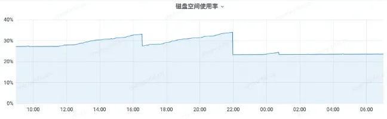

## 如何补写历史数据

具体参考[这里]()

注意，补的数据必须是在`retentionPerid`时间范围内的，如果一个本就是过期的数据写进去，会被直接丢弃。

## 如何对集群版进行扩缩容 {#resize}

1. 在新的机器上启动并运行新的`vmstorage`实例。
2. 为所有 vmselect 组件的`-storageNode`启动参数追加新的`vmstorage`实例地址。
3. 为一到两个 vminsert 组件的`-storageNode`启动参数追加新的`vmstorage`实例地址，重启后观察整个集群 timeseries 数量指标，此时集群会出现一定性能下降。
4. 等待整个集群趋于平稳后，升级重启剩余的`vminsert`组件，期间如果出现了集群抖动，需要暂缓升级步骤，等待集群平稳。
5. 若集群短期无法回稳，要么等待更长时间（最多2个小时），要么直接回滚。

**上述的`2,3`步骤一定不能反**，如果新 vmstorage 只在 vminsert 里，vmselect 里没有，那么写入到新 vmstorage 实例的数据会被无法查到，直到 vmselect 组件上也追加上这个新实例。

升级`vminsert`之所以需要缓慢重启，是因为`storageNode`列表变化会导致部分 timeseries 存储位置发生变化，比如之前存储在`A`Node上，重启后存储在`B`Node上。  
`B`节点上瞬间出现大量新 timeseries 时，会严重影响其性能，而且如果达到了`-storage.maxHourlySeries`或`-storage.maxDailySeries`限制，节点`B`可能会拒绝接收迁移过来的新 timeseries。

因此，我们只升级一到两个 vminsert 实例，先让少量的请求进行偏移，让发生迁移的 timeseries 在新的 Storage Node 创建出来 index（创建 index 是很吃资源的），再升级剩余的 vminsert。

## 集群版有效利用一机多盘 

vminsert 对传输的`-storageNode`地址列表采用一致性 hash 算法进行数据路由。而其多副本的策略是，每个`vmstorage`地址都会将自己的数据复制给后面相邻的2个`vmstorage`实例。

比如，`-storageNode`的参数值是`a,b,c,d`，而副本数`-replicationFactor`是`2`。那么`a`复制给`b`，`b`复制给`c`，`c`复制给`d`，`d`复制给`a`。这里的复制操作是在 vminsert 里完成的，每个 vmstorage 实例并不感知副本的存在（更多SN架构细节[见文档]()）。

因此我们可以在一个机器上，针对每个磁盘启动一个`vmstorage`实例，同时在`-storageNode`参数中，尽可能让同机器的 vmstorage 不相邻；不相邻的目的是避免一条数据的多个副本，都落在了同一台机器上的 vmstorage 实例上，
进而导致当一台机器故障时，一些指标的多个副本集体消失。

## 如何处理机器故障

机器故障的处理分为 2 个步骤，一个是将机器从集群摘除，另一个是在机器修复后加回到集群。后一步可参考[集群扩缩容](#resize)

按照下面的步骤将故障机从集群中摘除：

1. 从所有 vmselect 组件的`-storageNode`启动参数删掉故障的`vmstorage`实例地址。
1. 从所有 vminsert 组件的`-storageNode`启动参数删掉故障的`vmstorage`实例地址。

之所以优先摘除 vmselect 上的 Storage Node 是因为故障 Node 依然会被 vmselect 尝试查询，导致整个集群查询都变慢。

而 vminsert 组件自带了摘除能力，一个 Storage Node 不可用或很慢时，`vminsert`内部与之对应的 write buffer 会填满，填满后会自动将其置为 notready，并忽略它，所以对集群性能上的影响不会太大。

### 备份恢复？
如果你设置了多副本，那么大概率是不需要的。

因为故障机上的数据在它的(vminsert的`-storageNode`)相邻地址后面也有一份，而 vmselect 只要能够查到至少一份数据，就能返回正确结果。

## 如何处理磁盘空间不足

磁盘空间属于前期规划的，这种事故主要是因为前期规划失误。只能临时补救。具体有如下集中方法

### 强行 merge
让 vmstorage 执行 merge，会将多个 part merge 成一个 part，减少磁盘空间。有数据持续写入的 partition 会自动触发 merge，不要去强制 merge。所以只对历史 partition 进行 merge。

```shell
## 参数 partition_prefix 指定 partition，partition 的名字在 $DATA/data/small 下可以看到
curl 'http://localhost:8442/internal/force_merge?partition_prefix=2022_01'
```

效果如图所示：



磁盘使用率上升是因为 merge 过程创建新的 part 来  merge 老的多个 parts。突然下降代表 merge 结束，删掉老的 parts。

整个 merge 过程，CPU 和 Memory 几乎没有什么影响。merge 的耗时数个小时，跟数据量大小有关。

### 等待
如上所述，系统对多个 part 进行 merge 时，会临时使用一定的磁盘空间，合并后将老的 part 删除就会释放。

因此在磁盘不足时，可查看 vmstorage 是否正在执行 merge，如果是，可以等待其执行完毕。一次 merge 可能会执行是个小时甚至数天。

### 删除 cache
如果 cache 目录比较大，可以删除。但通常不会太大。

### 强制删除历史 partition
删除历史数据是最直接的。

1. 先 stop 掉 vmstorage 组件。
2. 删除`$DATA/data/{big,small}/YYYY_MM`目录。
3. 启动 vmstorage。

### 只有一个 partition ?
也就是这一个月而数据磁盘都扛不住，那么只能删除 part。part 的文件夹名称，包含着这个 part 的时间范围。可以根据这些数据删除历史 part。

```plain
./small/2022_02/93109700891_21411093_20220201043320.000_20220204141544.799_16CF806E39D42DF8
```

### 修改 retention
直接修改 vmstorage 的运行参数，让 retention 更短。然后重启，让 vmstorage 自己去删过期的 partition 也是OK的。

不过这就是永久生效了，而不是临时删下历史数据清理磁盘。

### <font style="color:rgb(216,57,49);">不要删 Series</font>
<font style="color:rgb(216,57,49);">因为删除 series 会带来额外很大的开销，让系统不稳定。而且它不会释放多少空间。</font>


## 查询结果不符合预期

如果你在 VictoriaMetrics 上查询到了非预期的或不稳定的数据，尝试按照下面的步骤来解决：

很多时候是因为查询语句本身就有问题，才会导致非预期的计算结果。建议阅读下[MetricsQL文档]()，特别是[子查询]()和[rollup函数]()部分。

1. 简化查询语句，检查内部子查询或指标的数据。比如，如果你的查询是`sum(rate(http_requests_total[5m])) by (job)`，那么就检查下面的这些语句是否符合预期。
    - 删掉最外层的`sum`，执行`rate(http_requests_total[5m])`，因为聚合逻辑可能会隐藏掉一些缺失的 timeseries，数据中的缺点或异常点。如果该查询返回的数据太多了，就试试往语句里增加一些 Label 过滤器。比如可以使用`rate(http_requests_total{job="foo"}[5m])`精准定位下目标异常数据。如果还是太多，就再加一些过滤器，来缩小目标范围。
    - 删掉外层的`rate`，只查询`http_requests_total`。同上，如果返回的数据太多了，就往语句里增加一些 Label 过滤器。


2. 如果简化后语句，返回了非预期或者不稳定的结果，那么就尝试使用接口 [/api/v1/export]() 把`[start..end]`时间范围内的数据都导出来，然后排查下原始打点是否符合预期。:
    
    
    
    ```sh {filename="单机"} 
    curl http://victoriametrics:8428/api/v1/export -d 'match[]=http_requests_total' -d 'start=...' -d 'end=...'
    ```
    
    
    ```sh {filename="集群"} 
    curl http://<vmselect>:8481/select/<tenantID>/prometheus/api/v1/export -d 'match[]=http_requests_total' -d 'start=...' -d 'end=...'
    ```
    
    

    
    请注意 [/api/v1/query]() and from [/api/v1/query_range]() 返回的是计算后的数据，而不是 db 中存储的原始样本。更多详情看[这篇文档](https://prometheus.io/docs/prometheus/latest/querying/basics/#staleness)。
    
    如果你是从 InfluxDB 迁移过来的，需要在单机版或在集群版的`vmselet`组件上使用`-search.setLookbackToStep`启动参数，
    更多详情看[这篇文档](https://docs.victoriametrics.com/guides/migrate-from-influx.html).
    
3. 有时候结果缓存可能也会导致查询结果不符合预期，因为`vmselect`或`vmsingle`将某段时间的某些指标缓存在本地，但这个时间段的数据在缓存后又发生了新的写入，即数据更新了。尝试用`nocache=1`参数进行查询，看结果是否会符合预期。
    * 如果问题出现在 cache 上，那么就用[resetRollupCache]()接口将缓存重置一下.
    * 使用`-search.disableCache`启动参数让单机版 VictoriaMetrics 或集群版的`vmselect`组件禁用缓存机制。
    * 使用`nocache=1`请求参数来请求`/api/v1/query`和 `/api/v1/query_range`。如果你在使用 Grafana，可以在 Prometheus 数据源设置里的`Custom Query Parameters`部分加上该参数。更多详情看[这篇文档](https://grafana.com/docs/grafana/latest/datasources/prometheus/)。
3. 如果你使用 VictoriaMetrics 的集群版本，那么当某些 `vmstorage` 节点暂时不可用时，它可能默认返回部分响应——详情请参见[集群可用性文档]()。如果你想优先保证查询的一致性而不是集群的可用性，那么可以向所有`vmselect`节点传递`-search.denyPartialResponse`启动参数。在这种情况下，只要有一个 `vmstorage` 节点不可用，VictoriaMetrics 就会在查询期间返回错误。另一种办法是向`/api/v1/query`和`/api/v1/query_range`传递`deny_partial_response=1`查询参数。如果你在使用 Grafana，可以在 Prometheus 数据源设置里的`Custom Query Parameters`部分加上该参数。更多详情看[这篇文档](https://grafana.com/docs/grafana/latest/datasources/prometheus/)
3. 如果你向`vmselect`传递`-replicationFactor`启动参数，那么建议从`vmselect`中移除此参数，因为当`vmstorage`节点包含的请求数据副本少于`-replicationFactor`时，这可能导致响应不完整。
3. 如果你发现最近写入的数据没有立即可见或可查询，请阅读更多关于[查询延迟]()行为的内容。
3. 尝试升级到最新版本的 VictoriaMetrics，并验证问题是否已解决。
3. 尝试使用`trace=1`查询参数执行查询。这将启用查询跟踪，返回内容中可能包含关于查询返回意外数据的有用信息。详情请参见[查询跟踪文档]()。
3. 检查传递给 VictoriaMetrics 组件的启动参数。如果你不清楚某些参数的用途或效果，请删掉。因为某些启动参数在设置不合理可能会以意想不到的方式改变查询结果。VictoriaMetrics 已针对默认参数值进行了优化，大部分场景不需要你调参。
3. 如果上述步骤未能帮助识别意外查询结果的根本原因，请提交一个包含如何重现问题的详细信息的[issue](https://github.com/VictoriaMetrics/VictoriaMetrics/issues/new)。与其在问题中分享截图，不如通过点击图表区域右上角的“导出查询”按钮，在 [VMUI]() 中分享查询和跟踪结果。
    

## 数据写入变慢 {#slow-insert}

下面列举的这些原因，可能会导致数据写入变慢：

1.  内存不足了，不足以支撑太多的[活跃时间序列]().

    VictoriaMetrics（或 VictoriaMetrics 集群版本中的 `vmstorage`）维护一个内存缓存，用来快速搜索每个查询指标的内部TSID。这个缓存名为`storage/tsid`。VictoriaMetrics 会根据运行 VictoriaMetrics（或`vmstorage`）的主机上的可用内存自动限制此缓存用量。如果缓存大小不足以容纳所有活动时间序列的数据，那么 VictoriaMetrics 会在磁盘上加载目标索引块，并解压缩，重新构建索引条目并将放入缓存。这个过程会消耗额外的 CPU 时间和磁盘读取 IO。

    VictoriaMetrics 的[官方 Grafana 仪表板]()包含一个 Slow inserts 图表，该图表显示数据写入期间`storage/tsid`缓存的缓存未命中百分比。如果 Slow inserts 图表在超过`10`分钟的时间内显示的值大于`5%`，那么很可能是当前的[活动时间序列](../faq.md#什么是what-is-active-timeseries)数量无法适应 `storage/tsid` 缓存。

    这个问题有如下几个解决办法：
    - **增加主机的可用内存**，直到 `slow inserts` 百分比低于 5%。如果运行的是 VictoriaMetrics 集群版本，则需要增加 `vmstorage` 节点的总可用内存。这可以通过两种方式实现：增加每个现有 `vmstorage` 节点的可用内存，或向集群添加更多 `vmstorage` 节点。
    - **减少活动时间序列的数量**。VictoriaMetrics 的[官方 Grafana 仪表板](https://docs.victoriametrics.com/#monitoring)包含一个显示活动时间序列数量的图表。VictoriaMetrics 的最新版本提供了[基数探索器](https://docs.victoriametrics.com/#cardinality-explorer)，可以帮助确定和修复[高基数]()的来源。


1. [高替换率]()，例如，当旧的时间序列以高频率被新的时间序列替换时。VictoriaMetrics 遇到新时间序列的样本时，需要在内部索引（即 `indexdb`）中注册时间序列，以便在后续选择查询中快速定位。注册新时间序列的过程比向已注册的时间序列添加新样本的过程慢一个数量级。因此，在[高替换率]()下，VictoriaMetrics 可能比预期的工作速度慢。  
    VictoriaMetrics 的[官方 Grafana 仪表板](https://docs.victoriametrics.com/#monitoring)提供了 `Churn rate` 图表，显示了过去 24 小时内注册的新时间序列的平均数量。如果这个数字超过了[活动时间序列]()的数量，则需要确定和修复[高替换率]()的来源。

1. 资源短缺，[VictoriaMetrics 官方 Grafana 仪表板](https://docs.victoriametrics.com/#monitoring) 包含 `resource usage` 图表，显示内存使用情况、CPU 使用情况、磁盘 IO 使用情况和可用磁盘大小。确保 VictoriaMetrics 有足够的可用资源，以便优雅地处理潜在的工作负载峰值，具体建议如下：

    如果 VictoriaMetrics 组件的可用资源较少，那么在工作负载稍微增加后可能会导致显著的性能下降。例如：
    - 如果可用 CPU 百分比接近 0，那么当数据摄取率稍微增加时，VictoriaMetrics 可能会在数据摄取过程中经历任意长的延迟。
    - 如果可用内存百分比达到 0，那么运行 VictoriaMetrics 组件的操作系统可能没有足够的内存用于 [页面缓存](https://en.wikipedia.org/wiki/Page_cache)。VictoriaMetrics 依赖页面缓存来快速查询最近摄取的数据。如果操作系统没有足够的可用内存用于页面缓存，那么它需要从磁盘重新读取请求的数据。这可能会显著增加磁盘读取 IO 并减慢查询和数据摄取的速度。
    - 如果可用磁盘空间低于 20%，那么 VictoriaMetrics 无法对传入数据执行最佳的后台合并。这会导致磁盘上的数据文件数量增加，进而减慢数据写入和查询速度。详情请参见[这些文档]()。

    建议保持以下资源使用率：
    - 50% 的空闲 CPU
    - 50% 的空闲内存
    - 20% 的空闲磁盘空间
    
6. 如果你运行的是 VictoriaMetrics 的集群版本，请确保 `vminsert` 和 `vmstorage` 组件位于同一网络内，并且它们之间的网络延迟较小。`vminsert` 将接收到的数据打包成批量数据包，并逐个发送给 `vmstorage`。它会等待 `vmstorage` 返回 `ack` 响应后再发送下一个数据包。如果 `vminsert` 和 `vmstorage` 之间的网络延迟较高（例如，它们运行在不同的数据中心），这可能会成为数据写入速度的限制因素。
   [VictoriaMetrics 集群版本的官方 Grafana 仪表板]() 包含 `vminsert` 组件的 `connection saturation` 图表。如果该图表达到 100%（1 秒），那么很可能是 `vminsert` 和 `vmstorage` 之间的网络延迟问题。另一个可能导致 `vminsert` 和 `vmstorage` 之间连接饱和度达到 100% 的问题是 `vmstorage` 节点的资源短缺。在这种情况下，你需要增加 `vmstorage` 节点的可用资源（CPU、RAM、磁盘 IO），或者向集群中添加更多的 `vmstorage` 节点。
7. 资源被其他服务抢占。确保 VictoriaMetrics 组件运行在没有其他资源密集型应用程序的环境中。这些应用程序可能会抢占 VictoriaMetrics 组件所需的 RAM、CPU、磁盘 IO 和网络带宽。这类问题很难通过 [VictoriaMetrics 集群版本的官方 Grafana 仪表板]() 捕捉到，正确的诊断需要检查运行 VictoriaMetrics 的实例上的资源使用情况。
8. 如果你在单节点 VictoriaMetrics 或 `vmstorage` 有足够的空闲 CPU 和 RAM ，那么请增加单节点 VictoriaMetrics 或 `vmstorage` 上 `-cacheExpireDuration` 启动参数的值，使其大于时间序列的写入样本之间的间隔（即 `scrape_interval`）。有关更多详细信息，请参见[此评论](https://github.com/VictoriaMetrics/VictoriaMetrics/issues/3976#issuecomment-1476883183)。
9. 如果你看到 VictoriaMetrics 组件的 CPU 使用率持续处在反常高位，请检查相应 [Grafana 仪表板](https://grafana.com/orgs/victoriametrics) 中 `Resource usage` 部分的 `CPU spent on GC` 面板。如果 GC 占用的 CPU 时间百分比很高，那么可以通过将 [GOGC](https://tip.golang.org/doc/gc-guide#GOGC) 环境变量更改为更高的值来减少组件的 CPU 使用率，其代价是内存开销更大。默认情况下，VictoriaMetrics 组件使用 `GOGC=30`。尝试使用 `GOGC=100` 运行 VictoriaMetrics 组件，看看是否有助于降低 CPU 使用率。


## 慢查询

一些查询可能比其他查询消耗更多的时间和资源（CPU、RAM、网络带宽）。如果查询执行时间超过 `-search.logSlowQueryDuration` 启动参数设定的持续时间（默认 5 秒），VictoriaMetrics 会视其为慢查询并记录到日志里。

VictoriaMetrics 提供了 [VMUI 的 `top queries` 页面](https://docs.victoriametrics.com/#top-queries)，显示执行时间最长的查询。

以下是提高慢查询性能的解决方案：
- **增加 VictoriaMetrics 的 CPU 和内存**。如果你使用的是 VictoriaMetrics 的集群版本，那么将 `vmselect` 节点迁移到具有更多 CPU 和 RAM 资源的机器上应该有助于提高慢查询的速度。查询性能始终受处理查询的单个 `vmselect` 节点资源的限制。例如，如果`vmselect`上的 2 核心 CPU 不能快速处理查询，那么将 `vmselect` 迁移到具有 4 核 CPU 的机器上应该可以将重查询性能提高最多 2 倍。如果 [VictoriaMetrics 官方 Grafana 仪表板]() 上的 `concurrent select` 图表达到了限制，则应优先向集群添加更多`vmselect`节点。有时增加更多的`vmstorage`节点也可以帮助提高慢查询的速度。
- **重写慢查询，使其变得更快**。不幸的是，仅通过查看查询很难确定它是否慢。
  实践中慢查询的主要来源是使用了过大回溯窗口的 [告警和记录规则](https://docs.victoriametrics.com/vmalert/#rules)。这些查询经常用于 SLI/SLO 计算，例如 [Sloth](https://github.com/slok/sloth)。  
  举个例子，`avg_over_time(up[30d]) > 0.99` 需要每次执行时读取和处理过去 30 天内 `up` [时间序列]() 的所有 [原始样本]()。如果此查询频繁执行，则可能占用大量的 CPU、磁盘读取 IO、网络带宽和 RAM。可以通过以下方式优化此类查询：
    - **减少方括号中的回溯窗口**。例如，`avg_over_time(up[10d])` 在 VictoriaMetrics 上所需的计算资源最多比 `avg_over_time(up[30d])` 少 3 倍。
    - **增加告警和记录规则的评估间隔**，使其执行频率降低。例如，将 [vmalert]() 上 `-evaluationInterval` 启动参数的值从 `1m` 增加到 `2m` 应该可以将 VictoriaMetrics 的计算资源使用量减少 2 倍。

  另一个慢查询的来源是 [子查询]() 使用不当。如果你不清楚它们的工作原理，建议避免使用子查询。用户很容易在不知情的情况下创建子查询。例如，`rate(sum(some_metric))` 根据 [MetricsQL 查询的隐式转换规则]() 被隐式转换为以下子查询：
  ```
    rate(
    sum(
        default_rollup(some_metric[1i])
    )[1i:1i]
    )
  ```
  这个查询可能不会返回预期的结果。相反，应该使用 `sum(rate(some_metric))`。详情请参见[这篇文章](https://www.robustperception.io/rate-then-sum-never-sum-then-rate)。

  VictoriaMetrics 提供了 [查询跟踪]() 功能，可以帮助确定慢查询的来源。另请参见[这篇文章](https://valyala.medium.com/how-to-optimize-promql-and-metricsql-queries-85a1b75bf986)，解释了如何确定和优化慢查询。

## OOM(Out of memory)

VictoriaMetrics 中最常见的内存不足（即 OOM）崩溃来源如下：
1. **不当的启动参数值**。检查传递给 VictoriaMetrics 组件的启动参数。如果你不清楚某些参数的用途或效果，请将它们从运行参数中移除。不当的启动参数值可能导致内存和 CPU 使用量增加。内存使用量的增加会增加 OOM 崩溃的几率。VictoriaMetrics 已针对默认参数值进行了优化。
    例如，不建议调整 VictoriaMetrics 中的缓存大小，因为这经常会导致 OOM 异常。[这些文档]()提到了一些不建议调整的启动参数。如果你发现 VictoriaMetrics 需要增加某些缓存大小以适应当前工作负载，那么最好迁移到具有更多内存的主机，而不是尝试手动调整缓存大小。
2. **意外的重查询**。如果查询需要选择和处理数百万个 timeseries，则该查询被认为是重查询。这样的查询可能导致 OOM 异常，因为 VictoriaMetrics 需要在内存中保留一些 timeseries 的数据。VictoriaMetrics 提供了[各种设置]()，可以帮助限制资源使用。更多背景信息，请参见[如何优化 PromQL 和 MetricsQL 查询](https://valyala.medium.com/how-to-optimize-promql-and-metricsql-queries-85a1b75bf986)。VictoriaMetrics 还提供了[查询跟踪器](../query/metricsql/_index.md/#tracing)，以帮助识别重查询的来源。
3. **缺少内存处理突发的工作负载**。如果 VictoriaMetrics 组件在当前流量压力下使用了几乎所有可用内存，那么建议迁移到具有更大内存的主机。这将防止在突发流量抖动时可能发生的 OOM 情况。建议至少有 50% 的可用内存，以优雅地处理可能的流量波动。请参见[单节点 VictoriaMetrics 的容量规划]()和[集群版本 VictoriaMetrics 的容量规划]()。


## 集群抖动

VictoriaMetrics 集群可能会在没有足够的可用资源（CPU、RAM、磁盘 IO、网络带宽）来处理当前流量压力时变得不稳定。

集群不稳定的最常见原因有：

- **突发流量波动**。例如，如果活动时间序列的数量增加了 2 倍，而集群没有足够的可用资源来处理增加的 timeseries，那么它可能会变得不稳定。VictoriaMetrics 提供了各种配置设置，可用于限制意外的突发流量。详情请参见[这些文档]()。
- **各种维护任务**，如滚动升级或配置更改时的组件重启。例如，如果一个集群包含 `N=3` 个 `vmstorage` 节点，并且它们逐个重启（即滚动重启），那么在滚动重启期间，集群将只有 `N-1=2` 个健康的 `vmstorage` 节点。这意味着健康的 `vmstorage` 节点的负载相比滚动重启前至少增加了 `100%/(N-1)=50%`。例如，它们需要处理比平时多`50%`的数据。实际上，剩余的`vmstorage`节点的负载增加不止这些，因为它们需要注册从暂不可用的 `vmstorage` 节点重新路由过来的新时间序列。如果 `vmstorage` 节点在滚动重启前的可用资源（CPU、RAM、磁盘 IO）少于 50%，那么这可能导致集群过载和数据写入及查询的不稳定。
  滚动重启期间的负载增加可以通过增加集群中的 `vmstorage` 节点数量来减少。例如，如果 VictoriaMetrics 集群包含 `N=11` 个 `vmstorage` 节点，那么 `vmstorage` 节点滚动重启期间的负载增加将为 `100%/(N-1)=10%`。建议集群中至少有 8 个 `vmstorage` 节点。如果启用了多副本，建议的 `vmstorage` 节点数量最好乘以 `-replicationFactor`，详情请参见[复制和数据安全文档]()。
- **时间序列 Hash**。接收到的时间序列由 `vminsert` 在配置的 `vmstorage` 节点之间一致性 Hash。作为分片 Key，`vminsert` 使用时间序列名称和 Label，并遵循它们的顺序。如果时间序列中的 Label 顺序不断变化，可能导致每次 hash 的结果不一样，进而导致可用 `vmstorage` 之间的时间序列分布不均。系统期望客户端负责 Label 的顺序始终保持一致（如 `Prometheus` 或 `vmagent` 在采集时保证）。如果无法保证这一点，请为 `vminsert` 设置 `-sortLabels=true` 启动参数。但排序可能会增加 `vminsert` 的 CPU 消耗。

针对 VictoriaMetrics 集群不稳定的明显解决方案是确保集群组件有足够的可用资源来优雅地处理增加的工作负载。详情请参见[容量规划文档]()和[集群调整和可扩展性文档]()。