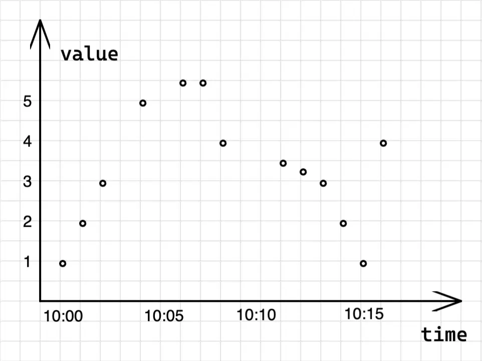
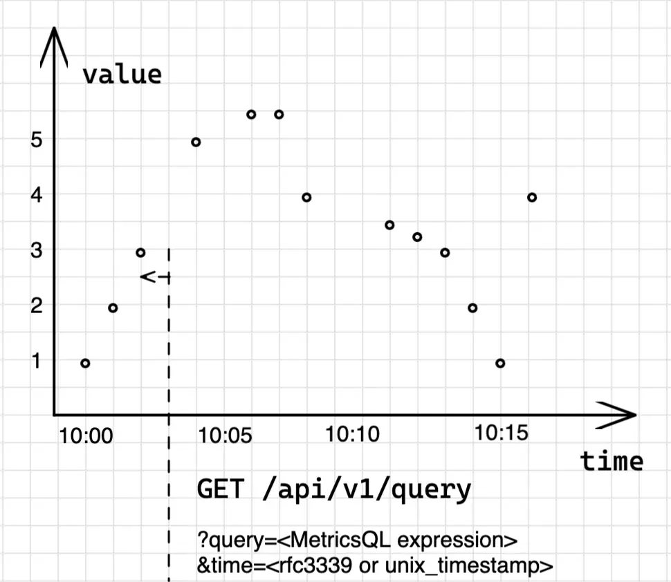
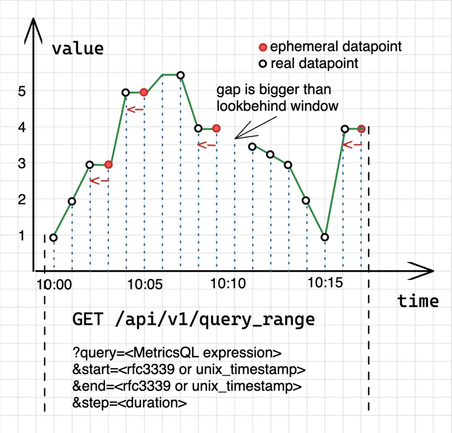
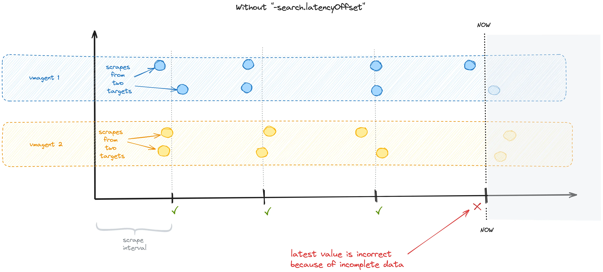
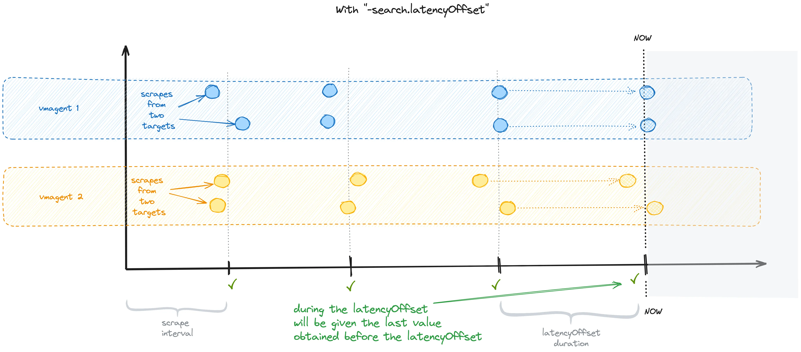

VictoriaMetrics 提供了一个 [HTTP API]() 用于处理数据查询。这些 API 被用于各种集成使用，例如[Grafana]()。相同的 API 也被 [VMUI]() 使用，VMUI 是一个用于查询和可视化指标的图形用户界面。

系统包含两个主要的 API，用于处理 [Instant Query(即时查询)](#instant-query)和 [Range Query(范围查询)](#range-query)。

## Instant Query（即时查询） {#instant-query}

Instant Query 在指定的时间点上执行查询：
```
GET | POST /api/v1/query?query=...&time=...&step=...&timeout=...
```

参数：

- `query`- MetricsQL 查询语句.
- `time`- 可选参数，以**秒**为精度来执行查询。如果省略，时间将设置为`now()`(当前时间戳)。`time`参数值可以用[很多种格式](#timestamp)给定。
- `step`- 可选参数，在执行查询时，在最近多久的时间[间隔](https://prometheus.io/docs/prometheus/latest/querying/basics/#time-durations)内查找[raw sample]()数据（当在指定时间缺少样本时使用）。例如，请求`/api/v1/query?query=up&step=1m`表示在`now()`和`now()-1m`之间的时间段内查找指标`up`的最近写入数据点。如果省略，`step`默认设置为`5m`(5分钟)。
- `timeout`- 可选参数，查询超时时间。例如，`timeout=5s`会在`5s`后取消请求。默认的超时时间会使用系统参数`-search.maxQueryDuration`指定的值。 该参数在单机版 VictoriaMetrics 和 vmselect 组件都有支持。

即时查询的结果是一个符合查询表达式中过滤条件的 [timeseries]() 列表。每个返回的 timeseries 都包含一个（时间戳，值）样本条目，即 [sample]()，其中时间戳等于查询参数中的时间，而值代表数据结果。

要了解即时查询的工作原理，让我们从一个原始数据样本开始：

```
foo_bar 1.00 1652169600000 # 2022-05-10 10:00:00
foo_bar 2.00 1652169660000 # 2022-05-10 10:01:00
foo_bar 3.00 1652169720000 # 2022-05-10 10:02:00
foo_bar 5.00 1652169840000 # 2022-05-10 10:04:00, 丢了 1 个数据点
foo_bar 5.50 1652169960000 # 2022-05-10 10:06:00, 丢了 1 个数据点
foo_bar 5.50 1652170020000 # 2022-05-10 10:07:00
foo_bar 4.00 1652170080000 # 2022-05-10 10:08:00
foo_bar 3.50 1652170260000 # 2022-05-10 10:11:00, 丢了 2 个数据点
foo_bar 3.25 1652170320000 # 2022-05-10 10:12:00
foo_bar 3.00 1652170380000 # 2022-05-10 10:13:00
foo_bar 2.00 1652170440000 # 2022-05-10 10:14:00
foo_bar 1.00 1652170500000 # 2022-05-10 10:15:00
foo_bar 4.00 1652170560000 # 2022-05-10 10:16:00
```

上面的数据包含了`foo_bar`时间序列的样本列表，样本之间的时间间隔从`1m`到`3m`不等。如果我们将这个数据样本绘制在图表上，它将具有以下形式：



为了获取`foo_bar`这个时间序列在特定时间的数值，比如`2022-05-10 10:03:00`，在 VictoriaMetrics 中我们使用即时查询：

```sh
curl "http://<victoria-metrics-addr>/api/v1/query?query=foo_bar&time=2022-05-10T10:03:00.000Z"
```

```json
{
  "status": "success",
  "data": {
    "resultType": "vector",
    "result": [
      {
        "metric": {
          "__name__": "foo_bar"
        },
        "value": [
          1652169780, // 2022-05-10 10:03:00
          "3"
        ]
      }
    ]
  }
}
```
作为返回值，VictoriaMetrics 返回了一个值为`3`的 (时间戳, 样本值) 数据，表示在给定时间`2022-05-10 10:03:00`的`foo_bar`序列。  
但是，如果我们再次查看原始数据样本，会发现`2022-05-10 10:03:00`并没有写入样本数据。  
当请求的时间戳没有原始样本时，VictoriaMetrics 会尝试找到距离请求时间最近的一条样本：




VictoriaMetrics 尝试在`step`时间范围(默认为`5m`)内寻找最近样本数据作为替代。

即时查询可能返回多个时间序列，但每个序列只有一个数据样本。即时查询用于以下场景：

- 获取最后写入的值；
- 用于`count_over_time`等汇总函数；
- 用于警报规则，因为告警通常关注最新的数据；
- 在 Grafana 中绘制 Stat 或 Table 面板。

## Range Query（范围查询） {#range-query}

Range Query 在给定的`[start...end]`时间范围内使用`step`大小的间隔执行查询语句

```
GET | POST /api/v1/query_range?query=...&start=...&end=...&step=...&timeout=...
```

请求参数:

- `query`- MetricsQL 查询语句。
- `start`- 执行查询语句的[开始时间](#timestamp)。
- `end`- 可选参数，执行查询语句的[结束时间](#timestamp)，如果没有传参，则自动使用当前时间。
- `step`- 可选参数，查询语句返回的数据点之间的间隔。查询语句会在`start`, `start+step`,`start+2*step`, …, `end`这些时间点上执行查询语句。如果`step`参数没有传，则默认为`5m`(5分钟)。
- `timeout`- 可选参数，查询超时时间。默认的超时时间会使用启动参数`-search.maxQueryDuration`指定的值。 该参数在单机版 VictoriaMetrics 和集群版的 vmselect 组件都有支持。

Range Query 的查询结果是一组匹配了`query`语句中过滤器的 [timeseries]() 列表。结果中的每一个 series 都包含**一组**（时间戳，样本值）数据，这些数据就是查询语句在时间`start`,`start+step`,`start+2*step`, …,`end`这些时间点上执行的查询结果。  
换句话说，Range Query 其实就是在`start`,`start+step`, …, `end`这些时间点上独立执行了 [Instant Query](#instant-query)，然后把执行结果数据放到一块返回。

比如，获取`foo_bar`指标在时间`2022-05-10 09:59:00`到`2022-05-10 10:17:00`范围内的数据，我们可以发送范围查询请求：

```sh
curl "http://<victoria-metrics-addr>/api/v1/query_range?query=foo_bar&step=1m&start=2022-05-10T09:59:00.000Z&end=2022-05-10T10:17:00.000Z"
```

```json
{
  "status": "success",
  "data": {
    "resultType": "matrix",
    "result": [
      {
        "metric": {
          "__name__": "foo_bar"
        },
        "values": [
          [
            1652169600,
            "1"
          ],
          [
            1652169660,
            "2"
          ],
          [
            1652169720,
            "3"
          ],
          [
            1652169780,
            "3"
          ],
          [
            1652169840,
            "7"
          ],
          [
            1652169900,
            "7"
          ],
          [
            1652169960,
            "7.5"
          ],
          [
            1652170020,
            "7.5"
          ],
          [
            1652170080,
            "6"
          ],
          [
            1652170140,
            "6"
          ],
          [
            1652170260,
            "5.5"
          ],
          [
            1652170320,
            "5.25"
          ],
          [
            1652170380,
            "5"
          ],
          [
            1652170440,
            "3"
          ],
          [
            1652170500,
            "1"
          ],
          [
            1652170560,
            "4"
          ],
          [
            1652170620,
            "4"
          ]
        ]
      }
    ]
  }
}
```

在返回结果中，VictoriaMetrics 为`foo_bar`指标在时间`2022-05-10 09:59:00`到`2022-05-10 10:17:00`范围返回了`17`个（时间戳，样本值）的数据。但是，我们再看一下原始样本数据，会发现原始数据只有`13`个数据点。

其原因是 Range Query 实际上在时间范围`[start...end]`内执行了`1 + (start-end)/step`次 [Instant Query](#instant-query)。如果我们将请求的返回结果绘制成看板图，则如下所示：



蓝色的虚线代表的是系统在这些时间点上执行了 Instant Query。
由于 Instant Query 保留了补点能力，所以图中包含两种类型的数据点：真实数据点和临近数据点。临近数据点总是使用最近写入的[`raw sample`]()（见上图中的红色箭头）。

这种补点的特性来自于 [PULL 模型]()的设计前提细节：

- Metrics 数据是以固定间隔抓取采集的。
- 如果监控系统负载过高，抓取动作可能会被跳过。
- 抓取动作可能因为网络原因失败。

根据这些前提细节，假设范围查询缺少[`raw sample`]()，那么很可能是一次抓取遗漏了，因此它会用之前的`raw sample`填充。
同样的情况也适用于`step`小于样本之间实际间隔的情况。实际上，如果我们为相同的请求设置`step=1s`，我们将在返回数据中得到大约`1000`个数据点，但其中大多数是临时数据点。

有时，用于定位数据点的回溯窗口不够大，图表中会出现空白。对于 Range Query，回溯窗口不等于`step`参数。它是根据请求时间范围内的前`20`个[`raw samples`]()之间间隔的中位数计算的。通过这种方式，VictoriaMetrics 就能自动调整回溯窗口以填补空白并同时检测过时的序列。

Range Query 主要用于绘制指定时间范围内的时间序列数据。这些查询在以下场景中非常有用：

- 跟踪给定时间范围内的指标状态；
- 关联多个指标在时间范围内的变化；
- 观察指标变化的趋势和动态。

如果你需要导出原始写入指标，可以使用[导出接口]()。

## 数据延时 {#latency}

默认情况下，VictoriaMetrics 不会立即返回最近写入的样本。相反，它会检索在`-search.latencyOffset`启动参数指定的时间之前写入的最后结果，该参数的默认值为 30 秒。适用于`query`和`query_range`2类接口，这可能会给人带来一种数据写入有以 30 秒延迟的感觉。

此参数的目的是为了防止最近一次采集间隔中，只有一部分指标写入到了数据库，而导致统计类查询结果错误。

下面我们用几个示意图来解释下将`-search.latencyOffset`设置为`0`会出现什么问题：



如果设置了该参数，VM 将在整个`-search.latencyOffset`持续时间内返回在`-search.latencyOffset`持续时间之前写入的最后一个指标数据。



可以通过`latency_offset`查询参数在每个查询请求中覆盖`-search.latencyOffset`启动参数给的默认值。

VictoriaMetrics 将最近写入的样本缓存在内存中长达几秒钟，然后定期将这些样本刷新到磁盘。这种缓冲提高了数据写入性能。即使将`-search.latencyOffset`启动参数设置为`0`，或者将`latency_offset`查询参数设置为`0`，缓冲的样本在查询结果中也是看不到的。

你可以向单机版的 VictoriaMetrics 的`/internal/force_flush`发送 HTTP 请求，或向[集群版的 VictoriaMetrics]() 的 vmstorage 发送请求，另其强制将缓冲的样本刷新到磁盘，使数据能够被及时查到。  
但通常`/internal/force_flush`接口仅用于调试和测试目的。不要在生产环境中调用它，因为这可能会显著降低数据写入性能并增加资源消耗。

可观测场景，因为数据源头采集一般就是按照`30s`一次的频率，所以数据天然就会至少有`30s`的延时，所以几秒的缓存带来的延时对于观测业务场景是完全可接受的，这对上层业务的感知影响微乎其微，但对 TSDB 带来的性能收益却是非常大的。

## 查询优化技巧
+ VictoriaMetrics 接受`extra_label=<label_name>=<label_value>`查询参数（可选），可以用于强制使用额外 Label 过滤器执行查询。例如，`/api/v1/query_range?extra_label=user_id=123&extra_label=group_id=456&query=<query>`会自动将`{user_id="123",group_id="456"}`Label 过滤器添加到给定的查询中。  
此功能可用于限制给定租户可见的 timeseries 范围。一般`extra_label`查询参数由位于 VictoriaMetrics 前面的查询代理服务自动设置。
+ VictoriaMetrics 接受`extra_filters[]=series_selector`查询参数（可选），可用于对查询强制执行任意的 Label 过滤器。例如，`/api/v1/query_range?extra_filters[]={env=~"prod|staging",user="xyz"}&query=<query>`将自动将`{env=~"prod|staging",user="xyz"}`Label 过滤器添加到给定的查询中。此功能可用于限制给定租户可见的 timeseries 范围。我们建议在 VictoriaMetrics 前面的查询代理自动设置`extra_filters[]`查询参数。其实就是`extra_label`参数的增强版，因为可以用正则等。
+ VictoriaMetrics 接受多种格式的`time`，`start`和`end`查询参数，可参考[这些文档](#timestamp)。
+ VictoriaMetrics 对于[`/api/v1/query`](#instant-query)和[`/api/v1/query_range`](#range-query)接口支持`round_digits`查询参数。它可用于指定返回的指标值的保留小数点位数。例如，`/api/v1/query?query=avg_over_time(temperature[1h])&round_digits=2`会将让返回的指标值保留小数点后面 2 位。
+ VictoriaMetrics 允许在[`/api/v1/labels`]()和[`/api/v1/label/<labelName>/values`]()接口中使用`limit`查询参数来限制返回的条目数量。例如，对`/api/v1/labels?limit=5`的查询请求最多返回 5 个唯一的 Label 值，并忽略其他 Label。如果提供的`limit`值超过了相应的启动参数`-search.maxTagKeys`或`-search.maxTagValues`，则会使用启动参数中指定的限制。
+ 默认情况下，VictoriaMetrics 从[`/api/v1/series`]()、[`/api/v1/labels`]()  和[`/api/v1/label/<labelName>/values`]()返回最近一天从`00:00 UTC`开始的 series 数据，而 Prometheus API 默认返回所有时间的数据。  
如果要选择特定的时间范围的 series 数据，可使用`start`和`end`参数指定。  
由于性能优化的考虑，VictoriaMetrics会将指定的`start..end`时间范围舍入到天的粒度。如果您需要在给定时间范围内获取精确的 Label 集合，请将查询发送到[`/api/v1/query`](#instant-query)或[`/api/v1/query_range`](#range-query)。
+ VictoriaMetrics 在[/api/v1/series]()中接受`limit`查询参数，用于限制返回的条目数量。例如，对`/api/v1/series?limit=5`的查询将最多返回 5 个 series，并忽略其余的时间序列。如果提供的`limit`值超过了相应的启动参数`-search.maxSeries`的值，则会使用命令行中指定的限制。
+ 此外，VictoriaMetrics还提供了以下接口：
  - `/vmui`- 基本的 Web UI 界面，阅读[这些文档](https://docs.victoriametrics.com/Single-server-VictoriaMetrics.html#vmui)。 
  - `/api/v1/series/count`- 返回数据库中 timeseries 的总数量。注意：
    * 该接口扫描了整个数据库的倒排索引，所以如果数据库包含数千万个 series 时间序列，它可能会很慢。
    * 该接口可能把[删除 time series](https://docs.victoriametrics.com/Single-server-VictoriaMetrics.html#how-to-delete-time-series) 计算在内，这是内部实现导致的。
  - `/api/v1/status/active_queries`- 返回当前正在执行的查询。
  - `/api/v1/status/top_queries`- 返回下面几个查询列表:
    * 执行最频繁的查询列表 - `topByCount`
    * 平均执行时间最长的查询列表 - `topByAvgDuration`
    * 执行时间最长的查询列表 - `topBySumDuration`
    * 返回的查询个数可以使用`topN`参数进行限制。历史查询可以使用`maxLifetime`参数过滤掉。比如，请求`/api/v1/status/top_queries?topN=5&maxLifetime=30s`返回最近 30 秒内每个类型的 Top5 个查询列表。VictoriaMetrics 会跟踪统计最近`-search.queryStats.lastQueriesCount`时间内，且执行时间大于`search.queryStats.minQueryDuration`的查询。


## Timestamp 格式 {#timestamp}

VictoriaMetrics 在查询和导出接口中会接收`time`,`start`,`end`参数。系统这些时间参数支持如下几种写法：

+ **Unix 秒级时间戳**，float 类型，小数部分代表的是毫秒。比如，`1562529662.678`。
+ **Unix 毫秒级时间戳**。比如，`1562529662678`。
+ [**RFC3339**](https://www.ietf.org/rfc/rfc3339.txt)。比如， `2022-03-29T01:02:03Z`or `2022-03-29T01:02:03+02:30`.
+ **RFC3339 的省略格式**。比如：`2022`, `2022-03`, `2022-03-29`, `2022-03-29T01`, `2022-03-29T01:02`, `2022-03-29T01:02:03`。该 RFC3339 格式默认是使用 UTC 时区的。可以使用`+hh:mm`or `-hh:mm`后缀来指定时区。比如，`2022-03-01+06:30`代表`2022-03-01`是`06:30`时区。
+ **基于当前时间的相对时间**。比如`1h5m`,`-1h5m`或`now-1h5m`均代表 1小时5分钟之前，这里的`now`表示当前时间。