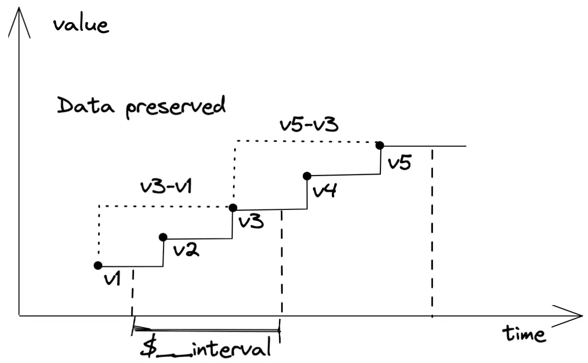
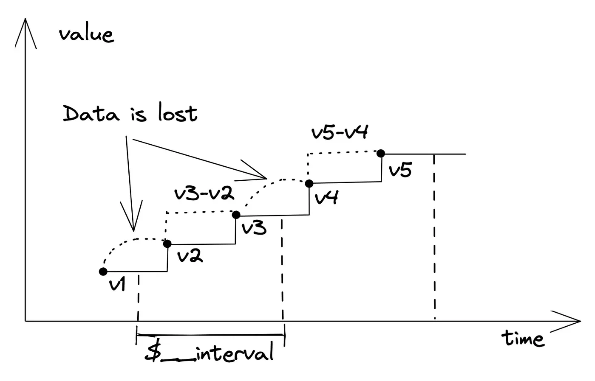
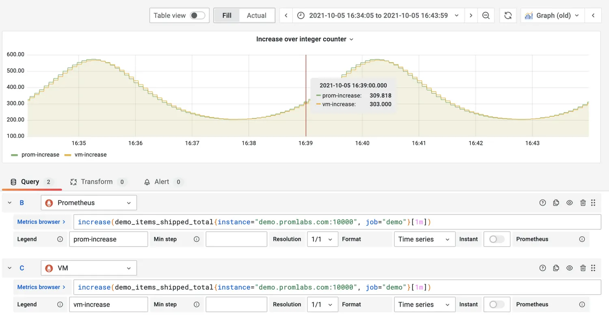
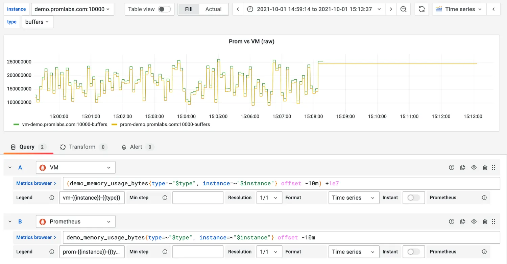

VictoriaMetrics提供了一种特殊的查询语言，用于执行查询语句 - MetricsQL。它是一个类似 [PromQL](https://prometheus.io/docs/prometheus/latest/querying/basics) 的查询语言，具有强大的函数和功能集，专门用于处理时间序列数据。MetricsQL完全兼容PromQL，因此他们之间大部分概念都是共享的。

所以，使用VictoriaMetrics替换Prometheus后，由Prometheus数据源创建的Grafana仪表板不会收到任何影响。然而，这两种语言之间存在[一定的差异](#diff)。

一个[独立的 MetricQL 库](https://godoc.org/github.com/VictoriaMetrics/metricsql)可用于在其他应用中解析 MetricQL 语句。

如果你对 PromQL 不熟，建议阅读一下[这篇文章]()。

MetricsQL 在以下功能上与 PromQL 实现方式不同，这些不同改进了用户体验：

+ MetricsQL在计算范围函数（如`rate`和`increase`）时，考虑了方括号中窗口之前的上一个点。这样可以返回用户对于`increase(metric[$__interval])`查询所期望的精确结果，而不是Prometheus为此类查询返回的不完整结果。 
+ MetricsQL不会推断范围函数的结果。这解决了 [Prometheus 中存在的问题](https://github.com/prometheus/prometheus/issues/3746)。有关VictoriaMetrics和Prometheus计算`rate`和`increase`的技术细节，请参阅 [issue](https://github.com/VictoriaMetrics/VictoriaMetrics/issues/1215#issuecomment-850305711)。 
+ MetricsQL对于 step 小于抓取间隔的rate查询返回预期非空响应。这解决了 [Grafana 中存在的问题](https://github.com/grafana/grafana/issues/11451)。还请参阅[这篇文章](https://www.percona.com/blog/2020/02/28/better-prometheus-rate-function-with-victoriametrics/)。
+ MetricsQL将`scalar`类型与没有 Label 的`instant vector`视为相同，因为这些类型之间微小差异通常会让用户感到困惑。有关详细信息，请参阅[相应的 Prometheus 文档](https://prometheus.io/docs/prometheus/latest/querying/basics/#expression-language-data-types)。 
+ MetricsQL从输出中删除所有`NaN`值，因此一些查询（例如`(-1)^0.5`）在VictoriaMetrics中返回空结果，在Prometheus中则返回一系列NaN值。请注意，Grafana不会为NaN值绘制任何线条或点，因此最终结果在VictoriaMetrics和Prometheus上看起来是相同的。 在应用函数后，
+ MetricsQL保留指标名称，并且该函数不改变原始时间序列的含义。例如，`min_over_time(foo)`或`round(foo)`将在结果中保留`foo`指标名称。有关详细信息，请参阅[issue](https://github.com/VictoriaMetrics/VictoriaMetrics/issues/674)。

## MetricQL 功能特性
MetricsQL 除了实现了 PromQL 的所有功能，还额外增加了下面的特性，这些特性目的解决实际应用场景中遇到的问题。如果你认为 MetricsQL 中缺失一些有用的功能，可以[提交一个 Feature Request](https://github.com/VictoriaMetrics/VictoriaMetrics/issues)

这些特性可以在 [VictoriaMetrics playground](https://play.victoriametrics.com/select/accounting/1/6a716b0f-38bc-4856-90ce-448fd713e3fe/prometheus/graph/) 进行验证，也可以在你自己的 [VictoriaMetrics 实例]()上验证。

MetricsQL 特性列表:

+ Graphite-compatible filters can be passed via `{__graphite__="foo.*.bar"}` syntax. See [these docs](https://docs.victoriametrics.com/#selecting-graphite-metrics). VictoriaMetrics also can be used as Graphite datasource in Grafana. See [these docs](https://docs.victoriametrics.com/#graphite-api-usage) for details. See also [label_graphite_group](https://docs.victoriametrics.com/MetricsQL.html#label_graphite_group) function, which can be used for extracting the given groups from Graphite metric name.
+ Lookbehind window in square brackets may be omitted. VictoriaMetrics automatically selects the lookbehind window depending on the current step used for building the graph (e.g. `step` query arg passed to [/api/v1/query_range](https://docs.victoriametrics.com/keyConcepts.html#range-query)). For instance, the following query is valid in VictoriaMetrics: `rate(node_network_receive_bytes_total)`. It is equivalent to `rate(node_network_receive_bytes_total[$__interval])` when used in Grafana.
+ [Series selectors](https://docs.victoriametrics.com/keyConcepts.html#filtering) accept multiple `or` filters. For example, `{env="prod",job="a" or env="dev",job="b"}` selects series with either `{env="prod",job="a"}` or `{env="dev",job="b"}` labels. See [these docs](https://docs.victoriametrics.com/keyConcepts.html#filtering-by-multiple-or-filters) for details.
+ [Aggregate functions](https://docs.victoriametrics.com/MetricsQL.html#aggregate-functions) accept arbitrary number of args. For example, `avg(q1, q2, q3)` would return the average values for every point across time series returned by `q1`, `q2` and `q3`.
+ [@ modifier](https://prometheus.io/docs/prometheus/latest/querying/basics/#modifier) can be put anywhere in the query. For example, `sum(foo) @ end()` calculates `sum(foo)` at the `end` timestamp of the selected time range `[start ... end]`.
+ Arbitrary subexpression can be used as [@ modifier](https://prometheus.io/docs/prometheus/latest/querying/basics/#modifier). For example, `foo @ (end() - 1h)` calculates `foo` at the `end - 1 hour` timestamp on the selected time range `[start ... end]`.
+ [offset](https://prometheus.io/docs/prometheus/latest/querying/basics/#offset-modifier), lookbehind window in square brackets and `step` value for [subquery](https://docs.victoriametrics.com/MetricsQL.html#subqueries) may refer to the current step aka `$__interval` value from Grafana with `[Ni]` syntax. For instance, `rate(metric[10i] offset 5i)` would return per-second rate over a range covering 10 previous steps with the offset of 5 steps.
+ [offset](https://prometheus.io/docs/prometheus/latest/querying/basics/#offset-modifier) may be put anywhere in the query. For instance, `sum(foo) offset 24h`.
+ Lookbehind window in square brackets and [offset](https://prometheus.io/docs/prometheus/latest/querying/basics/#offset-modifier) may be fractional. For instance, `rate(node_network_receive_bytes_total[1.5m] offset 0.5d)`.
+ The duration suffix is optional. The duration is in seconds if the suffix is missing. For example, `rate(m[300] offset 1800)` is equivalent to `rate(m[5m]) offset 30m`.
+ The duration can be placed anywhere in the query. For example, `sum_over_time(m[1h]) / 1h` is equivalent to `sum_over_time(m[1h]) / 3600`.
+ Numeric values can have `K`, `Ki`, `M`, `Mi`, `G`, `Gi`, `T` and `Ti` suffixes. For example, `8K` is equivalent to `8000`, while `1.2Mi` is equivalent to `1.2*1024*1024`.
+ Trailing commas on all the lists are allowed - label filters, function args and with expressions. For instance, the following queries are valid: `m{foo="bar",}`, `f(a, b,)`, `WITH (x=y,) x`. This simplifies maintenance of multi-line queries.
+ Metric names and label names may contain any unicode letter. For example `температура{город="Киев"}` is a value MetricsQL expression.
+ Metric names and labels names may contain escaped chars. For example, `foo\-bar{baz\=aa="b"}` is valid expression. It returns time series with name `foo-bar` containing label `baz=aa` with value `b`. Additionally, the following escape sequences are supported:
    - `\xXX`, where `XX` is hexadecimal representation of the escaped ascii char.
    - `\uXXXX`, where `XXXX` is a hexadecimal representation of the escaped unicode char.
+ Aggregate functions support optional `limit N` suffix in order to limit the number of output series. For example, `sum(x) by (y) limit 3` limits the number of output time series after the aggregation to 3. All the other time series are dropped.
+ [histogram_quantile](https://docs.victoriametrics.com/MetricsQL.html#histogram_quantile) accepts optional third arg - `boundsLabel`. In this case it returns `lower` and `upper` bounds for the estimated percentile. See [this issue for details](https://github.com/prometheus/prometheus/issues/5706).
+ `default` binary operator. `q1 default q2` fills gaps in `q1` with the corresponding values from `q2`.
+ `if` binary operator. `q1 if q2` removes values from `q1` for missing values from `q2`.
+ `ifnot` binary operator. `q1 ifnot q2` removes values from `q1` for existing values from `q2`.
+ `WITH` templates. This feature simplifies writing and managing complex queries. Go to [WITH templates playground](https://play.victoriametrics.com/select/accounting/1/6a716b0f-38bc-4856-90ce-448fd713e3fe/expand-with-exprs) and try it.
+ String literals may be concatenated. This is useful with `WITH` templates: `WITH (commonPrefix="long_metric_prefix_") {__name__=commonPrefix+"suffix1"} / {__name__=commonPrefix+"suffix2"}`.
+ `keep_metric_names` modifier can be applied to all the [rollup functions](https://docs.victoriametrics.com/MetricsQL.html#rollup-functions) and [transform functions](https://docs.victoriametrics.com/MetricsQL.html#transform-functions). This modifier prevents from dropping metric names in function results. See [these docs](https://docs.victoriametrics.com/MetricsQL.html#keep_metric_names).

## keep_metric_names

默认情况下，Metric 名称会在应用函数计算后的结果数据中去掉，因为计算后的结果数据改变了原始指标名所代表的含义。这导致当一个函数被应用于多个名称不同的 Timeseries 时，可能会出现`duplicate time series`错误，使用 `keep_metric_names` 可以修复这个错误。

例如 `rate({__name__=~"foo|bar"}) keep_metric_names` 会在返回的数据中保留 `foo` 和 `bar` 指标名。

## 与 PromQL 的差异 {#diff}

### 背景
长期以来，我们无法衡量与PromQL的兼容性。 甚至连一个完整定义的 [PromQL 规范](https://promlabs.com/blog/2020/08/06/comparing-promql-correctness-across-vendors#what-is-correct-in-the-absence-of-a-specification)都没有。 不过后来，[Prometheus Conformance Program](https://prometheus.io/blog/2021/05/03/introducing-prometheus-conformance-program/)发布，目的是认证软件与 Prometheus的兼容性"达到 100% 时，将授予该标志"。 该开源工具 [prometheus/compliance](https://github.com/prometheus/compliance) 就是用来检查兼容性的。 

衡量兼容性的方法很简单--该工具需要一个包含要运行的 [PromQL 查询列表的配置文件](https://github.com/prometheus/compliance/blob/6d63e44ca06d317c879b7406ec24b01a82213aa0/promql/promql-compliance-tester.yml#L107)、一个用作参考的 Prometheus 服务器以及任何其他要测试的软件。 该工具会向 Prometheus 和被测软件发送 PromQL 查询，如果它们的响应不匹配，就会将查询标记为失败。

### 兼容性测试
我们在 Prometheus [v2.30.0](https://github.com/prometheus/prometheus/releases/tag/v2.30.0) 和 VictoriaMetrics [v1.67.0](https://github.com/VictoriaMetrics/VictoriaMetrics/releases/tag/v1.67.0) 之间运行兼容性测试，将得到如下结果：


```plain
====================================================================
General query tweaks:
*  VictoriaMetrics aligns incoming query timestamps to a multiple of the query resolution step.
====================================================================
Total: 385 / 529 (72.78%) passed, 0 unsupported
```

基于上述测试结果，VictoriaMetrics 有 149 个失败用例，和 Prometheus 的兼容性有`72.59%`。让我们来进一步分析下失败的查询用例。

### Keeping metric name
According to PromQL, functions that transform a metric's data should [drop the metric name from the result](https://github.com/prometheus/prometheus/issues/380), since the meaning of the initial metric has changed. However, this approach has some drawbacks. For example, the `max_over_time` function calculates the max value of the series without changing its physical meaning. Therefore, MetricsQL [keeps the metric name for such functions](https://github.com/VictoriaMetrics/VictoriaMetrics/issues/674). It also enables queries over multiple metric names: `max_over_time({__name__=~"process_(resident|virtual)_memory_bytes"}[1h])`. While in PromQL such query fails with `vector cannot contain metrics with the same labelset` error.

Hence, test suit functions like `*_over_time`, `ceil` , `floor` , `round` , `clamp_*` , `holt_winters` , `predict_linear` in VictoriaMetrics do intentionally contain the metric name in the results:


```plain
QUERY: avg_over_time(demo_memory_usage_bytes[1s])
-      Metric: s`{instance="demo.promlabs.com:10002", job="demo", type="buffers"}`,
+     Metric: s`demo_memory_usage_bytes{instance="demo.promlabs.com:10002", job="demo", type="buffers"}`,
```

There were 92 (~17% of 529 tests total) such queries in the test suite which failed because the metric name is present in the response from VictoriaMetrics, while the values in the response are identical. VictoriaMetrics isn't going to change this behavior as their users find this is more logical and [rely on it](https://github.com/VictoriaMetrics/VictoriaMetrics/issues/1384).

### Better rate()
凡是涉及对回溯窗口样本值首尾样本值进行计算的 rollup 函数，比如 `rate`、`delta`、`increase` 等函数；其MetricsQL 和 PromQL 都存在统一的计算差异。因此 VictoriaMetrics 使用 `xxx_prometheus` 的命名提供了兼容 Prometheus 统计方式的 rollup 函数，如 `rate_prometheus`、`delta_prometheus`、`increase_prometheus` 等。而默认则使用 MetricsQL 的统计方式。

以 increase 函数为例，MetricsQL 的计算方式更加精准，如下图所示。

假设我们有5个样本值，当回溯窗口大小是`$__interval` 时，我们期望得到的就是`V3-V1`和`V5-V3`两个值。即当前回溯窗口的最后一个样本值应该与前一个回溯窗口的最后一个样本值计算，而不是和本窗口的第一个样本值计算。



再看 Prometheus 的计算方式，如下图所示。它使用一个回溯窗口的最后一个样本值，与该窗口的第一个值进行计算。因为 V1 样本不在第一个窗口内，V3 不再第二个窗口内，这就导致 Prometheus 计算出来的值是`V3-V2`和`V5-V4`，结果并不正确。



此外，Prometheus 的这种统计方式还有另外一个问题。就是如果`$_interval`大小的时间窗口内只有一个样本值，那么`rate`和`increase`这种汇总函数的结果为空。

MetricsQL doesn't apply extrapolation when calculating `rate` and `increase`. This solves the issue of fractional `increase()` results over integer counters:



increase() query over time series generated by integer counter results in decimal values for Prometheus due to extrapolation.

It is [quite important](https://www.robustperception.io/what-range-should-i-use-with-rate) to choose the correct lookbehind window for `rate` and `increase` in Prometheus. Otherwise, incorrect or no data may be returned. [Grafana](https://grafana.com/) even introduced a special variable [$__rate_interval](https://grafana.com/blog/2020/09/28/new-in-grafana-7.2-__rate_interval-for-prometheus-rate-queries-that-just-work/) to address this issue, but it may cause more problems than it solves:

+ Users need to configure the scrape interval value in datasource settings to get it to work;
+ Users still need to add `$__rate_interval` manually to every query that uses `rate`;
+ It won't work if the datasource stores metrics with different scrape intervals (e.g. global view across multiple datasources);
+ It only works in Grafana.

In MetricsQL, a lookbehind window in square brackets may be omitted. VictoriaMetrics automatically selects the lookbehind window depending on the current step, so `rate(node_network_receive_bytes_total)` works just as `rate(node_network_receive_bytes_total[$__interval])`. And even if the interval is too small to capture enough data points, MetricsQL will automatically expand it. That's why queries like `deriv(demo_disk_usage_bytes[1s])` return no data for Prometheus and VictoriaMetrics expands the lookbehind window prior to making calculations.

There are 39 (~7% of 529 tests total) queries (rate, increase, deriv, changes, irate, idelta, resets, etc.) exercising this logic which cause the difference in results between VictoriaMetrics and Prometheus:


```plain
QUERY: rate(demo_cpu_usage_seconds_total[5m])
-           Value:     Inverse(TranslateFloat64, float64(1.9953032056421414)),
+           Value:     Inverse(TranslateFloat64, float64(1.993400981075324)),
```

For more details about how rate/increase works in MetricsQL please check [docs](https://docs.victoriametrics.com/MetricsQL.html#rate) and [example on github](https://github.com/VictoriaMetrics/VictoriaMetrics/issues/1215#issuecomment-850305711).

### NaNs
NaNs are unexpectedly complicated. Let's begin with the fact that in [Prometheus there are two types of NaNs](https://www.robustperception.io/get-thee-to-a-nannary): [normal NaN](https://github.com/prometheus/prometheus/blob/19152a45d8a8f841206d321f79a60ab6d365a98f/pkg/value/value.go#L22) and [stale NaN](https://github.com/prometheus/prometheus/blob/19152a45d8a8f841206d321f79a60ab6d365a98f/pkg/value/value.go#L28). Stale NaNs are used as "staleness makers" — special values used to identify a time series that had become stale. VictoriaMetrics didn't initially support this because VictoriaMetrics needed to integrate with many systems beyond just Prometheus and had to have a way to detect staleness uniformly for series ingested via Graphite, Influx, OpenTSDB and other supported data ingestion protocols. Support of Prometheus staleness markers was [recently added](https://github.com/VictoriaMetrics/VictoriaMetrics/issues/1526).

Normal NaNs are results of mathematical operations, e.g. `0/0=NaN`. However, in OpenMetrics there is [no special meaning or use case for NaNs](https://github.com/OpenObservability/OpenMetrics/blob/main/specification/OpenMetrics.md#nan).

While NaNs are expected when evaluating mathematical expressions, it is not clear how useful they are for users, or if there are any benefits to return NaNs in the result. It looks like the opposite is true because users are [often](https://stackoverflow.com/questions/53430836/prometheus-sum-one-nan-value-result-into-nan-how-to-avoid-it)[confused](https://github.com/prometheus/prometheus/issues/7637)[with](https://github.com/prometheus/prometheus/issues/6780) the [received](https://github.com/prometheus/prometheus/issues/6645)[results](https://stackoverflow.com/questions/47056557/how-to-gracefully-avoid-divide-by-zero-in-prometheus).

MetricsQL consistently deletes NaN from query responses. This behavior is intentional because there is no meaningful way to use such results. That's why testing queries such as `demo_num_cpus * NaN` or `sqrt(-demo_num_cpus)` return an empty response in MetricsQL, and returns NaNs in PromQL.

There were 6 (~1% of 529 tests total) queries in thetest suite expecting NaNs in responses: `sqrt(-metric)` , `ln(-metric)` , `log2(-metric)` , `log10(-metric)` and `metric * NaN` .

### Negative offsets
VictoriaMetrics supports negative offsets and Prometheus also does as well starting with version [2.26](https://github.com/prometheus/prometheus/releases/tag/v2.26.0) if a specific feature flag is enabled. However, query results are different even with the enabled feature flag due to the fact that Prometheus continues the last value of the metric during the additional 5min:



VictoriaMetrics vs Prometheus negative offset query. VictoriaMetrics response value is shifted by 1e7 to show the difference between the lines visually. Without this shift, they are identical except the last 5min.

Such behavior was unexpected to us. To get more details about it please check the following discussion:

[Series with negative offset are continued with the last value up to 5min · Discussion #9428 ·…You can't perform that action at this time. You signed in with another tab or window. You signed out in another tab or…github.com](https://github.com/prometheus/prometheus/discussions/9428)

VictoriaMetrics isn't going to change the logic of negative offsets because this feature was released [2 years before](https://github.com/prometheus/prometheus/issues/6282#issuecomment-564301756) Prometheus did it and users rely on that.

There were 3 (~0.5% of 529 tests total) queries for -1m, -5m, -10m offsets in the test suite:


```plain
QUERY: demo_memory_usage_bytes offset -1m
RESULT: FAILED: Query succeeded, but should have failed.
```

### Precision loss
VictoriaMetrics fails the following test case:


```plain
QUERY: demo_memory_usage_bytes % 1.2345
  Timestamp: s"1633073960",
- Value: Inverse(TranslateFloat64, float64(0.038788650870683394)),
+ Value: Inverse(TranslateFloat64, float64(0.038790081382158004)),
```

The result is indeed different. It is off on the 5th digit after the decimal point and the reason for this is not in MetricsQL but in VictoriaMetrics itself. The query result isn't correct because the raw data point value for this specific metric doesn't match between Prometheus and VictoriaMetrics:


```plain
curl  --data-urlencode 'query=demo_memory_usage_bytes{instance="demo.promlabs.com:10000", type="buffers"}' --data-urlencode 'time=1633504838' 
..."value":[1633504838,"148164507.40843752"]}]}}%                                                                                  curl  --data-urlencode 'query=demo_memory_usage_bytes{instance="demo.promlabs.com:10000", type="buffers"}' --data-urlencode 'time=1633504838'
..."value":[1633504838,"148164507.4084375"]}]}}%
```

VictoriaMetrics may reduce the precision of values with more than 15 decimal digits due to the [used compression algorithm](https://faun.pub/victoriametrics-achieving-better-compression-for-time-series-data-than-gorilla-317bc1f95932). If you want to get more details about how and why this happens, please read the "Precision loss" section in [Evaluating Performance and Correctness](https://medium.com/@valyala/evaluating-performance-and-correctness-victoriametrics-response-e27315627e87). In fact, any solution that works with floating point values has precision loss issues because of the nature of [floating-point arithmetic](https://en.wikipedia.org/wiki/Floating-point_arithmetic).

While such precision loss may be important in rare cases, it doesn't matter in most practical cases because the [measurement error](https://en.wikipedia.org/wiki/Observational_error) is usually much larger than the precision loss.

While VictoriaMetrics does have higher precision loss than Prometheus, we believe it is completely justified by the [compression gains](https://valyala.medium.com/prometheus-vs-victoriametrics-benchmark-on-node-exporter-metrics-4ca29c75590f) our solution generates. Moreover, only 3 (~0.5% of 529 tests total) queries from the test suite fail due to precision loss.

### Query succeeded, but should have failed
The following query fails for PromQL but works in MetricsQL:


```plain
QUERY: {__name__=~".*"}
RESULT: FAILED: Query succeeded, but should have failed.
```

PromQL rejects such a query to prevent database overload because query [selects all the metrics](https://github.com/prometheus/prometheus/issues/2162) from it. At the same time, PromQL does not prevent a user from running an almost identical query`{__name__=~".+"}` , which serves the same purpose.

The other example of a failing query is the following:


```plain
QUERY: label_replace(demo_num_cpus, "~invalid", "", "src", "(.*)")
RESULT: FAILED: Query succeeded, but should have failed.
```

The query fails for PromQL because it doesn't allow using `~` char in label names. VictoriaMetrics accepts data ingestion from various protocols and systems where such char is allowed, so it [has to support](https://github.com/VictoriaMetrics/VictoriaMetrics/issues/672#issuecomment-670189308) a wider list of allowed chars.

There were 2 (~0.3% of 529 tests total) queries that failed because of incompatibility but we can’t imagine a situation where it would harm a user’s experience.

### Summary
There are differences between MetricsQL and PromQL. MetricsQL was created long after the PromQL with the goal of improving the user experience and making the language easier to use and understand.

How compatibility is measured in the [Prometheus Conformance Program](https://prometheus.io/blog/2021/05/03/introducing-prometheus-conformance-program/) isn't ideal because it really only shows if the tested software uses Prometheus PromQL library under the hood or not. This is particularly complicated for solutions written in programming languages other than Go.

By the way, the percentage of failing tests is easy to increase or decrease by changing the number of range intervals (e.g. 1m, 5m etc.) in tests. In the case of VictoriaMetrics, about 90 tests have failed not because of wrong calculations, but because of the metric name present in the response. Of course, there is no ideal way to be fair to everyone. That's why this post exists to explain the differences.

We also want to say a big thank you to [Julius Volz](https://github.com/juliusv), the author of these [compliance tests](https://promlabs.com/promql-compliance-tests/). Thanks to his work and patience we were able to fix most of the real incompatibility issues in MetricsQL.

