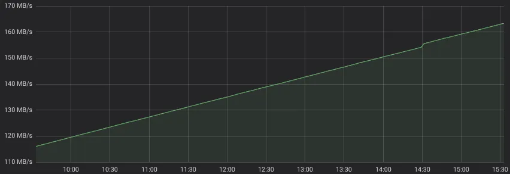

[PromQL](https://prometheus.io/docs/prometheus/latest/querying/basics/) 是 [Prometheus](https://prometheus.io/) 系统的查询语言。它是为绘图、告警或派生 Timeseries（通过 [recording rules](https://prometheus.io/docs/prometheus/latest/configuration/recording_rules/)） 场景而设计的强大且简单的语言。PromQL 是从零开始设计的，与其他在时间序列数据库中使用的查询语言（比如 [TimescaleDB 的 SQ](https://www.timescale.com/)L，[InfluxQL](https://docs.influxdata.com/influxdb/v1.7/query_language/) 或者 [Flux](https://github.com/influxdata/flux)）没有任何共同之处。

这样做可以为典型的 TSDB 查询创建一个清晰的语言。但是它也有代价 - 初学者通常需要花费几个小时阅读官方的[PromQL文档](https://prometheus.io/docs/prometheus/latest/querying/basics/)，才能理解其工作原理。让我们简化和缩短 PromQL 的学习曲线。

## 查询一个 Timeseries
选择使用 PromQL 查询 Timeseries 就像在查询中写入一个时间序列名称一样简单。例如，下面的查询将返回所有名称为`node_network_receive_bytes_total`的 timeseries：

```
node_network_receive_bytes_total
```

这个名称源自于[node_exporter指标](https://github.com/prometheus/node_exporter)，它包含了在各种网络接口上接收的字节数。这样一个简单的查询可能会返回具有相同名称但带有不同 Label Set 的多个 Timeseries。例如，上面的查询可能会返回以下`device`Label 等于`eth0`、`eth1`和`eth2`的 Timeseries：

```
node_network_receive_bytes_total{device="eth0"}
node_network_receive_bytes_total{device="eth1"}
node_network_receive_bytes_total{device="eth2"}
```

不通的Label被放在了花括号中：`{device="eth0"}`, `{device="eth1"}`, `{device="eth2"}`.

让我们来看下 TimescaleDB 的 SQL 来达到同样的效果：

```
SELECT
  ts.metric_name_plus_tags,
  r.timestamps,
  r.values
FROM (
  (SELECT
   time_series_id,
   array_agg(timestamp ORDER BY timestamp) AS timestamps,
   array_agg(value ORDER BY timestamp) AS values
   FROM
   metrics
   WHERE
   time_series_id IN (
     SELECT id FROM time_series
     WHERE metric_name = 'node_network_receive_bytes_total'
   )
   GROUP BY
   time_series_id
  )
) AS r JOIN time_series AS ts ON (r.time_series_id = ts.id)
```

对比下来是不是觉得很简单。SQL 不得不写得更加复杂，才能与上述的PromQL查询结果相媲美。因为 SQL 不会自带时间范围和降采样机制，但这些都会被 [PromQL 的 /query_range](https://prometheus.io/docs/prometheus/latest/querying/api/#range-queries) 接口 使用`start`，`end`和`step`参数自动完成。

## 使用Label过滤
一个指标名称可能返回多个具有不同 Label Set 的 timeseries，就像上面的例子一样。如何选择只匹配`{device="eth1"}`的 timeseries？只需在查询中提及所需的 Label 即可：

```
node_network_receive_bytes_total{device="eth1"}
```

如果你想要查询除了`eth1`的所有 timeseries，只需要把语句里的`=`换成`!=`就可以：

```
node_network_receive_bytes_total{device!="eth1"}
```

如何选择`device`以`eth`开头的所有 timeseries 呢？只需要使用正则表达式：

```
node_network_receive_bytes_total{device=~"eth.+"}
```

这个正则过滤器支持 [Go 语言](https://golang.org/pkg/regexp/)（RE2）支持的所有写法。

要查询所有`device`不以`eth`开头的 timeseries，则只需要把`=~`替换为`!~`：

```
node_network_receive_bytes_total{device!~"eth.+"}
```

## 使用多个Label过滤
Label 过滤器可以被联合使用。举个例子：下面的查询语句只会返回`node42:9100`实例中`device`以`eth`开头的 timeseries。

```
node_network_receive_bytes_total{instance="node42:9100", device=~"eth.+"}
```

这些 Label 过滤器之间是与运算关系。意思是『返回即匹配这个过滤器，又匹配那个过滤器的数据』。

那如果实现或运算逻辑呢？当前的 PromQL 是不支持或运算的，但大多数场景是可以通过正则表达式来解决的。举个例子，下面的查询语句就会返回`device`是`eth1`或`lo`的 timeseries。

```
node_network_receive_bytes_total{device=~"eth1|lo"}
```

## 对 Metric 名称使用正则过滤
有时我们可能需要同时返回多个监控指标。Metric 名称本质上也是一个普通的 Label 的值，其 Label 名是`__name__`。所以可以通过对 Metric 名使用正则的方式，来过滤出多个指标名的数据。举个例子，下面的查询语句会返回`node_network_receive_bytes_total`和`node_network_transmit_bytes_total`两个指标的 timeseries 数据：

```
{__name__=~"node_network_(receive|transmit)_bytes_total"}
```

## 对比最新数据和历史数据
PromQL 支持查询历史数据，并将它与当前最新数据进行合并或对比。只需要给查询语句增加一个 [offset](https://prometheus.io/docs/prometheus/latest/querying/basics/#offset-modifier)。举个例子，下面的查询语句会返回一周前名字是`node_network_receive_bytes_total`的所有 timeseries：

```
node_network_receive_bytes_total offset 7d
```

The following query would return points where the current GC overhead exceeds hour-old GC overhead by 1.5x.

下面的查询将返回当前GC开销超过一小时前GC开销1.5倍的数据点。

```
go_memstats_gc_cpu_fraction > 1.5 * (go_memstats_gc_cpu_fraction offset 1h)
```

运算符`>`和`*`在下面会有介绍。

## 计算速率
细心的读者会注意到上面的查询语句在 [Grafana](http://docs.grafana.org/features/datasources/prometheus/) 上绘制的线条都是下面这样递增的样式：



这样的图表实用性几乎为零，因为它们显示的是难以解释的不断增长的Counter值，而我们想要的是网络带宽图表 —— 在图表左侧看到`MB/s`。PromQL有一个神奇的函数可以实现这个功能 —— `rate()`。它可以计算所有匹配时间序列的每秒速率：

```
rate(node_network_receive_bytes_total[5m])
```

这样监控图就变正确了：

![rate(counter[5m])](promql-demo-2.png)

查询语句中的`[5m]`是什么意思呢？这是一个代表`5m`（5分钟）时间区间。在这个场景中，在计算每个时间点的每秒平均增长率时， 会往回看`5m`的数据，即最近5分钟的每秒平均增长。每个数据点的计算公式可以简化为`(Vcurr-Vprev)/(Tcurr-Tprev)`，`Vcurr`代表当前时间`Tcurr`上的数值，`Vprev`代表在时间`Tprev`上的数值，其中`Tprev=Tcurr-5m`。

如果这看起来太复杂，那么就记住，这个时间区间越大，监控图就会约平滑；而更小的时间区间会让监控图变得更加跳跃（抖动）。VictoriaMetrics 对 PromQL 进行了扩展，这个时间区间`[d]`可以省略不写，缺省情况下就是2个数据点之间的间隔（通过`step`参数指定的），而`step`的默认缺省值是`5m`。

```
rate(node_network_receive_bytes_total)
```

## 速率(rate)的缺陷
Rate 删除度量名称，同时保留内部时间序列的所有 Label。

不要对可能上下波动的时间序列使用 Rate。此类时间序列称为 [Gauge](https://prometheus.io/docs/concepts/metric_types/#gauge)。Rate 只能应用于 [Counter](https://prometheus.io/docs/concepts/metric_types/#counter)，Counter 总是上升的，但有时可能会重置为零（例如，服务重启时）。

不要用`irate`代替`rate`，因为它不能[捕捉尖峰](https://medium.com/@valyala/why-irate-from-prometheus-doesnt-capture-spikes-45f9896d7832)，而且查询速度也比`rate`快不了多少。

## 算术运算
PromQL 支持所有基础的算术运算

+ 加法 (+)
+ 减法 (-)
+ 乘法 (*)
+ 除法 (/)
+ 取模 (%)
+ 指数 (^)

这样就可以进行各种数据转换。比如，将`bytes/s`转换成`bits/s`：

```
rate(node_network_receive_bytes_total[5m]) * 8
```

此外，也可以进行跨指标运算。例如，[该文中巨大的 Flux 查询](https://www.influxdata.com/blog/practical-uses-of-cross-measurement-math-in-flux/)就可以简单地用下面的 PromQL 语句表达：

```
co2 * (((temp_c + 273.15) * 1013.25) / (pressure * 298.15))
```

将多个时间序列与算术运算结合起来需要了解[匹配规则](https://prometheus.io/docs/prometheus/latest/querying/operators/#vector-matching)。否则查询可能会导致数据中断或不正确的结果。匹配规则的基础很简单：

+ PromQL 引擎从算术运算左侧和右侧的所有时间序列中剥离指标名称（Metric Name），但不触及标签（Label）
+ 对于左侧的每个时间序列，PromQL 引擎搜索右侧具有相同标签集（Label Set）的相应时间序列，对每个数据点应用运算操作，并返回具有相同标签集（Label Set）的运算结果。如果没有找到匹配的标签集合（Label Set），则时间序列会被从结果中忽略丢弃。

匹配规则可以通过 [ignoring](https://prometheus.io/docs/prometheus/latest/querying/operators/#vector-matching)[,](https://prometheus.io/docs/prometheus/latest/querying/operators/#vector-matching)[on](https://prometheus.io/docs/prometheus/latest/querying/operators/#vector-matching)[,](https://prometheus.io/docs/prometheus/latest/querying/operators/#vector-matching)[group_left](https://prometheus.io/docs/prometheus/latest/querying/operators/#vector-matching)[和](https://prometheus.io/docs/prometheus/latest/querying/operators/#vector-matching)[group_right](https://prometheus.io/docs/prometheus/latest/querying/operators/#vector-matching)[修饰符](https://prometheus.io/docs/prometheus/latest/querying/operators/#vector-matching)进行增强。不过其逻辑非常复杂，大多数场景都不需要使用。

## 比较运算
PromQL 支持下面几种[比较运算](https://prometheus.io/docs/prometheus/latest/querying/operators/#comparison-binary-operators)：

+ 等于 (==)
+ 不等于 (!=)
+ 大于 (>)
+ 大于等于 (>=)
+ 小于 (<)
+ 小于等于 (<=)

这些运算符可以像算术运算符一样应用于任意 PromQL 表达式。 比较操作的结果是具有唯一匹配数据点的时间序列。 例如，以下查询将仅返回小于 2300 字节/秒的带宽

```
rate(node_network_receive_bytes_total[5m]) < 2300
```

其结果如下图所示，图中会出现带宽超过 2300 字节/秒的间隙：

![rate(node_network_receive_bytes_total[5m]) < 2300](promql-demo-3.png)

比较运算符的结果可以使用 bool 修饰符进行修改：

```
rate(node_network_receive_bytes_total[5m]) < bool 2300
```

在这个例子中，对于有数据的部分会被转化为`true（1）`，没有数据的转换成`false（0）`：

![rate(node_network_receive_bytes_total[5m]) < bool 2300](promql-demo-4.png)

## 分组聚合函数
PromQL 支持对时间序列进行[分组聚合](https://prometheus.io/docs/prometheus/latest/querying/operators/#aggregation-operators)。时间序列按给定的标签集（Labels）进行分组，然后将给定的聚合函数应用于每个组。 例如，以下查询将返回按实例分组的所有网络接口的入口流量总和：

```
sum(rate(node_network_receive_bytes_total[5m])) by (instance)
```

## 使用 Gauge
Gauge 是随时可能上下波动的时间序列。 例如，内存使用情况、温度或压力。 绘制仪表图表时，预计会看到图表上每个点的最小值、最大值、平均值和/或分位数值。PromQL 支持使用下面的函数完成这些：

+ [min_over_time]()
+ [max_over_time]()
+ [avg_over_time]()
+ [quantile_over_time]()

比如，以下查询将在图表上绘制每个时间序列的可用内存的最小值：

```
min_over_time(node_memory_MemFree_bytes[5m])
```

VictoriaMetrics 为 PromQL 增添了 [rollup_*]() 函数，当处理 Gauge 时，它会自动返回`min`, `max`和`avg`值，例如:

```
rollup(node_memory_MemFree_bytes)
```

## 操纵Label
PromQL 提供了 2 个函数用于 Label 修改，丰富、删除或创建：

+ [label_replace]()
+ [label_join]()

尽管这些函数使用起来很困难，但它们允许对所选时间序列上的标签进行强大的动态操作。 label_ 函数的主要用例是将标签转换为所需的值。

VictoriaMetrics 提供了[更丰富的而方便的 Label 改写方法]()了扩展了这方面的能力。

+ [label_set]() — 为时间序列额外增加 Label
+ [label_del]() — 从时间序列中删除指定的 Label
+ [label_keep]() — 从时间序列中保留指定的 Label，而删除其他所有 Label
+ [label_copy]() — 把某个 Label Values 复制成其他 Label
+ [label_move]()— 重命名 Label Name
+ [label_transform]() — 将所有匹配了正则表达式的子串，替换到模板中。
+ [label_value]() — 将规定 Label 的 Value 转换为数字，作为 Value 返回。

## 一个查询返回多个结果
有时候我们需要使用一个 PromQl 语句查询多个时间序列结果。可以使用 [or](https://prometheus.io/docs/prometheus/latest/querying/operators/#logical-set-binary-operators) 操作符。比如，下面的语句将会返回名为`metric1`、`metric2`和`metric3`的时序数据结果：

```
metric1 or metric2 or metric3
```

VictoriaMetrics 简化了语句的写法，只需要把这些指标用括号（）包围起来：

```
(metric1, metric2, metric3)
```

请注意，这里可以放置任何 PromQL 语句，而不仅仅只是指标名称。

使用组合表达式 or 时候时，经常会掉进一个陷阱：具有重复标签集（Label Set）的数据结果将被跳过。 例如，以下查询将跳过 sum(b)，因为 sum(a) 和 sum(b) 具有相同的标签集（它们根本没有标签）：

```
sum(a) or sum(b)
```

## 总结
PromQL 是一种简单但功能强大的时间序列数据库查询语言。 它允许以简洁而清晰的方式编写典型的 TSDB 查询，特别是与 SQL、InfluxQL 或 Flux 进行比较时。 虽然它可能不支持一些查询，而这些场景是由强大的 SQL 查询支持的，但这些场景在实践中非常罕见，以至于我现在至少记不起一个。 如果您知道此类情况，请在评论中提及。

本文并没有提及 PromQL 中所有的功能，因为本文仅针对初学者：

+ 本文没有提及很多[函数](https://prometheus.io/docs/prometheus/latest/querying/functions/)和[逻辑运算符](https://prometheus.io/docs/prometheus/latest/querying/operators/#logical-set-binary-operators) 。
+ 本文没有包含[子查询](https://medium.com/@valyala/prometheus-subqueries-in-victoriametrics-9b1492b720b3)内容。
+ 本文没有包含查询模板(通过`CTE`or [WITH templates](https://victoriametrics.com/promql/expand-with-exprs)), 它可以大大简化复杂的 PromQL 语句。
+ 本文没有提及很多 VictoriaMetrics 所支持的 [MetricsQL]() 诸多有用特性。

我建议可以通过这个[备忘单](https://promlabs.com/promql-cheat-sheet/)来学习 PromQL。

