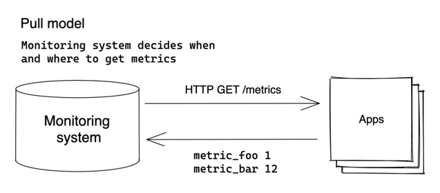
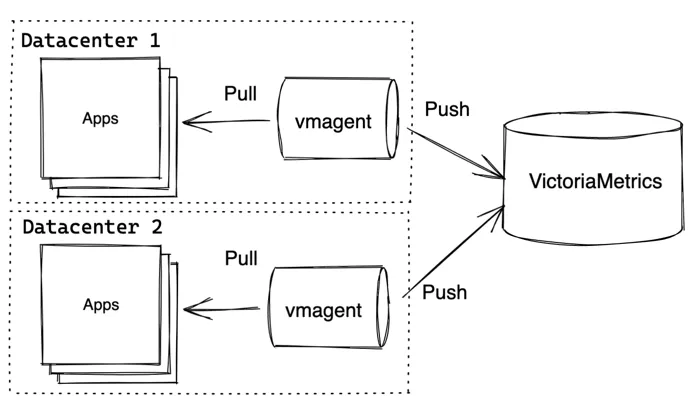

VictoriaMetrics 支持当今监控应用的 2 种主流写入模式：Push 和 Pull。

## Push 模型
客户端定期以推送模式将收集到的指标数据发送给服务端：


客户端（应用程序）决定何时何地发送其指标。VictoriaMetrics支持以下数据摄取协议（也称为推送协议）：

+ [Prometheus remote write API](https://docs.victoriametrics.com/Single-server-VictoriaMetrics.html#prometheus-setup).
+ [Prometheus text exposition format](https://docs.victoriametrics.com/Single-server-VictoriaMetrics.html#how-to-import-data-in-prometheus-exposition-format).
+ [DataDog protocol](https://docs.victoriametrics.com/Single-server-VictoriaMetrics.html#how-to-send-data-from-datadog-agent).
+ [InfluxDB line protocol](https://docs.victoriametrics.com/Single-server-VictoriaMetrics.html#how-to-send-data-from-influxdb-compatible-agents-such-as-telegraf) over HTTP, TCP and UDP.
+ [Graphite plaintext protocol](https://docs.victoriametrics.com/Single-server-VictoriaMetrics.html#how-to-send-data-from-graphite-compatible-agents-such-as-statsd) with [tags](https://graphite.readthedocs.io/en/latest/tags.html#carbon).
+ [OpenTSDB put message](https://docs.victoriametrics.com/Single-server-VictoriaMetrics.html#sending-data-via-telnet-put-protocol).
+ [HTTP OpenTSDB /api/put requests](https://docs.victoriametrics.com/Single-server-VictoriaMetrics.html#sending-opentsdb-data-via-http-apiput-requests).
+ [JSON line format](https://docs.victoriametrics.com/Single-server-VictoriaMetrics.html#how-to-import-data-in-json-line-format).
+ [Arbitrary CSV data](https://docs.victoriametrics.com/Single-server-VictoriaMetrics.html#how-to-import-csv-data).

所有协议都与VictoriaMetrics[数据模型](https://www.victoriametrics.com.cn/victoriametrics/he-xin-gai-nian)完全兼容，可以在生产环境中使用。我们建议使用[github.com/VictoriaMetrics/metrics](https://github.com/VictoriaMetrics/metrics)包将应用程序指标推送到VictoriaMetrics。还可以使用已经存在的与上述协议兼容的客户端，例如`Telegraf`用的 InfluxDB line protocol。

创建自定义客户端或为指标编写应用程序非常简单，只需发送一个POST请求即可：


```plain
curl -d '{"metric":{"__name__":"foo","job":"node_exporter"},"values":[0,1,2],"timestamps":[1549891472010,1549891487724,1549891503438]}' -X POST 'http://localhost:8428/api/v1/import'
```

允许将指标推送/写入[单机版VictoriaMetrics](https://www.victoriametrics.com.cn/victoriametrics/dan-ji-ban-ben)、集群组件vminsert 和 [vmagent](https://www.victoriametrics.com.cn/victoriametrics/xi-tong-zu-jian/vmagent)。

Push 模型的优点：

+ 在VictoriaMetrics方面，配置更简单 - 无需为监控应用程序配置VictoriaMetrics的位置。不需要复杂的服务发现方案。 
+ 安全设置更简单 - 无需设置从VictoriaMetrics到每个监控应用程序的访问权限。 

详细了解Percona为什么从 Pull 模式转向 Push 模式，请参阅 [Foiled by the Firewall: A Tale of Transition From Prometheus to VictoriaMetrics](https://www.percona.com/blog/2020/12/01/foiled-by-the-firewall-a-tale-of-transition-from-prometheus-to-victoriametrics/)。

Push 模型的缺点：

+ 增加了对被监控应用程序的配置复杂性。每个应用程序都需要独立配置与度量系统交付指标数据的地址。还需要配置指标推送间隔以及在指标传递失败时采取的策略。 
+ 将指标数据推送给多个监控系统可能会比较麻烦。
+ 很难判断是应用程序崩溃还是由于其他原因停止发送指标数据。 
+ 如果应用程序以太短间隔推送指标数据，可能会使监控系统负载过重。

## Pull 模型
Pull 模型是由Prometheus推广的一种方法，其中监控系统决定何时以及从哪里拉取指标：



在 Pull 模型中，监控系统需要知道所有需要监控的应用程序的地址。指标是定期从已知的应用程序（也称为抓取目标）通过HTTP协议进行抓取（拉取）。

VictoriaMetrics支持发现与Prometheus兼容的目标，并以与Prometheus相同的方式从这些目标中抓取指标-请参阅这些文档。

[单机版VictoriaMetrics](https://www.victoriametrics.com.cn/victoriametrics/dan-ji-ban-ben)和[vmagent](https://www.victoriametrics.com.cn/victoriametrics/xi-tong-zu-jian/vmagent)都支持指标抓取。

Pull 模型的优点：

+ 更易于调试-VictoriaMetrics了解所有被监视的应用程序（即抓取目标）。 `up == 0`查询立即显示不可用的抓取目标。有关抓取目标的实际信息可以在`http://victoriametrics:8428/targets`和`http://vmagent:8429/targets`上找到。 
+ 监控系统可以控制指标采集频率，因此更容易控制其负载。 
+ 应用程序不知道监控系统，并且无需实现指标传递逻辑。 

Pull 模型的缺点：

+ 较难设置安全性-监控系统需要访问它所监视的应用程序。 
+ Pull 模型重度依赖于服务发现方案。

## 常见的数据收集方法
VictoriaMetrics支持数据收集的 Push 和 Pull 模式。许多场景只使用其中一种模式，或同时使用两种模式。

对于数据收集来说，最常见的方法是同时使用这两种模式：


在这种方法中，使用了额外的组件 - vmagent。vmagent是一个轻量级代理程序，其主要目的是收集、过滤、重新标记和发送指标给VictoriaMetrics。它支持上述提到的所有Push和Pull协议。

关于VictoriaMetrics和vmagent的基本监控设置已在示例docker-compose清单中进行了描述。在这个示例中，vmagent会抓取一系列目标，并将收集到的数据转发给VictoriaMetrics。然后，VictoriaMetrics被作为Grafana上的一个Prometheus类型数据源，以查询收集到的数据。

VictoriaMetrics组件允许构建更高级的拓扑结构。例如，vmagents可以从不同数据中心推送指标到中央的VictoriaMetrics：



在这个例子中，VictoriaMetrics可以是单机版的VictoriaMetrics或者是集群版本VictoriaMetrics。vmagent还允许将相同的数据复制到多个目标。

