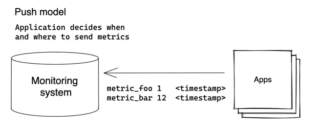
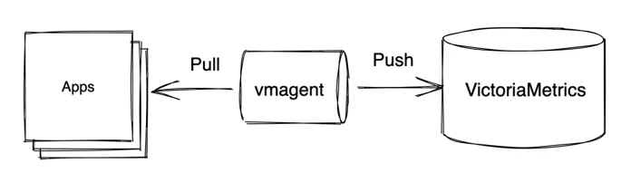
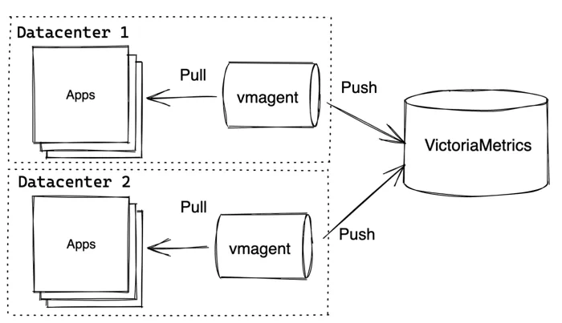

VictoriaMetrics 支持当今监控应用的 2 种主流写入模式：Push 和 Pull。

## Push 模型 {#push}
客户端定期以推送模式将收集到的指标数据发送给服务端：



客户端（应用程序）决定何时何地发送其指标。VictoriaMetrics支持以下数据摄取协议（也称为推送协议）：

+ [Prometheus remote write API](https://docs.victoriametrics.com/Single-server-VictoriaMetrics.html#prometheus-setup).
+ [Prometheus text exposition format](https://docs.victoriametrics.com/Single-server-VictoriaMetrics.html#how-to-import-data-in-prometheus-exposition-format).
+ [DataDog protocol](https://docs.victoriametrics.com/Single-server-VictoriaMetrics.html#how-to-send-data-from-datadog-agent).
+ [InfluxDB line protocol](https://docs.victoriametrics.com/Single-server-VictoriaMetrics.html#how-to-send-data-from-influxdb-compatible-agents-such-as-telegraf) over HTTP, TCP and UDP.
+ [Graphite plaintext protocol](https://docs.victoriametrics.com/Single-server-VictoriaMetrics.html#how-to-send-data-from-graphite-compatible-agents-such-as-statsd) with [tags](https://graphite.readthedocs.io/en/latest/tags.html#carbon).
+ [OpenTSDB put message](https://docs.victoriametrics.com/Single-server-VictoriaMetrics.html#sending-data-via-telnet-put-protocol).
+ [HTTP OpenTSDB /api/put requests](https://docs.victoriametrics.com/Single-server-VictoriaMetrics.html#sending-opentsdb-data-via-http-apiput-requests).
+ [JSON line format](https://docs.victoriametrics.com/Single-server-VictoriaMetrics.html#how-to-import-data-in-json-line-format).
+ [Arbitrary CSV data](https://docs.victoriametrics.com/Single-server-VictoriaMetrics.html#how-to-import-csv-data).

所有协议都与VictoriaMetrics[数据模型](https://www.victoriametrics.com.cn/victoriametrics/he-xin-gai-nian)完全兼容，可以在生产环境中使用。我们建议使用[github.com/VictoriaMetrics/metrics](https://github.com/VictoriaMetrics/metrics)包将应用程序指标推送到VictoriaMetrics。还可以使用已经存在的与上述协议兼容的客户端，例如`Telegraf`用的 InfluxDB line protocol。

创建自定义客户端或为指标编写应用程序非常简单，只需发送一个POST请求即可：


```plain
curl -d '{"metric":{"__name__":"foo","job":"node_exporter"},"values":[0,1,2],"timestamps":[1549891472010,1549891487724,1549891503438]}' -X POST 'http://localhost:8428/api/v1/import'
```

允许将指标推送/写入[单机版VictoriaMetrics](https://www.victoriametrics.com.cn/victoriametrics/dan-ji-ban-ben)、集群组件vminsert 和 [vmagent](https://www.victoriametrics.com.cn/victoriametrics/xi-tong-zu-jian/vmagent)。

Push 模型的优点：

+ 在VictoriaMetrics方面，配置更简单 - 无需为监控应用程序配置VictoriaMetrics的位置。不需要复杂的服务发现方案。 
+ 安全设置更简单 - 无需设置从VictoriaMetrics到每个监控应用程序的访问权限。 

详细了解Percona为什么从 Pull 模式转向 Push 模式，请参阅 [Foiled by the Firewall: A Tale of Transition From Prometheus to VictoriaMetrics](https://www.percona.com/blog/2020/12/01/foiled-by-the-firewall-a-tale-of-transition-from-prometheus-to-victoriametrics/)。

Push 模型的缺点：

+ 增加了对被监控应用程序的配置复杂性。每个应用程序都需要独立配置与度量系统交付指标数据的地址。还需要配置指标推送间隔以及在指标传递失败时采取的策略。 
+ 将指标数据推送给多个监控系统可能会比较麻烦。
+ 很难判断是应用程序崩溃还是由于其他原因停止发送指标数据。 
+ 如果应用程序以太短间隔推送指标数据，可能会使监控系统负载过重。

这些缺点也可以通过技术架构的调整来解决，详见[下文](#design-for-company)

## Pull 模型 {#pull}
Pull 模型是由Prometheus推广的一种方法，其中监控系统决定何时以及从哪里拉取指标：


在 Pull 模型中，监控系统需要知道所有需要监控的应用程序的地址。指标是定期从已知的应用程序（也称为抓取目标）通过HTTP协议进行抓取（拉取）。

VictoriaMetrics支持发现与Prometheus兼容的目标，并以与Prometheus相同的方式从这些目标中抓取指标-请参阅这些文档。

[单机版VictoriaMetrics](https://www.victoriametrics.com.cn/victoriametrics/dan-ji-ban-ben)和[vmagent](https://www.victoriametrics.com.cn/victoriametrics/xi-tong-zu-jian/vmagent)都支持指标抓取。

Pull 模型的优点：

+ 更易于调试，VictoriaMetrics了解所有被监视的应用程序（即抓取目标）。 `up == 0`查询立即显示不可用的抓取目标。有关抓取目标的实际信息可以在`http://victoriametrics:8428/targets`和`http://vmagent:8429/targets`上找到。 
+ 监控系统可以控制指标采集频率，因此更容易控制系统负载。 
+ 应用程序不知道监控系统，并且无需实现指标发送逻辑。甚至无需为监控系统搭建测试联调环境，接入服务只需要`curl`自己的服务验证指标数据正确即可。 

Pull 模型的缺点：

+ 较难设置安全性，监控系统需要访问它所监视的应用程序。 
+ Pull 模型重度依赖于服务发现方案。


## 哪种模式更好？ {#which-is-better}

### 常见的数据收集方法
VictoriaMetrics支持数据收集的 Push 和 Pull 模式。许多场景只使用其中一种模式，或同时使用两种模式。

对于数据收集来说，最常见的方法是同时使用这两种模式：



在这种方法中，使用了额外的组件 - vmagent。vmagent是一个轻量级代理程序，其主要目的是收集、过滤、重新标记和发送指标给 VictoriaMetrics。它支持上述提到的所有 Push 和 Pull 协议。

VictoriaMetrics 组件允许构建更高级的拓扑结构。例如，vmagent 可以从不同数据中心推送指标到集中的 VictoriaMetrics：



在这个例子中，VictoriaMetrics 可以是单机版的 VictoriaMetrics 或者是集群版本 VictoriaMetrics。vmagent 还可以将相同的数据复制到多个目标地址。

Push 和 Pull 模型代表的是监控服务和被监控服务（即用户系统）的交互模式。在不同的系统架构中，二者带来的优劣不同，上面对优缺点也有一些说明。

这里针对一些场景给出更具体的建议。

### 开源系统（非官方）

如果你只是监控系统的用户，而不是维护者。而且你的系统长期有开源的计划，那么就使用 Prometheus Exporter 的方式对外暴露指标，以 Pull 的方式与监控系统交互。

因为 Prometheus 的 Pull 协议更被云原生社区所接受，你无需适配各式各样的可观测系统。

如果所在公司内部监控采用的不是 Pull 模型，而你的系统又不得不与之对接；可以额外增加一个 sidecar 组件，将 Prometheus 格式指标从自身`/metrics`接口中 Pull 出来，再按照公司监控系统规范 Push 给它。  
这很类似上面的架构，只是 vmagent 这个组件不是公司统一维护的，而是你自己维护的。

### 公司内部监控系统设计（非官方） {#design-for-company}

如果你要为公司搭建一个监控系统，供内部自研服务使用。那么我**建议你采用 Push 模式**。Pull 模式是监控系统使用者所青睐的模式，但它会给维护者带来很多麻烦。比如：

1. Pull 模式依赖于服务发现，如果系统架构不存在该能力，会非常麻烦。
2. 需要内部网络互通，一些金融类系统会被隔离在一个独立网络内，统一走安全网关对外暴露接口；监控系统无权感知内部实例变化情况，也不允许发送 Pull 请求。
3. Pull 模式的采集配置维护成本很高，一个新服务上线，或老服务下线，对应的采集配置谁来更新是个麻烦事；除非你结合服务发现系统自动管理采集配置。

结合上面列举的 Push 模式的缺点，我们可以抽象出一个结论：

**视系统规模而定；被监控服务较少时，采用 Pull 模式给接入用户带来较好的体验；被监控服务多时，维护者不得不采用 Push 模式将一些对接的复杂性转嫁给用户**。

所以我建议从一开始就采用 Push 模式，后期可利用 agent 来解决上述 Push 模式缺点：
1. 所有被监控服务，都将数据 Push 到`localhost:port`上，该地址是每个机器的监控 agent（如 vmagent）监听的，配置起来不复杂。
2. 指标如果要推送给多个系统，可在 agent 里进行多发。
3. 因为 agent 和被监控系统运行在同一台机器上，导致指标消失的问题很好定位。
3. 指标推送间隔控制，可在 agent 里面进行去重覆盖；比如 agent 对于同一个 timeseries 每 30s 向服务端 Push 一次最新数据。

### 并存模式（非官方）

一些大型监控系统，经过长时间演进后，不得不同时提供 2 种模式；只不过有主次之分。

1. Pull 为主，个别想用 Push 接入的服务，自己独立对接中心的 VictoriaMetrics 服务（比如运行在独立 VPC 内部的金融服务）。
2. Push 为主，个别想用 Pull 接入的服务（来自于开源社区），用户自己额外维护一个 sidecar（比如 vmagent） 去 Pull 服务指标，让 sidecar Push 出来。

**而到底以哪种模式为主，需要看被监控服务是自研居多还是开源居多；如果公司内部大部分服务组件都是基于开源系统搭建的，那 Pull 模式为主无疑是最佳选项；如果公司内部大部分服务组件都是自研的，那么建议采用 Push 方式来对接**。